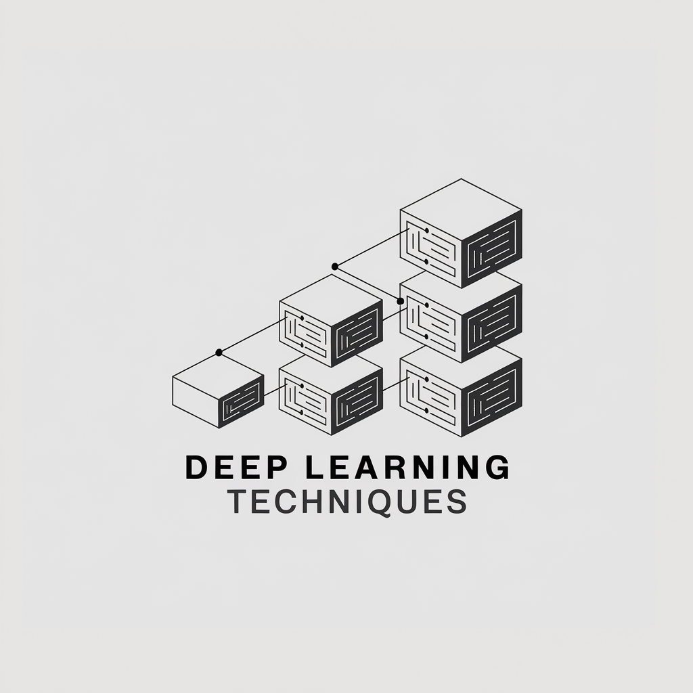

# Deep Learning Techniques

<p align="center">
  
  
  
  
</p>

<p align="center">
  
</p>

An advanced, research-focused library for Keras/TensorFlow, providing a rich collection of cutting-edge deep learning components. This toolkit is designed for researchers and practitioners to experiment with novel layers, loss functions, and analysis tools, build state-of-the-art architectures, and gain deeper insights into their models.

---

## Table of Contents
1. [Key Features](#key-features)  
2. [Installation](#installation)  
3. [Usage Examples](#usage-examples)  
4. [Project Structure](#project-structure)  
5. [Documentation](#documentation)  
6. [Experiments](#experiments)  
7. [Contributing](#contributing)  
8. [License](#license)  
9. [References](#references)  

---

## Key Features

A comprehensive suite of tools organized into four key areas:

<details>
<summary><b>1. Novel Layers & Architectures</b></summary>

- **Modern Attention Mechanisms**: `DifferentialMultiHeadAttention`, `HopfieldAttention`, `SparseAttention`, and `NonLocalAttention`.
- **Advanced Convolutional Blocks**: `ConvNeXtV1` & `V2`, `Convolutional Block Attention Module` (CBAM), and `OrthoBlock`.
- **Cutting-edge Layers**: Implementations of `BitLinear`, `Kolmogorov-Arnold Networks` (KAN), and `Capsule Networks`.
- **Specialized MLP Variants**: `GatedMLP` (gMLP), `Differential FFN`, and `PowerMLP`.
- **Full Model Implementations**: `Depth Anything`, `MobileNetV4`, `CoshNet`, `CapsNet`, and more.

</details>

<details>
<summary><b>2. Advanced Normalization & Regularization</b></summary>

- **Normalization Layers**: A wide range of `RMSNorm` variants (including `BandRMS` and `BandLogitNorm`), `GlobalResponseNorm` (GRN), and `LogitNorm`.
- **Orthogonal Constraints**: `SoftOrthogonal` and `SoftOrthonormal` regularizers, `SRIP` regularization, and orthonormal initializers to improve model stability and gradient flow.
- **Novel Regularizers**: `BinaryPreference` and `TriStatePreference` regularizers to encourage quantized weight states.
- **Stochastic Techniques**: `StochasticDepth` for robust training of deep networks.

</details>

<details>
<summary><b>3. Specialized Losses & Optimization</b></summary>

- **Metric-Driven Losses**: The `AnyLoss` framework allows direct optimization of classification metrics like F1-score and Balanced Accuracy.
- **Information-Theoretic Losses**: `GoodhartAwareLoss` to mitigate metric gaming by penalizing spurious correlations.
- **Specialized Losses**: Custom losses for clustering (`ClusteringLoss`) and segmentation.
- **Optimization Tools**: `WarmupSchedule` for learning rates and utilities for deep supervision.

</details>

<details>
<summary><b>4. In-Depth Model Analysis & Visualization</b></summary>

- **Weight & Activation Analysis**: `WeightWatcher` integration for SVD-based generalization analysis and `ActivationDistributionAnalyzer` to inspect layer-by-layer statistics.
- **Comprehensive Visualization**: Built-in `VisualizationManager` and `ModelAnalyzer` to compare model performance, confidence distributions, and feature representations.
- **Logging Infrastructure**: Robust logging utilities to monitor training and analysis pipelines.

</details>

---

## Installation

> **Note:** This library requires Python 3.11 or newer.

1. **Clone the repository:**
   ```bash
   git clone https://github.com/nikolasmarkou/dl_techniques.git
   cd dl_techniques
   ```

2. **Install dependencies:**
   For standard usage, install the dependencies from `requirements.txt`:
   ```bash
   pip install -r requirements.txt
   ```
   The key dependencies include `tensorflow==2.18.0` and `keras>=3.8.0`.

3. **Editable Install (for developers):**
   If you plan to contribute or modify the code, an editable install is recommended. This uses the `pyproject.toml` file.
   ```bash
   pip install -e ".[dev]"
   ```

---

## Usage Examples

### 1. Building a Model with Custom Layers

Here’s how to integrate advanced components like `OrthoBlock` and `GlobalResponseNorm` into a simple model:

```python
import tensorflow as tf
from dl_techniques.layers import OrthoCenterBlock
from dl_techniques.layers.norms import GlobalResponseNorm

inputs = tf.keras.Input(shape=(64,))
x = OrthoCenterBlock(units=128, activation='gelu')(inputs)
x = GlobalResponseNorm()(x)
outputs = tf.keras.layers.Dense(10, activation='softmax')(x)

model = tf.keras.Model(inputs, outputs)

model.compile(
    optimizer='adam',
    loss='categorical_crossentropy',
    metrics=['accuracy']
)

model.summary()
```

### 2. Using a Custom Loss Function

The `AnyLoss` framework lets you directly optimize for metrics like F1-score, which is especially useful for imbalanced datasets.

```python
from dl_techniques.losses import F1Loss

# ... model definition ...

model.compile(
    optimizer='adam',
    loss=F1Loss(),  # Directly optimize for F1-score
    metrics=['accuracy', 'precision', 'recall']
)

# model.fit(x_train, y_train)
```

---

## Project Structure

The repository is organized to separate the core library code, documentation, experiments, and tests.

- **`src/dl_techniques/`**: The main library source code.
  - `layers/`: All custom layers, including attention, normalization, and specialized blocks.
  - `losses/`: Custom loss functions like `AnyLoss` and `GoodhartAwareLoss`.
  - `regularizers/`: Advanced regularizers like `SRIP` and `SoftOrthogonal`.
  - `models/`: Full implementations of architectures like `ConvNeXt`, `Depth Anything`, etc.
  - `analysis/`: Tools for model analysis, including `WeightWatcher` and activation statistics.
- **`docs/`**: In-depth documentation on key concepts, architectures, and theoretical foundations.
- **`experiments/`**: Standalone scripts demonstrating the use of library components on real tasks (e.g., MNIST, CIFAR-10).
- **`tests/`**: A comprehensive test suite using `pytest` to ensure reliability and correctness.

---

## Documentation

Detailed explanations of key concepts and implementations can be found in the `docs/` directory. Highlights include:

- **[AnyLoss Framework](./docs/anyloss_classification_metrics_loss_functions.md)**: A deep dive into directly optimizing classification metrics like F1-score.
- **[Orthonormal Regularization & OrthoBlock](./docs/orthoblock.md)**: A novel block combining orthonormal weights with mean-centering normalization.
- **[Band-Constrained Normalization](./docs/bcn_thesis.md)**: A thesis on a novel normalization technique that preserves magnitude information.
- **[Mixture Density Networks (MDNs)](./docs/mdn.md)**: Theory, use cases, and best practices for probabilistic modeling.
- **[Hierarchical Vision Transformers](./docs/hierarchical_vision_transformers.md)**: Details on the hMLP stem and its advantages.
- **[Chronological Guide to Neural Architectures](./docs/neural_network_architectures.md)**: An extensive, chronological list of influential neural network architectures with key references.

---

## Experiments

The [`experiments/`](./experiments/) directory contains practical scripts and results for various techniques:

- **Goodhart's Law**: Testing `GoodhartAwareLoss` on spurious correlations in CIFAR-10.
- **OrthoBlock**: Comparing `OrthoCenterBlock` against baseline dense layers on CIFAR-10.
- **Differential FFN**: Evaluating the `DifferentialFFN` layer on synthetic data.
- **Mixture Density Networks**: Forecasting time series data with `MDN`s.
- **Custom Normalization**: Evaluating `BandRMS` and coupled normalization layers.

Each experiment provides a starting point for your own research and includes code for training, evaluation, and visualization.

---

## Contributing

1. **Fork** & **Clone** the repository.
2. **Create a Branch** for your feature or bugfix.
3. **Write Tests** covering changes (see `tests/` folder).
4. **Pre-commit Hooks**: This project uses [pre-commit](https://pre-commit.com/) for checks. Make sure these pass with `pytest`.
5. **Open a Pull Request** describing your changes.

**Coding Standards**:
- Follow [PEP 8](https://peps.python.org/pep-0008/).
- Prefer **type hints**.
- Use docstrings (Sphinx or NumPy style) for new layers, models, or utilities.
- Write thorough tests in `tests/`.

---

## License

This project is licensed under the **GNU General Public License v3.0**.

**Important**: The GPL-3.0 is a "copyleft" license. This means that any derivative work you create and distribute must also be licensed under GPL-3.0. Please review the [LICENSE](./LICENSE) file carefully before using this library in your projects, especially in a commercial context.

---

## References

This library is built upon an extensive body of research. The implementations are inspired by or directly based on numerous academic papers and resources. For a complete list of references, please see the `REFERENCES.md` file.

---

**Happy experimenting with DL Techniques!** If you have questions, bug reports, or feature requests, feel free to open an issue or start a discussion. Enjoy exploring the cutting-edge features and insights offered by this library