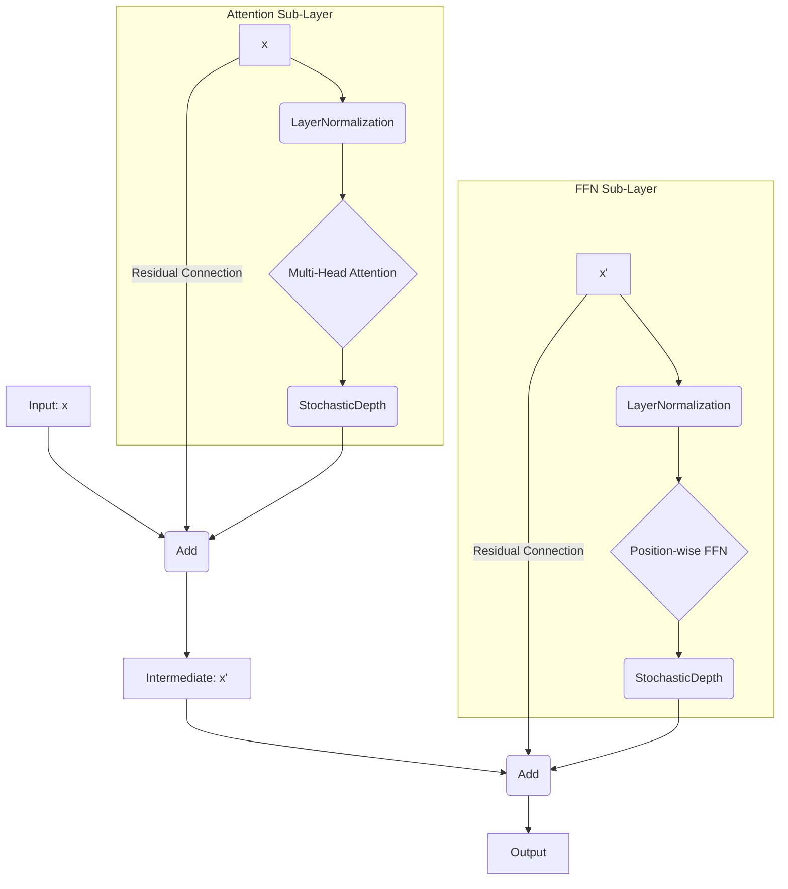

### An Exhaustive Guide to the Modern Transformer Block: Internals and SOTA Practices

This guide provides a meticulous breakdown of a single Transformer block as implemented in state-of-the-art Large Language Models. We will move beyond high-level concepts to the specific, nuanced choices that enable stable training of models with billions of parameters.

#### **References At-a-Glance:**

*   **Original Transformer:** [Vaswani et al., 2017, "Attention Is All You Need"](https://arxiv.org/abs/1706.03762)
*   **Layer Normalization:** [Xiong et al., 2020, "On Layer Normalization in the Transformer Architecture"](https://arxiv.org/abs/2002.04745) (Analyzes Pre-LN)
*   **Activation Functions:**
    *   **GELU:** [Hendrycks & Gimpel, 2016, "Gaussian Error Linear Units"](https://arxiv.org/abs/1606.08415)
    *   **SwiGLU:** [Shazeer, 2020, "GLU Variants Improve Transformer"](https://arxiv.org/abs/2002.05202)
*   **Stochastic Depth:** [Huang et al., 2016, "Deep Networks with Stochastic Depth"](https://arxiv.org/abs/1603.09382)
*   **AdamW Optimizer:** [Loshchilov & Hutter, 2019, "Decoupled Weight Decay Regularization"](https://arxiv.org/abs/1711.05101)

---

### Part 1: Architectural Blueprint - The Pre-LN Transformer Block

The fundamental design is a **Pre-Layer Normalization (Pre-LN)** block. This structure is paramount for training stability in very deep networks.

The flow for each sub-layer (MHA and FFN) follows this precise pattern:
`output = x + StochasticDepth(SubLayer(LayerNormalization(x)))`



---

### Part 2: Deep Dive - The Multi-Head Attention (MHA) Sub-Layer

#### **1. Linear Projections (Q, K, V)**

*   **Implementation:** A single `keras.layers.Dense` layer projects the input `d_model` into a `3 * d_model` dimension, which is then split to form Q, K, and V. This is more computationally efficient than three separate `Dense` layers as it leverages a single, larger matrix multiplication.
*   **The "No Bias" Rule:** The `use_bias` parameter is set to `False`.
    *   **Reason:** The subsequent `LayerNormalization` layer has its own learnable bias parameter (`beta`). This makes the bias in the `Dense` layer mathematically redundant. Removing it saves parameters and simplifies the model.
*   **Weight Initialization:** Keras's default `glorot_uniform` (Xavier) or `he_normal` initializers are standard and work well.

#### **2. Attention Calculation and Regularization**

*   **Scaling:** The `QKᵀ` dot product is scaled by `1 / sqrt(head_dim)`. This is not a regularizer but a critical stabilization technique to prevent the softmax input from having excessively large variance.
*   **Attention Dropout:**
    *   **What:** A `keras.layers.Dropout` is applied directly to the attention weights *after* the softmax operation.
    *   **How Much?** This is a key hyperparameter.
        *   **Typical Value:** `0.1` is a very common default for training medium-to-large models.
        *   **Range:** It can range from `0.0` (no dropout) to `0.2`. For extremely large models (e.g., 100B+ parameters), which are less prone to overfitting, or during fine-tuning, this is often set to `0.0`.
    *   **Purpose:** Prevents the model from becoming over-reliant on a few specific tokens for its context. It forces a "flatter" attention distribution, improving generalization.

---

### Part 3: Deep Dive - The Position-wise Feed-Forward Network (FFN) Sub-Layer

This sub-layer is where the model performs most of its non-linear processing and is a critical component for model capacity.

#### **1. Structure and Expansion**

*   **Core Structure:** Two linear layers with a non-linear activation function in between.
*   **Expansion Factor:** The first `Dense` layer expands the dimensionality.
    *   **Standard Practice:** The intermediate dimension is `4 * d_model`. For example, a model with `d_model=768` will have an FFN intermediate dimension of `3072`.
    *   **Reason:** This projects the token representations into a much higher-dimensional space, allowing the model to learn more complex and separable functions before projecting back down to `d_model`.
*   **The "No Bias" Rule:** Just like in the MHA layer, `use_bias=False` is standard practice for both `Dense` layers in the FFN, as they are preceded by a `LayerNormalization` layer.

#### **2. The Activation Function: Beyond ReLU**

While the original Transformer used ReLU, SOTA models use smoother and more expressive activations.

*   **GELU (Gaussian Error Linear Unit):**
    *   **What:** `activation="gelu"`. A smooth approximation of the rectifier (ReLU). It weights inputs by their magnitude, unlike ReLU which gates at zero.
    *   **Why:** It was shown to improve performance in models like BERT and GPT-2/3.

*   **SwiGLU (Swish-Gated Linear Unit): The Current SOTA**
    *   **What:** This is a more complex structure that provides a gating mechanism. The FFN is modified:
        1.  The input `x` is projected up to `(8/3) * d_model * 2` (or simply `2 * ffn_dim`, where `ffn_dim` is often `4 * d_model`).
        2.  This is split into two equal-sized tensors, `A` and `B`.
        3.  The output is calculated as: `(Swish(A)) * B`, where Swish is `x * sigmoid(x)`. In Keras, `gelu` is often used instead of Swish in `SwiGLU`'s activation component as in the LLaMA paper.
        4.  A final `Dense` layer projects this back down to `d_model`.
    *   **Why:** The gating mechanism (`* B`) allows the network to dynamically control how much information from the activated tensor `A` flows through. This has consistently shown superior performance in models like PaLM and LLaMA.

#### **3. FFN Regularization**

*   **Dropout:** The final `Dense` layer of the FFN is often followed by a `keras.layers.Dropout` layer. The dropout rate is typically the same as the attention dropout (`0.1`). This is a standard dropout on activations.
*   **Stochastic Depth:** This is applied to the *entire output* of the FFN sub-layer, as shown in the architectural diagram.

---

### Part 4: The Overarching Regularization and Optimization Regime

These techniques apply to the entire block and the model as a whole.

*   **Layer Normalization:**
    *   **Type:** Pre-LN.
    *   **Epsilon:** A small constant (`epsilon=1e-5` or `1e-6`) is added to the variance in the denominator for numerical stability.
    *   **Parameters:** `LayerNorm` has learnable `gamma` (scale) and `beta` (shift) parameters. These parameters are **typically excluded** from weight decay.

*   **Stochastic Depth (DropPath):**
    *   **What:** A `keras.layers.StochasticDepth` that wraps the output of each sub-layer (MHA and FFN).
    *   **How Much?** A typical rate is `0.1`. In very deep networks, this rate can be scheduled to increase linearly with the depth of the layer (e.g., from `0.0` at the first layer to `0.1` at the last).
    *   **Why:** It's a more powerful regularizer than conventional dropout, as it forces the model to rely on different network paths and depths, creating an implicit ensemble.

*   **The Optimizer: AdamW**
    *   **What:** `keras.optimizers.AdamW`.
    *   **Why it's Essential:** Standard `Adam` with L2 regularization is flawed; the effective weight decay is coupled with the adaptive learning rate, making it unpredictable. `AdamW` decouples the weight decay from the gradient update, applying it directly to the weights as described in the original L2 regularization formulation. This is the **de facto standard**.
    *   **Weight Decay Value:** A strong regularization value like `0.1` is common for training LLMs from scratch. For fine-tuning, this is often reduced significantly (e.g., `0.01` or `0.0`).

---

### Part 5: The Complete Keras 3 Code with SOTA Details

This code implements a `TransformerBlock` with the advanced **SwiGLU** FFN and all the discussed regularization details.

```python
import keras
from keras import layers
from keras import ops
import math


# Configuration object to hold all hyperparameters
class Config:
    d_model = 768
    n_head = 12
    block_size = 1024
    # Dropout applied to attention weights and FFN activations
    dropout_prob = 0.1
    # Stochastic Depth rate for the entire sub-layer
    stochastic_depth_prob = 0.1
    # Epsilon for LayerNorm for numerical stability
    layer_norm_epsilon = 1e-5
    # FFN expansion factor
    ffn_expansion_factor = 4


config = Config()


class SwiGLUFFN(layers.Layer):
    """ SwiGLU Feed-Forward Network as seen in LLaMA and PaLM """

    def __init__(self, config, **kwargs):
        super().__init__(**kwargs)
        hidden_dim = int(config.d_model * config.ffn_expansion_factor)
        # LLaMA uses a slightly different intermediate dim calculation
        # It's often a multiple of 128 for hardware efficiency
        ffn_dim_multiple_of = 256
        hidden_dim = int(2 * hidden_dim / 3)
        hidden_dim = ffn_dim_multiple_of * ((hidden_dim + ffn_dim_multiple_of - 1) // ffn_dim_multiple_of)

        # SOTA Detail: use_bias=False
        self.w1 = layers.Dense(hidden_dim, use_bias=False)  # Gating projection
        self.w2 = layers.Dense(hidden_dim, use_bias=False)  # Value projection
        self.w3 = layers.Dense(config.d_model, use_bias=False)  # Output projection

        # SOTA Detail: Dropout on the final FFN output
        self.dropout = layers.Dropout(config.dropout_rate)

    def call(self, x, training=None):
        # Apply Swish to the first projection and multiply by the second (gating)
        gated_x = self.w1(x)
        value_x = self.w2(x)
        # LLaMA uses SiLU (Swish) which is ops.silu
        # GELU can also be used here and is a common choice.
        activated_gate = ops.silu(gated_x)

        # Element-wise multiplication
        x = activated_gate * value_x

        # Project back to d_model and apply dropout
        x = self.w3(x)
        x = self.dropout(x, training=training)
        return x


class CausalSelfAttention(layers.Layer):
    # (Implementation from the previous answer remains the same)
    # It correctly uses use_bias=False and has attn_dropout
    def __init__(self, config, **kwargs):
        super().__init__(**kwargs)
        self.d_model = config.d_model
        self.n_head = config.n_head
        self.head_dim = self.d_model // self.n_head
        self.c_attn = layers.Dense(3 * self.d_model, use_bias=False)
        self.c_proj = layers.Dense(self.d_model, use_bias=False)
        self.attn_dropout = layers.Dropout(config.dropout_rate)

    def call(self, x, training=None):
        B, T, C = ops.shape(x)
        q, k, v = ops.split(self.c_attn(x), 3, axis=-1)
        q = ops.transpose(ops.reshape(q, (B, T, self.n_head, self.head_dim)), (0, 2, 1, 3))
        k = ops.transpose(ops.reshape(k, (B, T, self.n_head, self.head_dim)), (0, 2, 1, 3))
        v = ops.transpose(ops.reshape(v, (B, T, self.n_head, self.head_dim)), (0, 2, 1, 3))
        scores = ops.matmul(q, ops.transpose(k, (0, 1, 3, 2))) / ops.sqrt(ops.cast(self.head_dim, x.dtype))
        mask = ops.triu(ops.ones((1, 1, T, T), dtype="bool"), k=1)
        scores = ops.where(mask, -1e9, scores)
        weights = ops.softmax(scores, axis=-1)
        weights = self.attn_dropout(weights, training=training)
        output = ops.matmul(weights, v)
        output = ops.reshape(ops.transpose(output, (0, 2, 1, 3)), (B, T, C))
        return self.c_proj(output)


class TransformerBlock(layers.Layer):
    def __init__(self, config, **kwargs):
        super().__init__(**kwargs)
        self.ln_1 = layers.LayerNormalization(epsilon=config.layer_norm_epsilon)
        self.attn = CausalSelfAttention(config)
        self.ln_2 = layers.LayerNormalization(epsilon=config.layer_norm_epsilon)
        self.ffn = SwiGLUFFN(config)  # Using the SOTA FFN

        # SOTA Detail: Stochastic Depth for regularization
        self.stochastic_depth = layers.StochasticDepth(config.stochastic_depth_prob)

    def call(self, x, training=None):
        # Pre-LN architecture with Stochastic Depth
        attn_output = self.attn(self.ln_1(x), training=training)
        x = x + self.stochastic_depth(attn_output, training=training)

        ffn_output = self.ffn(self.ln_2(x), training=training)
        x = x + self.stochastic_depth(ffn_output, training=training)

        return x


# Build and Compile with AdamW
inputs = keras.Input(shape=(config.block_size, config.d_model))
outputs = TransformerBlock(config)(inputs)
model = keras.Model(inputs, outputs)

# SOTA Detail: Use AdamW with a non-trivial weight_decay
optimizer = keras.optimizers.AdamW(learning_rate=3e-4, weight_decay=0.1)
model.compile(optimizer=optimizer, loss="...")
model.summary()
```

### Summary & Conclusion: A Checklist for a SOTA Transformer Block

| Component                  | SOTA Choice                                         | Typical Value(s)                                                                    | Key Rationale                                                                        |
| -------------------------- | --------------------------------------------------- | ----------------------------------------------------------------------------------- | ------------------------------------------------------------------------------------ |
| **Overall Architecture**   | Pre-Layer Normalization                             | N/A                                                                                 | Essential for stable training of deep networks.                                      |
| **Linear Layers (All)**    | `use_bias=False`                                    | N/A                                                                                 | Bias is redundant with LayerNorm's `beta` parameter; saves parameters.             |
| **Attention Dropout**      | Dropout on Softmax weights                          | `0.1` (common); `0.0` for very large models or fine-tuning.                         | Prevents over-reliance on single tokens, improves generalization.                    |
| **FFN Activation**         | SwiGLU                                              | N/A                                                                                 | Gating mechanism allows dynamic information flow, outperforming GELU/ReLU.           |
| **FFN Dimension**          | Expand to `4 * d_model`                             | `4x`                                                                                | Projects to high-dim space to learn complex functions.                               |
| **FFN Dropout**            | Dropout on final FFN output (before residual add)   | `0.1`                                                                               | Standard regularization on activations.                                              |
| **Block Regularization**   | Stochastic Depth (DropPath)                         | `0.1`; can be scheduled to increase with depth.                                     | Powerful regularizer, creates an implicit ensemble of varying network depths.      |
| **Optimizer**              | AdamW                                               | `weight_decay=0.1` (pre-training), `<0.1` (fine-tuning)                            | Correctly decouples weight decay from adaptive learning rates.                     |
| **LayerNorm Epsilon**      | Small constant in denominator                       | `1e-5` or `1e-6`                                                                    | Prevents division by zero, ensuring numerical stability.                           |