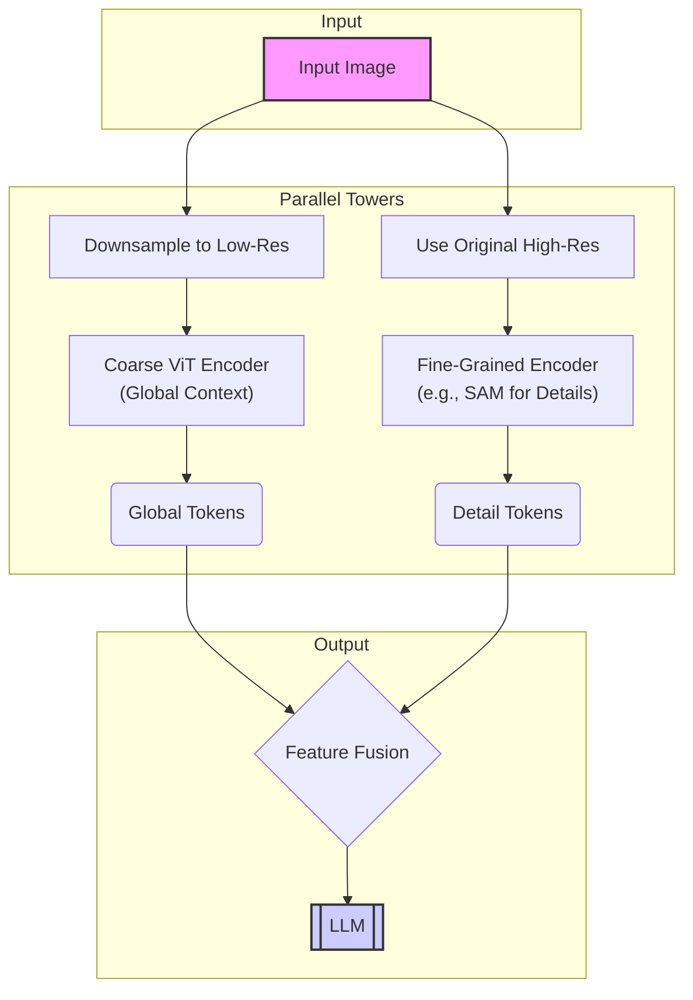
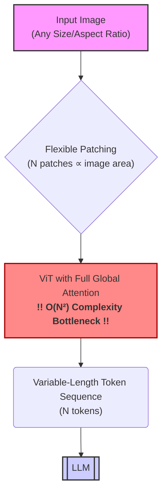
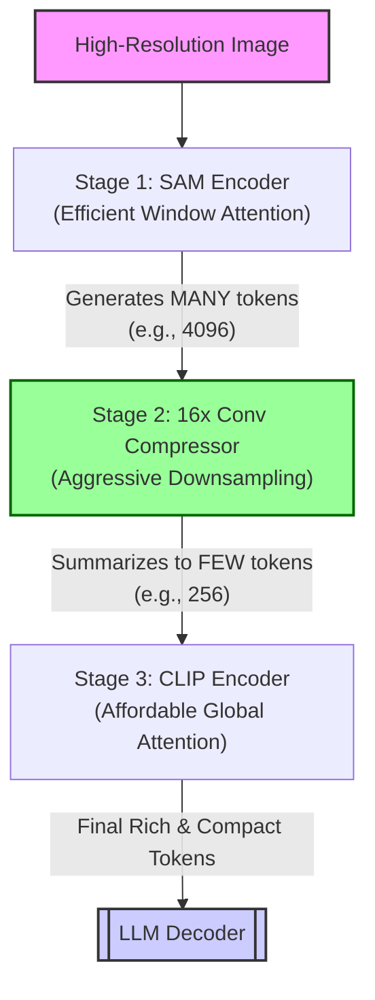

# A Technical Guide to Vision Encoder Architectures in Modern VLMs

## Table of Contents

1.  [**Introduction**](#1-introduction)
    *   The Core Challenge: Resolution vs. Computational Cost
2.  [**Architectural Paradigm 1: The Dual-Tower Architecture**](#2-the-dual-tower-architecture)
    *   Core Concept
    *   Detailed Architectural Breakdown
    *   Visual Diagram
    *   Identified Deficiencies
3.  [**Architectural Paradigm 2: The Tile-Based Architecture**](#3-the-tile-based-architecture)
    *   Core Concept
    *   Detailed Architectural Breakdown
    *   Visual Diagram
    *   Identified Deficiencies
4.  [**Architectural Paradigm 3: The Adaptive Resolution Architecture (NaViT)**](#4-the-adaptive-resolution-architecture-navit-paradigm)
    *   Core Concept
    *   Detailed Architectural Breakdown
    *   Visual Diagram
    *   Identified Deficiencies
5.  [**Architectural Paradigm 4: The Serial Compression Architecture**](#5-the-serial-compression-architecture)
    *   Core Concept
    *   Detailed Architectural Breakdown (Multi-Stage Pipeline)
    *   Visual Diagram
    *   How This Architecture Solves the Problem
6.  [**Comparative Summary Table**](#6-comparative-summary-table)
7.  [**Conclusion**](#7-conclusion)

***

## 1. Introduction

Vision-Language Models (VLMs) derive their power from the synergy between a **vision encoder** and a Large Language Model (LLM). The vision encoder's critical role is to translate a raw image—a grid of pixels—into a sequence of meaningful feature vectors, or "vision tokens," that the LLM can understand and reason about.

### The Core Challenge: Resolution vs. Computational Cost

The central dilemma in vision encoder design is a fundamental trade-off. **High-resolution images** are essential for tasks requiring fine-grained detail, such as reading text in a document (OCR), identifying small objects, or analyzing complex charts. However, processing these images naively leads to a quadratic explosion in computational complexity and memory usage, making models impractically slow and expensive. This guide provides an in-depth exploration of four distinct architectural paradigms, detailing their mechanisms, limitations, and the evolution of thought in solving this critical challenge.

***

## 2. The Dual-Tower Architecture

### Core Concept

This architecture employs a "divide and conquer" strategy. It processes an input image through two separate, parallel encoders (towers). One tower captures a coarse, global overview of the image, while the second focuses on extracting fine-grained, high-resolution details. The outputs are then fused to provide a comprehensive visual representation.

#### Representative Models
*   **Vary** (as the primary modern example discussed in the paper)

### Detailed Architectural Breakdown

1.  **Input Forking:** An input image is simultaneously fed into two distinct preprocessing pipelines.
2.  **Coarse Tower (Global Context):** The image is downsampled to a standard low resolution (e.g., 224x224) and passed through a standard Vision Transformer (ViT). This tower is computationally cheap and generates a small number of tokens that encapsulate the overall scene, layout, and context.
3.  **Fine-Grained Tower (Local Details):** The original, high-resolution image is processed by a specialized encoder optimized for detail, such as a SAM (Segment Anything Model) encoder. This tower identifies and extracts intricate features, creating a rich "visual vocabulary" from high-resolution patches.
4.  **Feature Fusion:** The token sequences from both towers are intelligently merged or concatenated. This fusion process combines the holistic understanding from the coarse tower with the specific, high-fidelity details from the fine-grained tower.
5.  **Final Representation:** This fused set of vision tokens is then presented to the LLM for reasoning.

### Visual Diagram

The data flow of this architecture can be visualized as follows:



### Identified Deficiencies

*   **❌ Complex Engineering:** Requires maintaining two separate image processing pipelines and two distinct encoder models. This complicates the entire ML-Ops lifecycle, from training infrastructure to deployment.
*   **❌ Training Inefficiency:** Coordinating and synchronizing two independent encoders makes implementing efficient pipeline parallelism during training challenging and can lead to bottlenecks.
*   **❌ Difficult Deployment:** The dual-model requirement increases the complexity and potential points of failure in a production environment.

***

## 3. The Tile-Based Architecture

### Core Concept

A classic computer vision technique adapted for VLMs. To process a high-resolution image that would overwhelm a single encoder, the image is systematically sliced into a grid of smaller, manageable tiles. Each tile is processed independently by the encoder, and the resulting tokens are concatenated.

#### Representative Models
*   **InternVL 2.0**
*   **LLaVA-NeXT**
*   **CogVLM**

### Detailed Architectural Breakdown

1.  **Image Tiling (or Patching):** A high-resolution input image is divided into a grid of smaller, fixed-size tiles. For example, a 4K image might be broken into a 4x4 grid of 1024x1024 tiles.
2.  **Independent Encoding:** Each tile is treated as a separate image and processed in parallel by a standard ViT encoder. This step is highly parallelizable across multiple GPUs.
3.  **Token Concatenation:** The vision tokens generated from each tile are collected and concatenated in their original spatial order to form one extremely long sequence.
4.  **Spatial Reconstruction in LLM:** This long sequence is fed to the LLM. Special positional encodings are essential to inform the LLM about the original location of each tile, allowing it to mentally reconstruct the full image's spatial layout.

### Visual Diagram

The data flow of this architecture can be visualized as follows:

```mermaid
graph TD
    A[High-Resolution Image] --> B{Tiling/Patching}

    subgraph Parallel Encoding of Tiles
        direction LR
        B --> C1[Tile 1] --> D[ViT Encoder] --> T1(Tokens 1)
        B --> C2[Tile 2] --> D
        D --> T2(Tokens 2)
        B --> C3[...] --> D
        D --> TN(...)
        B --> C4[Tile N] --> D
        D --> T4(Tokens N)
    end
    
    T1 & T2 & TN & T4 --> E{Concatenate All Tokens}
    E --> F(Massive Token Sequence<br/>(Very Long & Fragmented))
    F --> G[[LLM]]

    style A fill:#f9f,stroke:#333,stroke-width:2px
    style G fill:#ccf,stroke:#333,stroke-width:2px
```

### Identified Deficiencies

*   **❌ Excessive Token Count:** This is the primary drawback. Slicing a large image results in a massive number of vision tokens (often thousands), which makes the subsequent attention mechanism in the LLM a severe bottleneck, slowing down both prefill and generation.
*   **❌ Loss of Global Context at Encoder Level:** Since each tile is encoded in isolation, the vision encoder has no "global view." It cannot directly model relationships between objects that span tile boundaries. This places the entire burden of stitching the scene together on the LLM.
*   **❌ High Fragmentation:** The encoder's native resolution is often low (e.g., < 512x512), forcing large images to be fragmented into an excessive number of tiny pieces, hindering the model's ability to perceive larger structures.

***

## 4. The Adaptive Resolution Architecture (NaViT Paradigm)

### Core Concept

This architecture is built for maximum flexibility. It processes images of *any* aspect ratio and resolution natively without the need for resizing, padding, or tiling. The number of vision tokens generated is directly proportional to the image's total pixel area, following the Native Resolution Vision Transformer (NaViT) paradigm.

#### Representative Models
*   **Qwen2-VL**
*   **Google's NaViT** (The foundational work)

### Visual Diagram

The data flow of this architecture can be visualized as follows:



### Detailed Architectural Breakdown

1.  **Native Input Processing:** The input image is accepted as-is, preserving its original dimensions and aspect ratio.
2.  **Flexible Patching:** The image is partitioned into a sequence of patches. The total number of patches scales with the image's size. For instance, doubling the image's height and width quadruples the number of patches.
3.  **Full Global Attention:** The entire, potentially very long, sequence of patches is processed by a single ViT encoder that applies **global self-attention** across all patches simultaneously. This allows the model to capture long-range dependencies across the entire image in one pass.
4.  **Scaled Output:** The resulting sequence of vision tokens, whose length varies with the input image size, is passed to the LLM.

### Identified Deficiencies

*   **❌ Massive Memory Consumption:** The self-attention mechanism's memory complexity scales quadratically (O(n²)) with the sequence length (n). For high-resolution images that generate thousands of tokens, the memory required to store the attention matrix often exceeds the capacity of even high-end GPUs, causing out-of-memory (OOM) errors.
*   **❌ Prohibitive Computational Cost:** The computational cost also scales quadratically. Doubling image dimensions can quadruple the token count, leading to a ~16x increase in the computational cost of the attention layers.
*   **❌ Inefficient Training:** Training these models often requires "sequence packing" to create extremely long training batches, which is computationally intensive and can significantly slow down the training process.

***

## 5. The Serial Compression Architecture

### Core Concept

This novel architecture is a multi-stage, serial pipeline designed to get the best of all worlds: high-resolution perception with a low final token count and manageable memory usage. It uses an efficient model for initial detail capture and then **aggressively compresses** the visual information *before* passing it to a powerful but computationally expensive global attention model.

#### Representative Models
*   **DeepSeek-OCR** (with its **DeepEncoder**)

### Detailed Architectural Breakdown (Multi-Stage Pipeline)

1.  **Stage 1: High-Resolution Perception (Window Attention):**
    *   **Component:** A SAM-base encoder.
    *   **Mechanism:** A high-resolution image is processed using **windowed attention**, which is highly memory-efficient.
    *   **Result:** A large number of initial patch tokens (e.g., 4096) that capture fine-grained details.

2.  **Stage 2: Aggressive Token Compression (Convolutional Downsampling):**
    *   **Component:** A lightweight, 2-layer convolutional module.
    *   **Mechanism:** This module performs a **16x downsampling** on the tokens from Stage 1.
    *   **Result:** The token count is drastically reduced to a small, manageable number (e.g., from 4096 to just 256).

3.  **Stage 3: High-Level Knowledge Extraction (Global Attention):**
    *   **Component:** A powerful, pre-trained CLIP-large encoder.
    *   **Mechanism:** With a small token count, this model can now affordably apply full **global self-attention** to model long-range dependencies.
    *   **Result:** A final, compact, and semantically rich set of 256 vision tokens is passed to the LLM.

### Visual Diagram

The serial pipeline of this architecture can be visualized as follows:



### How This Architecture Solves the Problem

*   ✅ **Handles High Resolution Efficiently:** Uses windowed attention for the high-res input.
*   ✅ **Maintains Low Activation Memory:** The expensive global attention is only used *after* compression, on a small number of tokens.
*   ✅ **Produces Few Vision Tokens:** The aggressive compression ensures the LLM receives a compact sequence, enabling fast inference.
*   ✅ **Preserves Both Local and Global Context:** It uses the right tool for each job: windowed attention for local details and global attention for overall context, bridged by an effective compression module.

***

## 6. Comparative Summary Table

| Architecture                      | Key Mechanism                                    | Representative Models                 | Primary Strength                                   | Primary Weakness                                           |
| --------------------------------- | ------------------------------------------------ | ------------------------------------- | -------------------------------------------------- | ---------------------------------------------------------- |
| **Dual-Tower**                    | Parallel high-res and low-res encoders           | Vary                                  | Balances global context and fine-grained details   | High engineering complexity for training and deployment    |
| **Tile-Based**                    | Slice image into tiles, encode each independently | InternVL 2.0, LLaVA-NeXT, CogVLM      | Scales to very high resolutions; highly parallelizable | Massive vision token count; loss of global context at encoder |
| **Adaptive Resolution (NaViT)**   | Process any image natively with global attention  | Qwen2-VL, Google's NaViT              | Maximum flexibility; preserves original image data | Extreme memory and compute cost (O(n²)); prone to OOM errors |
| **Serial Compression**            | Serial pipeline of perception -> compression -> knowledge | DeepSeek-OCR (DeepEncoder)          | High-res input with low token output; memory-efficient | A novel approach; may introduce information loss during compression |

***

## 7. Conclusion

The design of vision encoders is a dynamic and critical area of VLM research. While early methods like tiling and dual-towers offered partial solutions, they came with significant trade-offs in efficiency, complexity, or contextual understanding. The trend towards adaptive resolution highlighted the need for flexibility but hit a hard wall of computational limits. The **Serial Compression** architecture represents a promising new direction, demonstrating that by intelligently staging and compressing visual information, it's possible to achieve the coveted goal of processing high-resolution images efficiently and effectively.