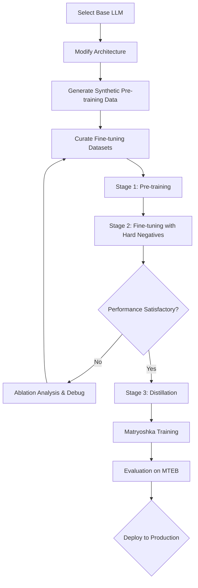

# State-of-the-Art Embedding Models: A Comprehensive Research Guide

## Executive Summary

The production of state-of-the-art (SOTA) text embedding models has crystallized into a dominant protocol, validated by recent breakthroughs from Qwen3, KaLM-Embedding-V2, and related research. This guide synthesizes current best practices into a comprehensive framework for building high-performance embedding systems. The core insight: **architecture is no longer the primary bottleneck—data quality and synthesis have become the limiting factor**.

---

## I. The Paradigm Shift: From Architecture to Data

### The Evolution of Embedding Research

The embedding landscape has undergone three distinct phases:

1. **Static Embeddings Era (2013-2018)**: Word2Vec, GloVe, FastText established vectoral semantics but suffered from polysemy blindness—each token received a single, context-independent vector.

2. **Contextual Embeddings Era (2018-2022)**: BERT and Transformer-based models introduced the observer effect—token meanings became dynamic, collapsing into specific states based on surrounding context.

3. **Foundation Model Adaptation Era (2022-Present)**: The current paradigm leverages massive decoder-only language models, adapted specifically for representation learning through architectural modifications and sophisticated data synthesis.

### The Current Bottleneck

**Critical Finding**: Model architecture improvements offer diminishing returns. The primary determinant of model quality is now:

- **Data volume** (scale)
- **Data diversity** (coverage of domains, languages, tasks)
- **Data quality** (synthetic generation vs. web scraping)
- **Data curation** (strategic mixing and hard negative mining)

A model trained on a superior dataset with a mediocre architecture will outperform a model with optimal architecture trained on inferior data.

---

## II. Foundation Model Selection: The Chassis

### Why Decoder-Only LLMs?

The current SOTA protocol abandons training small models from scratch. Instead, it begins with a pre-trained decoder-only foundation model (typically 1B-14B parameters) as the base.

**Advantages**:
- **Massive prior knowledge**: The LLM already encodes extensive world knowledge and linguistic understanding
- **Transfer learning efficiency**: Fine-tuning is orders of magnitude faster than training from scratch
- **Multilingual capability**: Modern LLMs support 50+ languages natively
- **Emergent reasoning**: Larger models exhibit improved compositional understanding

**Recommended Base Models** (as of 2024-2025):
- Qwen2.5 series (0.5B to 14B parameters)
- Mistral/Mixtral family
- Llama 3.x series
- Phi-3 (for efficiency-focused applications)

### Critical Architectural Modification: Bidirectional Attention

**The Problem**: Decoder-only models use causal (unidirectional) attention masks to enable autoregressive generation. For representation learning, this is suboptimal—you want each token to attend to ALL other tokens, not just preceding ones.

**The Solution**: Remove the causal attention mask during fine-tuning to enable fully bidirectional attention. This single modification is **mandatory** and provides substantial performance gains.

**Implementation Note**: This requires modifying the model's attention mechanism before training begins. Most modern frameworks allow attention mask customization during model initialization.

### Pooling Strategy: Simplicity Wins

Complex pooling mechanisms (weighted pooling, attention-based pooling, CLS token) have been eclipsed by **simple mean pooling** over all token embeddings.

**Why mean pooling works**:
- When the underlying model is sufficiently powerful, elaborate pooling adds minimal value
- Mean pooling is computationally efficient
- It avoids introducing additional trainable parameters
- Empirically performs as well or better than complex alternatives

**Practical Consideration**: Always exclude padding tokens from the mean calculation.

---

## III. Data Strategy: The Primary Determinant of Quality

### The Synthetic Data Revolution

**Paradigm**: Use larger, more capable LLMs as "data factories" to generate massive, high-quality training corpora.

#### Stage 1: Synthetic Pre-training Data Generation

**Process**:
1. **Seed Selection**: Curate a diverse set of seed documents spanning multiple domains (academic papers, Wikipedia, books, code, technical documentation)
2. **Query Generation**: Use a powerful LLM (e.g., GPT-4, Qwen3-32B, Claude) to generate queries for each document
3. **Persona Injection**: Apply diverse personas during generation to increase query diversity
4. **Scale**: Generate 100M-500M query-document pairs

**Persona-Driven Generation Example**:
```
Personas: ["curious student", "technical expert", "casual reader", "researcher", "business analyst"]

For each document:
    For each persona:
        Generate 3-5 queries that this persona would ask
        Vary query complexity, length, and formality
```

**Critical Success Factor**: The quality of synthetic data is bounded by the capability of the generator model. Using a GPT-4 class model is substantially superior to using a 7B parameter model.

#### Stage 2: High-Quality Supervised Fine-tuning Data

**Curation Philosophy**: Diversity trumps volume. KaLM-V2's success stems from curating **100+ distinct data categories**, including:

- **Semantic Similarity**: Sentence pairs with human-annotated similarity scores
- **Natural Language Inference**: Entailment, contradiction, neutral relationships
- **Question-Answering**: Query-passage pairs from MS MARCO, Natural Questions
- **Code Search**: Code snippet to natural language description
- **Cross-lingual Retrieval**: Parallel text in multiple languages
- **Domain-Specific**: Medical, legal, financial, scientific literature
- **Conversational**: Dialog-response pairs
- **Summarization**: Document-summary pairs
- **Paraphrase Detection**: Sentence pairs with paraphrase labels

**Data Mixing Strategy**:
- Temperature sampling from each category (not uniform)
- Up-weight categories where the model performs poorly
- Down-weight categories where performance plateaus
- Aim for 5M-20M examples total (smaller than pre-training, but higher quality)

### Hard Negative Mining: The Critical Component

**The Problem**: Random negative examples are too easy. The model learns to discriminate trivial differences, not nuanced semantic distinctions.

**The Solution**: Online hard negative mining with dynamic difficulty adjustment.

#### Online Hard Negative Mixing Protocol

1. **In-Batch Negatives**: Use other examples in the training batch as negatives
2. **Hard Negative Synthesis**: 
   - Use BM25 to retrieve documents with high lexical overlap but low semantic similarity
   - Generate adversarial queries using the LLM that are topically related but semantically distinct
   - Mine negatives that share entities/keywords but have different intents
3. **Dynamic Difficulty**: Gradually increase negative difficulty throughout training
4. **Negative-to-Positive Ratio**: Use 8-16 hard negatives per positive example

**Example Hard Negative**:
```
Query: "How does photosynthesis work?"
Positive: [Document explaining photosynthesis process]
Easy Negative: [Document about astrophysics]
Hard Negative: [Document about cellular respiration - related biological process but distinct]
```

### Data Quality Control

**Filtering Pipeline**:
1. **Deduplication**: Remove near-duplicate examples using MinHash or semantic similarity
2. **Length Filtering**: Remove extremely short (<10 tokens) or extremely long (>512 tokens) examples
3. **Quality Scoring**: Use a trained classifier to filter low-quality synthetic examples
4. **Language Detection**: Verify language labels, remove code-switched text unless intentional
5. **Toxicity Filtering**: Remove harmful, biased, or toxic content

---

## IV. Progressive Multi-Stage Training: The Optimization Pipeline

The SOTA protocol employs a three-stage training cascade, moving from coarse-grained to fine-grained knowledge.

### Stage 1: Weakly Supervised Pre-training

**Objective**: Build general-purpose representations on massive, noisy data

**Data**: 100M-500M synthetic query-document pairs

**Duration**: 1-3 epochs

**Batch Size**: 2048-4096 examples

**Learning Rate**: 1e-5 to 2e-5 (with warmup)

**Loss Function**: InfoNCE (in-batch contrastive loss)

$$
\mathcal{L}_{\text{InfoNCE}} = -\log \frac{\exp(\text{sim}(q, d^+)/\tau)}{\sum_{d \in \mathcal{D}} \exp(\text{sim}(q, d)/\tau)}
$$

where:
- $q$ = query embedding
- $d^+$ = positive document embedding
- $\mathcal{D}$ = all documents in batch (positives + negatives)
- $\tau$ = temperature (typically 0.05)
- $\text{sim}$ = cosine similarity or dot product

**Key Configuration**:
- Use gradient accumulation if GPU memory is limited
- Enable mixed-precision training (BF16 or FP16)
- Checkpoint every 10K-50K steps

### Stage 2: Supervised Fine-tuning

**Objective**: Specialize on diverse, high-quality task formats

**Data**: 5M-20M curated examples across 100+ categories

**Duration**: 3-10 epochs

**Batch Size**: 512-1024 examples

**Learning Rate**: 5e-6 to 1e-5 (lower than stage 1)

**Loss Function**: Enhanced contrastive loss with hard negatives

$$
\mathcal{L}_{\text{hard}} = -\log \frac{\exp(\text{sim}(q, d^+)/\tau)}{\exp(\text{sim}(q, d^+)/\tau) + \sum_{d^- \in \mathcal{D}^-} \exp(\text{sim}(q, d^-)/\tau)}
$$

where $\mathcal{D}^-$ includes both in-batch negatives and mined hard negatives.

**Critical Enhancement**: Focal-style reweighting

Apply dynamic sample weighting to focus on hard examples:

$$
\mathcal{L}_{\text{focal}} = -\alpha (1 - p)^\gamma \log(p)
$$

where:
- $p$ = model's predicted probability for the positive
- $\alpha$ = balancing factor (typically 0.25)
- $\gamma$ = focusing parameter (typically 2.0)

**Effect**: Easy examples (high $p$) receive minimal gradient updates; hard examples (low $p$) receive amplified gradients.

### Stage 3: Contrastive Distillation (Optional but Recommended)

**Objective**: Transfer fine-grained knowledge from a larger teacher model to the student

**Setup**: 
- Teacher: Larger or more capable model (e.g., 14B parameter model)
- Student: Your target model (e.g., 1.5B parameter model)

**Process**:
1. Generate embeddings for all training examples using both teacher and student
2. Compute soft similarity labels from teacher:

$$
p_{\text{teacher}}(d|q) = \frac{\exp(\text{sim}_{\text{teacher}}(q, d)/\tau_{\text{teacher}})}{\sum_{d' \in \mathcal{D}} \exp(\text{sim}_{\text{teacher}}(q, d')/\tau_{\text{teacher}})}
$$

3. Train student to match teacher's probability distribution:

$$
\mathcal{L}_{\text{distill}} = \text{KL}(p_{\text{teacher}} \| p_{\text{student}})
$$

**Why This Works**: The teacher model encodes nuanced semantic distinctions (e.g., "extremely similar" vs. "moderately similar") that binary labels cannot capture. The student learns to reproduce these fine-grained judgments.

**Data Efficiency**: Distillation can use a smaller dataset (1M-5M examples) because the teacher provides richer training signal than hard labels.

---

## V. Advanced Loss Functions & Optimization

### Multi-Objective Loss Composition

For models targeting multiple downstream tasks, compose losses with task-specific weighting:

$$
\mathcal{L}_{\text{total}} = \sum_{t=1}^{T} \lambda_t \mathcal{L}_t
$$

**Task Examples**:
- $\mathcal{L}_{\text{retrieval}}$: Contrastive loss for search
- $\mathcal{L}_{\text{similarity}}$: Regression loss for STS tasks
- $\mathcal{L}_{\text{classification}}$: Cross-entropy for categorization

**Weight Scheduling**: Start with uniform weights, then increase weights for underperforming tasks during training.

### Geometric Consistency Regularization

Encourage the embedding space to respect geometric properties:

$$
\mathcal{L}_{\text{triangle}} = \max(0, d(a, c) - d(a, b) - d(b, c) + \epsilon)
$$

This triangle inequality constraint prevents pathological embeddings where similarity transitivity breaks down.

### Temperature Scaling

The temperature parameter $\tau$ in contrastive losses is critical:

- **Low temperature** (0.01-0.05): Sharpens distinctions, emphasizes hard negatives
- **High temperature** (0.1-0.2): Smooths probability distribution, reduces overfitting

**Best Practice**: Start with $\tau = 0.05$ and anneal slightly during training if validation performance plateaus.

---

## VI. Matryoshka Representation Learning: Variable-Dimension Embeddings

### The Problem

Standard embedding models produce fixed-dimension outputs (e.g., 768-dimensional vectors). This creates inefficiency:
- Large dimensions are expensive to store and retrieve
- Many downstream tasks don't require full representational capacity
- No flexibility to trade performance for efficiency

### The Solution: Matryoshka Embeddings

**Core Idea**: Train the model such that truncated prefixes of the embedding vector remain semantically useful. A 768-dimensional embedding can be truncated to 256, 128, or 64 dimensions with graceful performance degradation.

**Metaphor**: Like Russian nesting dolls, critical information is frontloaded in early dimensions, with less critical information in later dimensions.

### Training Methodology

Modify the loss function to optimize embeddings at multiple dimensionalities simultaneously:

$$
\mathcal{L}_{\text{Matryoshka}} = \sum_{d \in \mathcal{D}} w_d \cdot \mathcal{L}(E[:d])
$$

where:
- $\mathcal{D} = \{64, 128, 256, 512, 768\}$ (dimensionality set)
- $E[:d]$ = first $d$ dimensions of embedding
- $w_d$ = weight for dimension $d$ (typically uniform: $w_d = 1$)
- $\mathcal{L}$ = base contrastive loss (e.g., InfoNCE)

**Implementation**:
1. Compute full embedding (e.g., 768-dim)
2. For each target dimension in $\mathcal{D}$:
   - Truncate embedding to that dimension
   - Compute loss using truncated embeddings
3. Sum all losses and backpropagate

**Training Cost**: Minimal overhead (~10-20% increase in training time)

### Performance Characteristics

**Empirical Results** (from Matryoshka research):

| Dimension | % of Full Size | % Performance Retained |
|-----------|----------------|------------------------|
| 768 (full)| 100%           | 100%                   |
| 512       | 66.7%          | 99.5%                  |
| 256       | 33.3%          | 98.9%                  |
| 128       | 16.7%          | 97.8%                  |
| 64        | 8.3%           | 98.4%                  |

**Key Finding**: Even at 64 dimensions (8.3% of full size), the Matryoshka model retains 98%+ of full performance, significantly outperforming naive truncation of standard models (which drops to ~85% performance).

### Deployment Strategy: Shortlisting & Reranking

1. **Initial Retrieval**: Use truncated embeddings (e.g., 64-dim) for fast approximate nearest neighbor search over entire corpus
2. **Shortlist**: Retrieve top-K candidates (e.g., K=1000)
3. **Reranking**: Use full embeddings (768-dim) to rerank shortlist for final results

**Efficiency Gain**: 10-15x speedup in retrieval with <2% performance loss

---

## VII. Multi-Objective Learning: Handling Conflicting Goals

### The Generalist-Specialist Paradox

When training a single model for multiple objectives (e.g., click-through rate prediction + conversion prediction + engagement metrics), **gradient conflict** emerges:

**Problem**: Different objectives pull model parameters in conflicting directions, leading to:
- Catastrophic forgetting (later objectives overwrite earlier learning)
- Degraded overall performance
- Unstable training dynamics

### Solution 1: Cascaded Selective Mask Fine-Tuning (CSMF)

**Philosophy**: Respect the causal hierarchy of user behavior.

**Process**:
1. **Stage 1**: Train on exposure/impression objective
   - All parameters trainable
2. **Stage 2**: Train on click objective
   - Freeze bottom 50% of layers
   - Apply layer dropout (randomly drop 20% of remaining layers)
3. **Stage 3**: Train on conversion objective
   - Freeze bottom 75% of layers
   - Apply aggressive layer dropout (30%)

**Rationale**: Early layers learn general representations; later layers learn task-specific transformations. By progressively freezing layers, you prevent lower-level representations from being corrupted while allowing task-specific adaptation.

**Parameter Efficiency**: This approach maintains constant model size and inference cost (unlike Mixture-of-Experts).

### Solution 2: Task-Specific Projection Heads

**Architecture**:
```
[Shared Encoder (frozen or lightly tuned)]
          ↓
    [Base Embedding]
          ↓
    ↙     ↓     ↘
[Task A] [Task B] [Task C]
[Head]   [Head]   [Head]
```

Each task has a small projection layer (1-2 layers, <5% of total parameters) that maps the shared embedding to task-specific space.

**Training**: Alternate between tasks, updating only the active task's head plus a small portion of the shared encoder.

---

## VIII. Architecture Design Principles

### Attention Mechanism Modifications

#### Multi-Scale Contextual Encoding

Standard Transformers use a single attention mechanism with fixed receptive field. SOTA models employ **hierarchical attention**:

**Layer Structure**:
- **Lower Layers (1-4)**: Local attention (window size: 128 tokens)
  - Captures fine-grained syntax and local coherence
- **Middle Layers (5-8)**: Global attention (full sequence)
  - Captures document-level semantics
- **Upper Layers (9-12)**: Sparse attention (strided with stride=4)
  - Captures high-level discourse structure

**Benefit**: Rich, multi-resolution representations without quadratic scaling to very long sequences.

#### Relative Position Encodings

Absolute position embeddings are suboptimal for variable-length inputs. Use **RoPE (Rotary Position Embeddings)** or **ALiBi (Attention with Linear Biases)**:

**RoPE**: Applies rotation matrices to query and key vectors based on relative positions

**ALiBi**: Adds position-dependent bias to attention scores:
$$
\text{score}(q_i, k_j) = q_i^T k_j - \lambda |i - j|
$$

**Advantage**: Better generalization to sequence lengths beyond those seen during training.

### Dimensionality Considerations

**Embedding Dimension** (output):
- **Small models** (100M-500M params): 512-768 dimensions
- **Medium models** (500M-3B params): 768-1024 dimensions
- **Large models** (3B+ params): 1024-2048 dimensions

**Hidden Dimension** (internal):
- Typically 4× embedding dimension (standard Transformer ratio)

**Number of Layers**:
- **Shallow models** (6-8 layers): Faster inference, lower capacity
- **Deep models** (12-24 layers): Higher capacity, better performance, slower inference

**Trade-off**: Deeper models with smaller hidden dimensions often outperform shallower models with larger hidden dimensions at similar parameter counts.

---

## IX. Evaluation & Benchmarking

### Canonical Benchmarks

**MTEB (Massive Text Embedding Benchmark)**: The gold standard for comprehensive evaluation

**Task Categories** (56 datasets across 8 categories):
1. **Retrieval**: Information retrieval tasks (e.g., MS MARCO, Natural Questions)
2. **Reranking**: Reranking retrieved candidates
3. **Clustering**: Document clustering (e.g., ArXiv classification)
4. **Classification**: Text classification tasks
5. **Semantic Textual Similarity**: STS Benchmark, SICK-R
6. **Pair Classification**: Duplicate detection, paraphrase identification
7. **Summarization**: Evaluate summary quality
8. **BitextMining**: Cross-lingual sentence alignment

**Reporting**: Always report MTEB average score alongside task-specific breakdowns.

### Domain-Specific Evaluation

Create custom evaluation sets for your target domain:
- **In-domain retrieval**: Curate 1K-5K query-document pairs from your domain
- **Hard negatives**: Manually verify that negatives are semantically distinct
- **Human annotation**: Gold-standard labels from domain experts

### Ablation Studies

Systematically evaluate contributions of each component:

| Component Removed | MTEB Score | Δ Performance |
|-------------------|------------|---------------|
| None (full model) | 72.5       | -             |
| - Synthetic data  | 68.3       | -4.2          |
| - Hard negatives  | 69.8       | -2.7          |
| - Stage 3 distillation | 71.2  | -1.3          |
| - Bidirectional attention | 65.9 | -6.6       |
| - Matryoshka loss | 72.3       | -0.2          |

**Insight**: This quantifies which innovations provide the most value.

---

## X. The Production Pipeline: End-to-End Workflow



### Computational Requirements

**Training Time Estimates** (on 8×A100 GPUs):

| Model Size | Stage 1 | Stage 2 | Stage 3 | Total |
|------------|---------|---------|---------|-------|
| 1B params  | 3 days  | 2 days  | 1 day   | 6 days|
| 3B params  | 7 days  | 4 days  | 2 days  | 13 days|
| 7B params  | 14 days | 7 days  | 3 days  | 24 days|

**Data Storage**:
- Synthetic pre-training data: 200-500GB
- Fine-tuning datasets: 20-100GB
- Model checkpoints: 5-30GB per checkpoint

---

## XI. Current Limitations & Open Problems

### 1. Synthetic Data Dependence

**Vulnerability**: The entire pipeline relies on high-quality LLMs for data generation. This creates:
- Centralized bottleneck (only few entities can train frontier LLMs)
- Inherited biases from generator models
- Homogenization of training distributions

**Open Problem**: Can we develop synthetic data generation that doesn't require 30B+ parameter models?

### 2. Architectural Mismatch

**Issue**: Decoder-only Transformers were designed for autoregressive generation, not representation learning. Removing the causal mask is a retrofit, not an optimal design.

**Open Problem**: Should we develop bespoke architectures specifically for embedding tasks? Candidates:
- Encoder-only models with advanced attention mechanisms
- Hybrid architectures with separate encoding and aggregation stages
- Graph neural networks for structured representation

### 3. Evaluation Limitations

**Challenge**: MTEB and similar benchmarks measure average performance across tasks. But real-world applications often require excellence in a single, specific task.

**Open Problem**: How do we balance general-purpose capability with task-specific optimization?

### 4. Geometric Constraints

**Issue**: Euclidean vector spaces impose constraints on representational capacity. Hierarchical data (taxonomies, ontologies) and cyclical data (temporal, spatial) are poorly represented in flat geometry.

**Emerging Solutions**:
- **Hyperbolic embeddings**: For hierarchical data (constant negative curvature)
- **Spherical embeddings**: For bounded, cyclical data
- **Mixed-curvature spaces**: Combining multiple geometries

**Open Problem**: Can we train models that adaptively select geometry per data point?

---

## XII. Future Directions

### 1. Adaptive Geometry Selection

**Vision**: Models that dynamically choose the optimal embedding geometry based on local data structure.

**Mechanism**: Mixture-of-Geometric-Experts architecture where attention gates select between Euclidean, hyperbolic, and spherical operators for each token.

### 2. Continuous Learning

**Vision**: Embedding models that continuously adapt to new domains and languages without catastrophic forgetting.

**Approaches**:
- Elastic Weight Consolidation (EWC)
- Progressive Neural Networks
- Memory-augmented architectures

### 3. Multimodal Embeddings

**Vision**: Unified embedding space for text, images, audio, and code.

**Current Leaders**: CLIP, ALIGN, ImageBind

**Challenge**: How to maintain strong unimodal performance while achieving tight cross-modal alignment?

### 4. Efficient Training

**Vision**: Train SOTA embeddings with 10× less compute.

**Approaches**:
- Better pre-training model (already partially achieved via foundation model reuse)
- Curriculum learning with intelligent data ordering
- Automated hyperparameter optimization
- Gradient checkpointing and mixed-precision innovations

---

## XIII. The Fundamental Truth: Data is the Asymptote

**The Central Insight**: The dominant protocol has pushed architectural optimization to its limits. Marginal gains from novel architectures are shrinking. The field has entered a regime where **data quality and scale are the primary levers for improvement**.

**Empirical Evidence**:
- Models with identical architectures but trained on synthetic vs. scraped data show 10-15 point MTEB score differences
- Adding 100M high-quality examples provides greater gains than doubling model size
- Hard negative quality impacts performance more than model depth

**Strategic Implication**: Research investment should prioritize:
1. Advanced data synthesis techniques
2. Curriculum and data ordering strategies
3. Multi-stage training protocols
4. Automated data quality assessment

Architecture innovation remains valuable but is now a secondary concern.

---

## XIV. Conclusion: The Recipe

To build a state-of-the-art embedding model in 2025:

1. **Foundation**: Start with a 1-7B parameter decoder-only LLM
2. **Modify**: Remove causal attention mask → bidirectional attention
3. **Data**: Generate 100M+ synthetic query-document pairs using a frontier LLM
4. **Curate**: Build diverse fine-tuning set (5M+ examples, 100+ categories)
5. **Train Stage 1**: Weakly supervised pre-training on synthetic data
6. **Train Stage 2**: Supervised fine-tuning with online hard negatives and focal loss
7. **Train Stage 3**: Optional distillation from larger teacher model
8. **Enhance**: Apply Matryoshka loss for variable-dimension flexibility
9. **Evaluate**: Benchmark on MTEB and domain-specific tests
10. **Iterate**: Ablation studies to identify weaknesses

**Expected Performance**: Following this protocol rigorously should yield MTEB scores in the 65-75 range, placing the model in the top tier of open-source embeddings.

**The Meta-Lesson**: The protocol itself is now well-established and somewhat commodified. **Competitive advantage comes from execution quality**—particularly in data synthesis, curation, and hard negative mining. These are labor-intensive, detail-oriented processes that resist automation. The most successful embedding models will be those built by teams that deeply understand their target domain and can craft training distributions that reflect real-world usage patterns.

The embedding problem is not solved. But the path forward is clear.