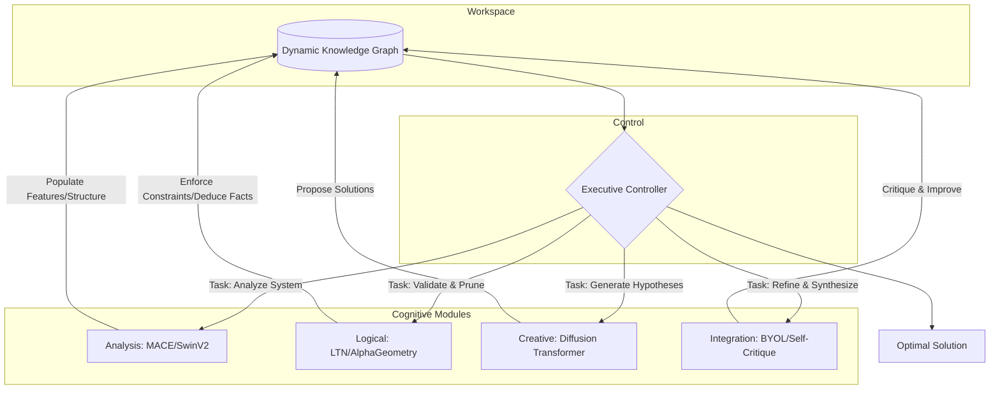

### **System Audit: A Unified Guide to Implementing Cognitive Frameworks in Deep Neural Networks**

This document provides an operational blueprint for architecting deep neural networks as functional analogues of cognitive processes. It synthesizes state-of-the-art models, mathematical constraint methodologies, and practical implementation strategies into a coherent, self-contained guide. The core thesis is that the next generation of AI will be defined by the convergence of high-dimensional pattern recognition with the rigor of formal mathematical and logical reasoning.

---

### **Table of Contents**
1.  **Analysis Frameworks:** Deconstructing Complexity
2.  **Logical Frameworks:** Structured Reasoning & Constraint Enforcement
3.  **Creative Frameworks:** Generating Novelty
4.  **Integration Frameworks:** Synthesizing Knowledge
5.  **Mathematical & Physical Constraint Enforcement:** Imposing Ground Truth
6.  **System Architecture & Deployment:** From Theory to Production

---

### **1. Analysis Frameworks: Deconstructing Complexity**

These frameworks parse, model, and predict system behavior by analyzing structure, components, and interactions. They are the perception layer of a cognitive architecture.

#### **Systems Thinking**
*   **Core Principle:** A system's emergent properties arise from the non-linear interactions and feedback loops of its components. Understanding is derived from modeling these interactions.
*   **AI Implementation:** Equivariant Graph Neural Networks (GNNs).
*   **State-of-the-Art:** **MACE (Higher Order Equivariant Message Passing)** achieves sub-kcal/mol accuracy in molecular dynamics by incorporating 4-body interactions. **Geometric Algebra Transformers (GATr)** process multivectors for natural handling of rotations and reflections.
*   **Constraint & Architectural Mandates:** The architecture must respect the system's underlying symmetries (e.g., E(3) equivariance for physical systems). Higher-order structures are modeled using topological deep learning (simplicial/cell complexes) to preserve invariants and mitigate over-squashing.
*   **Core Mechanism:** Equivariant higher-order message passing. Node updates are constrained to be covariant with physical transformations (translation, rotation), ensuring the model learns physically plausible representations.

    ```python
    # MACE Layer: E(3)-Equivariant Message Passing
    class MACELayer(keras.layers.Layer):
        def __init__(self, num_features, max_ell=3, hidden_irreps="128x0e+128x1o"):
            super().__init__()
            self.spherical_harmonics = SphericalHarmonics(max_ell)
            self.message_constructor = HigherOrderMessages(
                node_irreps=hidden_irreps,
                edge_irreps=f"{max_ell+1}x{max_ell}e",
                correlation_order=3 # 4-body interactions
            )
            self.aggregator = EquivariantAggregator(hidden_irreps)
            
        def call(self, node_features, edge_index, positions):
            edge_vectors = positions[edge_index[1]] - positions[edge_index[0]]
            distances = tf.norm(edge_vectors, axis=-1, keepdims=True)
            edge_sh = self.spherical_harmonics(edge_vectors)
            messages = self.message_constructor(node_features, edge_sh, distances, edge_index)
            aggregated = self.aggregator(messages, edge_index[1], tf.shape(node_features)[0])
            return aggregated
    ```
*   **Systemic Failure Mode:** **Oversmoothing.** After too many message-passing iterations, node representations converge, losing local information. This imposes a hard limit on the depth of systemic interaction that can be modeled without hierarchical or multi-scale architectures.

#### **Reductionist Thinking**
*   **Core Principle:** Decompose a complex system into its fundamental components, analyze their individual functions, and reassemble that understanding.
*   **AI Implementation:** Convolutional Neural Networks (CNNs).
*   **State-of-the-Art:** **ConvNeXt** modernizes CNNs by integrating Transformer design principles (large kernels, LayerNorm), achieving 87.8% ImageNet accuracy with high efficiency.
*   **Core Mechanism:** A hierarchy of convolutions and pooling. Early layers detect simple, localized patterns (decomposition). Deeper layers compose these into abstract motifs. The final fully-connected layers perform a statistical aggregation to correlate features with a label.
*   **Systemic Critique:** The "reassembly" is a statistical correlation, not a logical reconstruction. The model learns `P(Label | Features)`, not a causal model of how the components form the whole.

#### **Holistic Thinking**
*   **Core Principle:** A system's meaning is derived from the global context of all its components simultaneously.
*   **AI Implementation:** Transformers.
*   **State-of-the-Art:** **Swin Transformer V2** achieves linear complexity for vision tasks through shifted window attention. **Structured State Space Models (Mamba)** provide linear scaling with sequence length, enabling context propagation across over 1 million tokens.
*   **Core Mechanism:** Self-attention. For every token, the mechanism computes an attention score against every other token, creating a fully contextualized representation in a single layer.

    ```python
    # Swin Transformer Block: Hierarchical & Efficient Attention
    class SwinTransformerBlock(keras.layers.Layer):
        def __init__(self, dim, num_heads, window_size=7, shift_size=0):
            super().__init__()
            self.shift_size = shift_size
            self.window_size = window_size
            self.norm1 = keras.layers.LayerNormalization(epsilon=1e-5)
            self.attn = WindowAttention(dim, window_size=(window_size, window_size), num_heads=num_heads)
            self.norm2 = keras.layers.LayerNormalization(epsilon=1e-5)
            self.mlp = Mlp(dim, hidden_features=int(dim * 4))
            
        def call(self, x):
            B, H, W, C = keras.ops.shape(x)
            shortcut = x
            x = self.norm1(x)
            
            if self.shift_size > 0:
                x = keras.ops.roll(x, shift=(-self.shift_size, -self.shift_size), axis=(1, 2))
            
            x_windows = window_partition(x, self.window_size)
            attn_windows = self.attn(x_windows)
            
            x = window_reverse(attn_windows, self.window_size, H, W)
            if self.shift_size > 0:
                x = keras.ops.roll(x, shift=(self.shift_size, self.shift_size), axis=(1, 2))
            
            x = shortcut + x
            x = x + self.mlp(self.norm2(x))
            return x
    ```
*   **Systemic Trade-off:** Standard self-attention has `O(n^2)` complexity, making it computationally prohibitive for very long sequences, a bottleneck that architectures like Swin and Mamba are designed to overcome.

---

### **2. Logical Frameworks: Structured Reasoning & Constraint Enforcement**

These frameworks apply formal rules and principles to data to derive reliable, verifiable conclusions. They provide the formal reasoning core.

#### **Deductive Thinking**
*   **Core Principle:** Top-down logic. From a general rule, derive a specific conclusion. `(P → Q) ∧ P ⊢ Q`.
*   **AI Implementation:** Neuro-Symbolic AI.
*   **State-of-the-Art:** **AlphaGeometry** combines a neural language model with a symbolic deduction engine, achieving near-gold performance on IMO problems. **Logic Tensor Networks (LTN)** translate first-order logic into a differentiable TensorFlow graph, achieving 90-95% constraint satisfaction. **Scallop** provides a mature differentiable Datalog for seamless integration with PyTorch.
*   **Core Mechanism:** A bifurcated architecture of a neural perception module that grounds symbols from raw data, and a symbolic reasoning engine that operates on these symbols using a formal knowledge base. The interface between these two is the critical component.

    ```python
    # Logic Tensor Networks: Differentiable First-Order Logic
    import ltn
    # Define neural predicates
    cat = ltn.Predicate.MLP([32, 16, 1], activation="sigmoid")
    part_of = ltn.Predicate.MLP([64, 32, 1], activation="sigmoid")
    tail = ltn.Predicate.MLP([32, 16, 1], activation="sigmoid")
    
    # Define logical variables for tensors
    x_var = ltn.Variable("x", features)
    y_var = ltn.Variable("y", parts)
    
    # Express logical constraint: ∀x(cat(x) → ∃y(partOf(x,y) ∧ tail(y)))
    formula_sat = ltn.forall(x_var, 
        ltn.implies(cat(x_var),
            ltn.exists(y_var, ltn.and_(part_of([x_var, y_var]), tail(y_var)))
        )
    )
    
    # Add constraint satisfaction to the training loss
    total_loss = data_loss + lambda_logic * (1 - formula_sat.tensor)
    ```
*   **Systemic Failure Mode:** **The Grounding Problem.** The symbolic engine manipulates symbols (`cat`, `tail`) whose meaning is entirely dependent on the accuracy of the neural perception module. Perceptual errors lead to logically sound but factually incorrect deductions.

#### **Inductive Thinking**
*   **Core Principle:** Bottom-up logic. Generalize a principle from a finite set of specific observations.
*   **AI Implementation:** Standard Supervised Machine Learning.
*   **Core Mechanism:** Optimization via gradient descent. The model's weights converge through repeated exposure to labeled examples, representing the induced general principle.
*   **Systemic Risk:** **Spurious Correlation.** Induction is a statistical inference, not a proof. If training data is biased or non-representative, the model will induce a flawed or harmful general principle (algorithmic bias).

#### **Abductive Thinking**
*   **Core Principle:** Inference to the best explanation. Given an observation, find the most plausible underlying cause.
*   **AI Implementation:** Generative Models (VAEs, GANs, Diffusion Models).
*   **State-of-the-Art:** **Diffusion Transformers (DiT)** replace the standard U-Net backbone in diffusion models with a Transformer, demonstrating superior parameter scaling.
*   **Core Mechanism:** The model learns the underlying probability distribution of the data `P(X)`. Abduction is performed by finding the most likely latent variables (the "explanation") that could have generated the observed data, often through an iterative denoising process.

---

### **3. Creative Frameworks: Generating Novelty**

These frameworks synthesize new information, ideas, and solutions by exploring a learned possibility space.

#### **Divergent & Lateral Thinking**
*   **Core Principle:** Generate a broad spectrum of novel ideas by exploring many possible solutions, often by breaking established patterns.
*   **AI Implementation:** Generative Models with controlled stochastic sampling.
*   **State-of-the-Art:** **Latent Diffusion Models** achieve high-quality generation with 8x compression by operating in a VAE-based latent space.
*   **Core Mechanism:** Controlled stochasticity via advanced sampling strategies.
    *   **Classifier-Free Guidance:** Amplifies the influence of a text prompt to improve sample quality and controllability.
    *   **Nucleus (Top-p) Sampling:** Balances creativity and coherence by sampling from a dynamic subset of the most probable next tokens.
    *   **High Temperature:** Increases randomness by flattening the probability distribution, leading to more unexpected outputs.

    ```python
    # Creative Sampler with Classifier-Free Guidance
    class CreativeSampler:
        def __init__(self, model, temperature=1.0, top_p=0.95):
            self.model = model
            self.temperature = temperature
            self.top_p = top_p
        
        def sample_with_guidance(self, prompt, num_steps=50, guidance_scale=7.5):
            text_embedding = self.model.encode_text(prompt)
            null_embedding = self.model.encode_text("")
            x = tf.random.normal((1, 64, 64, 4)) # Latent space dimensions
            
            for t in reversed(range(num_steps)):
                # Predict noise for both conditional and unconditional paths
                noise_cond = self.model.predict_noise(x, t, text_embedding)
                noise_uncond = self.model.predict_noise(x, t, null_embedding)
                # Extrapolate to guide the generation
                noise_pred = noise_uncond + guidance_scale * (noise_cond - noise_uncond)
                x = self.denoise_step(x, noise_pred, t)
            
            return self.model.vae_decoder(x)
    ```

#### **Convergent Thinking**
*   **Core Principle:** Narrow a wide range of possibilities to find a single, optimal solution based on a set of criteria.
*   **AI Implementation:** Optimization, Reinforcement Learning (RL), and Classification models.
*   **Core Mechanism:** Maximization of an objective function. In a classifier, `ArgMax` selects the most probable class. In RL, policy optimization converges on actions that maximize expected reward. The entire process of gradient descent is a convergent search for optimal weights.

#### **Analogical Thinking**
*   **Core Principle:** Transfer relational knowledge from a well-understood source domain to a less-understood target domain.
*   **AI Implementation:** Transfer Learning and Meta-Learning.
*   **Core Mechanism:** Bi-level optimization (as in MAML) or feature re-use (fine-tuning). Meta-learning trains a model to be a fast learner by optimizing for performance across a distribution of tasks. Standard fine-tuning leverages general features learned from a massive source dataset (e.g., ImageNet) and adapts them to a specific target task.

---

### **4. Integration Frameworks: Synthesizing Knowledge**

These frameworks combine disparate or conflicting information to create a higher-level understanding.

#### **Dialectical Thinking**
*   **Core Principle:** A process of resolving conflict between a thesis and its antithesis to produce a synthesis that transcends both.
*   **AI Implementation:** Generative Adversarial Networks (GANs); Constitutional AI.
*   **Core Mechanism:** Adversarial loss. A Generator (thesis) proposes data, and a Discriminator (antithesis) critiques it. This zero-sum game forces the Generator to produce an increasingly refined synthesis. In Constitutional AI, a model critiques and refines its own output based on a set of principles, creating an internal dialectic.
*   **Systemic Challenge:** **Instability.** The adversarial process is prone to mode collapse (Generator produces limited outputs) or vanishing gradients (Discriminator becomes too strong), requiring careful stabilization techniques.

#### **Higher-Order Logic**
*   **Core Principle:** Reasoning about the process of reasoning itself; analyzing and drawing conclusions about statements and properties.
*   **AI Implementation:** Meta-Learning; Self-Supervised Learning (SSL).
*   **State-of-the-Art:** **BYOL (Bootstrap Your Own Latent)** achieves robust representation learning without negative pairs by having an online network predict the output of a target network (a slow-moving average of itself).
*   **Core Mechanism:** An outer optimization loop that updates a model based on its performance across a distribution of tasks or augmentations. The system learns the *property* of "learnability" or "invariance" rather than features for a single task.

    ```python
    # BYOL: Self-Supervised Learning without Negative Pairs
    class BYOL(keras.Model):
        def __init__(self, encoder, projection_dim=256, tau=0.996):
            super().__init__()
            self.tau = tau
            # Online network (student)
            self.online_encoder = encoder
            self.online_projector = self.build_projector(projection_dim)
            self.predictor = self.build_predictor(projection_dim)
            # Target network (teacher) - EMA updated, no gradients
            self.target_encoder = keras.models.clone_model(encoder)
            self.target_projector = keras.models.clone_model(self.online_projector)
            self.target_encoder.trainable = False
            self.target_projector.trainable = False
        
        def call(self, inputs):
            view1, view2 = inputs
            online_pred1 = self.predictor(self.online_projector(self.online_encoder(view1)))
            target_proj2 = self.target_projector(self.target_encoder(view2))
            loss = self.regression_loss(online_pred1, tf.stop_gradient(target_proj2))
            return loss

        def update_target_network(self):
            for online_w, target_w in zip(self.online_encoder.weights, self.target_encoder.weights):
                target_w.assign(self.tau * target_w + (1 - self.tau) * online_w)
    ```

---

### **5. Mathematical & Physical Constraint Enforcement: Imposing Ground Truth**

This is not a single cognitive framework but a cross-cutting methodology essential for building reliable AI. Constrained networks consistently achieve **20-50% performance improvements** over unconstrained versions.

*   **Physics-Informed Neural Networks (PINNs):** Embed differential equations directly into the loss function: `Loss = Loss_data + λ * Loss_physics`. `Loss_physics` penalizes the network if its output violates known physical laws (e.g., conservation of energy). Achieves >99% conservation accuracy.
*   **Augmented Lagrangian Methods:** A principled approach for constrained optimization by adding penalty terms and dual variables to the objective function, adapting penalties based on constraint violation.
*   **Projection Methods (Hard Constraints):** Use differentiable projection layers that force the network's output to lie on a constraint manifold (e.g., `P(y) = y - Aᵀ(AAᵀ)⁻¹max(0, Ay - b)`), guaranteeing constraint satisfaction.
*   **Symmetry & Conservation Laws:** Architectures like Lagrangian Neural Networks are designed to inherently conserve physical quantities like energy and momentum by leveraging Noether's theorem, which links symmetries to conservation laws.

---

### **6. System Architecture & Deployment: From Theory to Production**

Advanced AI systems are modular cognitive engines, orchestrating specialized components.

#### **Hybrid Cognitive Engine Architecture**

An executive controller manages a shared workspace (e.g., a dynamic knowledge graph) and deploys cognitive modules cyclically.



#### **Optimization & Deployment Strategy**

1.  **Phased Implementation:**
    *   **Foundation:** Pre-train a robust feature encoder using self-supervised methods (BYOL).
    *   **Specialization:** Fine-tune with domain-specific analysis modules (MACE for science, ConvNeXt for vision) and logical constraints (LTN).
    *   **Integration:** Combine modules using Mixture-of-Experts (MoE) architectures for efficient scaling.
2.  **Memory & Speed Optimization:**
    *   **Mixed Precision Training:** Use `float16` for computations and `float32` for weights to leverage Tensor Cores for a ~2x speedup. Keras `LossScaleOptimizer` handles numerical stability automatically.
    *   **Gradient Accumulation:** Process mini-batches sequentially and accumulate gradients before performing a weight update. This simulates a larger batch size without the corresponding memory footprint.
    *   **JAX Compilation:** Use Just-In-Time (JIT) compilation for constraint-checking and model execution for 5-10x acceleration.
3.  **Deployment & Monitoring:**
    *   **Distributed Training:** Use `tf.distribute.Strategy` (e.g., `MirroredStrategy`) to scale training across multiple GPUs/TPUs with automatic data and model sharding.
    *   **Modular Retrofitting:** Use Low-Rank Adaptation (LoRA) to add constraint-aware adapters to existing models, adding only 0.1-3% of parameters and avoiding costly retraining.
    *   **Continuous Monitoring:** Deploy with comprehensive monitoring for accuracy, creative diversity, and, crucially, constraint satisfaction. Implement adaptive loops that automatically strengthen constraint penalties or adjust creative sampling parameters based on live performance data.