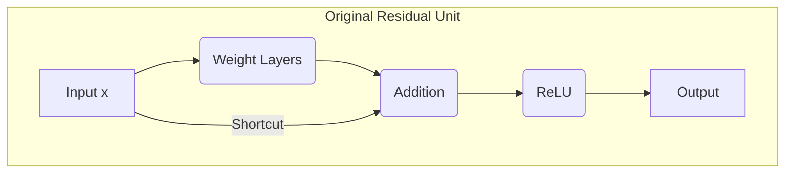
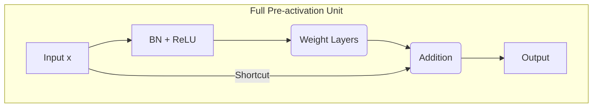

### A Survey of Residual Unit Variations in "Identity Mappings in Deep Residual Networks"

The 2016 paper "Identity Mappings in Deep Residual Networks" by He et al. provides a detailed analysis of the propagation dynamics within Deep Residual Networks (ResNets). The authors investigate the hypothesis that information propagation is most effective when both the skip connection and the after-addition activation function are identity mappings, creating a "clean" information path through the network.

To test this, the paper presents a series of ablation studies, systematically modifying the standard ResNet "residual unit" to disrupt this clean path. The performance of these variations is compared against the original unit and a proposed improved unit. This document surveys the different residual block variations analyzed and proposed in the paper, using Mermaid diagrams to illustrate their architectural differences.

---

### 1. Original Residual Unit

The paper begins by analyzing the original Residual Unit from "Deep Residual Learning for Image Recognition" [1]. This architecture serves as the baseline for comparison. It features an identity skip connection, with a ReLU activation function applied after the element-wise addition.

**Description:** The input `x_l` is passed through a stack of layers (the residual function `F`). The original input is also passed through an identity shortcut. The two paths are added together, and a ReLU activation is applied to the sum.

```mermaid
graph TD
    subgraph Residual Path
        B(Weight) --> C(BN) --> D(ReLU) --> E(Weight) --> F(BN);
    end

    subgraph Shortcut Path
        H(Identity Shortcut);
    end

    A[x_l] --> B;
    A --> H;

    F --> G(Addition);
    H --> G;
    G --> I(ReLU);
    I --> J[x_{l+1}];

    style B fill:#f9f,stroke:#333,stroke-width:2px
    style E fill:#f9f,stroke:#333,stroke-width:2px
```

---

### 2. Variations on the Shortcut Connection

The paper investigates several modifications to the identity shortcut connection to analyze their impact on information propagation and optimization. The findings suggest that operations that impede the "clean" shortcut path lead to optimization difficulties and higher error rates.

#### a. Constant Scaling

**Description:** The shortcut path is scaled by a constant factor (e.g., λ = 0.5). The paper reports that this variation struggles to converge or results in substantially higher test error, suggesting that scaling down the shortcut signal hampers optimization.

```mermaid
graph TD
    subgraph Residual Path
        B(Weight) --> C(BN) --> D(ReLU) --> E(Weight) --> F(BN);
    end

    subgraph Shortcut Path
        H(Identity Shortcut) --> H_scale(x 0.5);
    end

    A[x_l] --> B;
    A --> H;

    F --> G(Addition);
    H_scale --> G;
    G --> I(ReLU);
    I --> J[x_{l+1}];

    style B fill:#f9f,stroke:#333,stroke-width:2px
    style E fill:#f9f,stroke:#333,stroke-width:2px
    style H_scale fill:#bbf,stroke:#333,stroke-width:2px
```

#### b. Gating Mechanisms

Following Highway Networks, gating functions are introduced to modulate the signal. A gating function `g(x)` is implemented as a 1x1 convolution followed by a sigmoid activation.

**i. Exclusive Gating:** The residual path is scaled by `g(x)` and the shortcut path is scaled by `1 - g(x)`. The paper reports that this configuration lags behind the baseline performance, with training being highly sensitive to the initialization of the gate biases.

```mermaid
graph TD
    subgraph Gating Function
        G_calc(g(x) = Sigmoid(1x1 Conv));
    end

    subgraph Residual Path
        B(Weight) --> C(BN) --> D(ReLU) --> E(Weight) --> F(BN);
        F -- x g(x) --> F_scaled;
    end

    subgraph Shortcut Path
        H(Identity Shortcut);
        H -- x (1 - g(x)) --> H_scaled;
    end
    
    A[x_l] --> G_calc;
    A --> B;
    A --> H;

    F_scaled --> G(Addition);
    H_scaled --> G;
    G --> I(ReLU);
    I --> J[x_{l+1}];

    style G_calc fill:#bbf,stroke:#333,stroke-width:2px
    style B fill:#f9f,stroke:#333,stroke-width:2px
    style E fill:#f9f,stroke:#333,stroke-width:2px
```

**ii. Shortcut-only Gating:** Only the shortcut path is gated by `1 - g(x)`. The paper reports that performance is poor when the gate is initialized to halve the signal, but improves significantly and approaches the baseline when initialized to approximate an identity mapping (via a large negative bias `b_g`).

```mermaid
graph TD
    subgraph Gating Function
        G_calc(g(x) = Sigmoid(1x1 Conv));
    end

    subgraph Residual Path
        B(Weight) --> C(BN) --> D(ReLU) --> E(Weight) --> F(BN);
    end

    subgraph Shortcut Path
        H(Identity Shortcut);
        H -- x (1 - g(x)) --> H_scaled;
    end
    
    A[x_l] --> G_calc;
    A --> B;
    A --> H;

    F --> G(Addition);
    H_scaled --> G;
    G --> I(ReLU);
    I --> J[x_{l+1}];

    style G_calc fill:#bbf,stroke:#333,stroke-width:2px
    style B fill:#f9f,stroke:#333,stroke-width:2px
    style E fill:#f9f,stroke:#333,stroke-width:2px
```

#### c. 1x1 Convolutional Shortcut

**Description:** The identity shortcut is replaced with a 1x1 convolution. The paper reports that for very deep networks (e.g., 110 layers), this option results in higher training and test error compared to the identity shortcut.

```mermaid
graph TD
    subgraph Residual Path
        B(Weight) --> C(BN) --> D(ReLU) --> E(Weight) --> F(BN);
    end

    subgraph Shortcut Path
        H(1x1 Conv);
    end

    A[x_l] --> B;
    A --> H;

    F --> G(Addition);
    H --> G;
    G --> I(ReLU);
    I --> J[x_{l+1}];

    style B fill:#f9f,stroke:#333,stroke-width:2px
    style E fill:#f9f,stroke:#333,stroke-width:2px
    style H fill:#bbf,stroke:#333,stroke-width:2px
```

#### d. Dropout Shortcut

**Description:** Dropout is applied to the output of the identity shortcut. The paper finds this model fails to converge to a good solution, indicating that statistically impeding the shortcut signal hampers training.

```mermaid
graph TD
    subgraph Residual Path
        B(Weight) --> C(BN) --> D(ReLU) --> E(Weight) --> F(BN);
    end

    subgraph Shortcut Path
        H(Identity Shortcut) --> H_drop(Dropout);
    end

    A[x_l] --> B;
    A --> H;

    F --> G(Addition);
    H_drop --> G;
    G --> I(ReLU);
    I --> J[x_{l+1}];

    style B fill:#f9f,stroke:#333,stroke-width:2px
    style E fill:#f9f,stroke:#333,stroke-width:2px
    style H_drop fill:#bbf,stroke:#333,stroke-width:2px
```

---

### 3. Proposed "Pre-activation" Residual Unit

Based on the analysis, the paper proposes a new residual unit designed to maintain an identity mapping for both the shortcut and the after-addition activation. This is achieved by re-arranging the order of operations, moving activation functions (Batch Normalization and ReLU) to occur *before* the weight layers. This architecture is referred to as a "pre-activation" residual unit.

**Description:** The input `x_l` first passes through BN and ReLU. This activated output is then fed to the weight layers. The original input `x_l` is passed through the identity shortcut. The two paths are added with no subsequent activation function.

```mermaid
graph TD
    subgraph Residual Path
        B(BN) --> C(ReLU) --> D(Weight) --> E(BN) --> F(ReLU) --> G(Weight);
    end

    subgraph Shortcut Path
        I(Identity Shortcut);
    end

    A[x_l] --> B;
    A --> I;

    G --> H(Addition);
    I --> H;
    H --> J[x_{l+1}];

    style D fill:#f9f,stroke:#333,stroke-width:2px
    style G fill:#f9f,stroke:#333,stroke-width:2px
```

***

### The Power of Pre-activation: A Guide to the Superior ResNet Block

#### The Core Problem: Why Deeper Networks are Harder to Train

For years, a fundamental challenge in deep learning was the **vanishing gradient problem**. As networks became deeper, the error signal (gradient) used for training had to travel backward across many layers. At each step, this signal could shrink exponentially, eventually becoming so small that the earliest layers of the network would stop learning. This made it nearly impossible to train very deep models effectively.

#### The Original ResNet's Breakthrough: The "Shortcut Superhighway"

The original ResNet architecture introduced a revolutionary solution: the **skip connection** (or "shortcut"). This created a direct path, or a "superhighway," for the gradient to flow, bypassing layers and preventing it from vanishing.

The structure of the original block was `Output = ReLU( F(x) + x )`, where `F(x)` represents the weight layers.



This design was a massive success, allowing for the training of networks with hundreds of layers. However, it contained a subtle flaw.

#### The Hidden Flaw: A Gate on the Superhighway

The `ReLU` activation in the original block is placed *after* the main path and the shortcut are added together. The ReLU function, `max(0, input)`, acts as a one-way gate. If the sum `F(x) + x` is negative, the ReLU clamps the output to zero.

When this happens, the gradient for that path is completely blocked. This puts a "gate" on the superhighway, impeding the free flow of information and making the path less "clean" than it could be.

#### The Solution: The "Full Pre-activation" Block

The paper "Identity Mappings in Deep Residual Networks" identified this flaw and proposed an elegant solution: **move the activation functions so they occur *before* the weight layers.**

The "full pre-activation" unit has the following structure: `Output = F( BN(ReLU(x)) ) + x`.


Notice two critical differences in this diagram:
1.  **Activations are moved:** Batch Normalization (BN) and ReLU are now applied to the input `x` at the beginning of the block's main path.
2.  **The end is clean:** There is **no activation function after the addition**. The output is the direct sum, which becomes the input for the next block.

### Why Pre-activation is Superior: Two Key Benefits

This simple reordering provides two powerful advantages that make the pre-activation design superior.

#### 1. Unimpeded Information Flow (Easier Optimization)

The pre-activation design creates the cleanest possible path for information to travel through the network.

*   **Forward Pass:** The input signal `x` can propagate through the entire network via the chain of shortcuts without being altered. Information is preserved perfectly across many layers.
*   **Backward Pass:** This is the most crucial benefit. The gradient can flow backward along the shortcut path **completely unimpeded**. It does not pass through a ReLU that might zero it out or a Batch Norm that might scale it. This perfects the "gradient superhighway," making optimization significantly easier, especially for extremely deep networks.

#### 2. Improved Regularization

The second advantage stems from the new placement of Batch Normalization, which helps the model generalize better to unseen data.

*   **In the original unit**, a normalized signal from the weight layers was added to the *unnormalized* shortcut signal. The input to the next block's weight layers was therefore a mixture of distributions.
*   **In the pre-activation unit**, the input `x` is normalized by BN *before* it enters the weight layers. This ensures that the input to **every single weight layer in the entire network is a normalized distribution.**

This consistent normalization acts as a powerful regularizer, stabilizing the learning process and helping to prevent overfitting.

### Conclusion

The "full pre-activation" residual unit is a masterclass in deep learning refinement. By identifying and removing a subtle bottleneck in the original design, it creates a truly unimpeded path for information and gradients. This simple reordering **eases optimization** and **improves regularization**, leading to models that are both easier to train and more accurate.