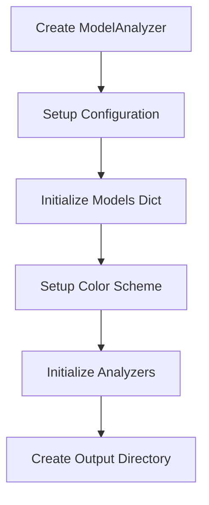
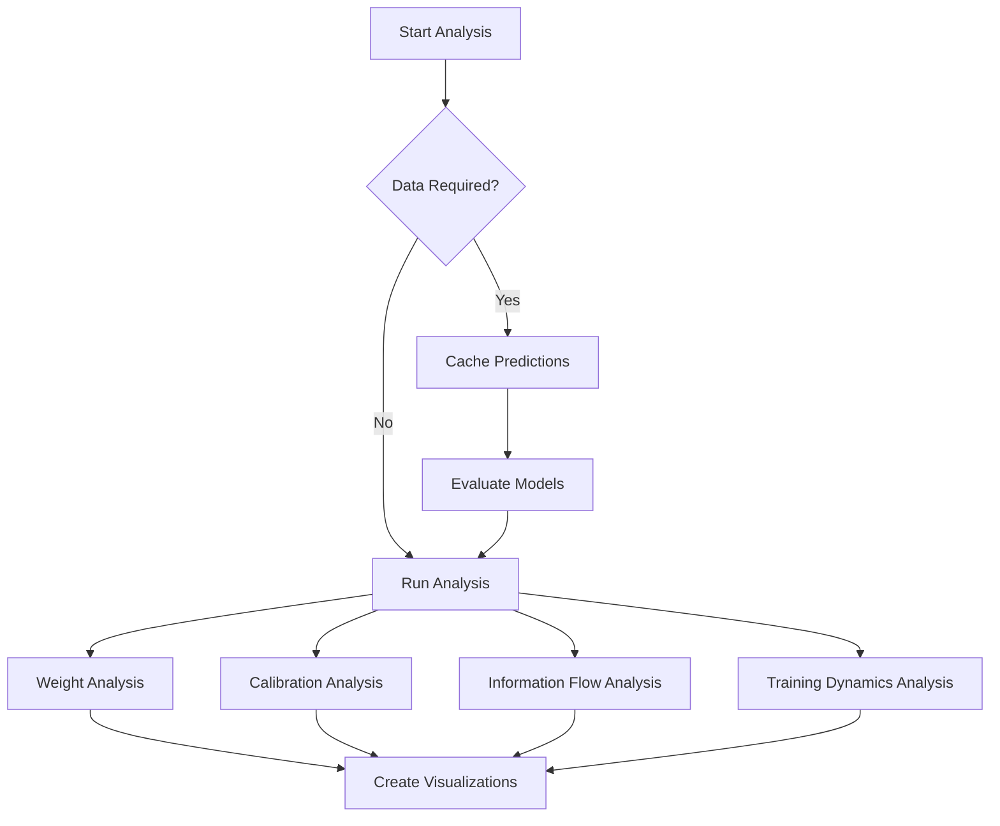
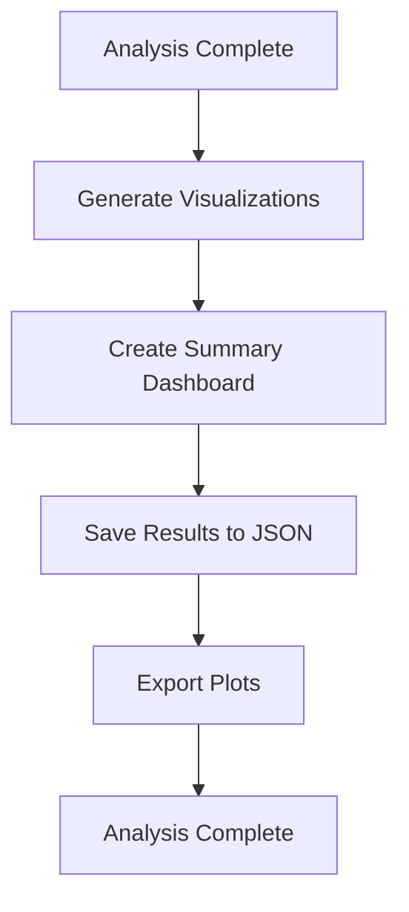

# Model Analyzer Module

A comprehensive, modular analysis toolkit for deep learning models built on Keras 3.8+ and TensorFlow 2.18+. This module provides multi-dimensional model analysis including weight distributions, calibration metrics, information flow patterns, and training dynamics with publication-ready visualizations.

## 1. Introduction

The Model Analyzer is designed to provide deep insights into your neural network models beyond simple accuracy metrics. It helps answer critical questions about model behavior:

- **Weight Health**: Are my model weights well-distributed and healthy?
- **Calibration**: How confident should I be in my model's predictions?
- **Information Flow**: How does information propagate through my network layers?
- **Training Dynamics**: Did my model train efficiently and converge properly?

### Key Features

- 🔍 **Comprehensive Analysis**: Four specialized analysis modules covering different aspects of model behavior
- 📊 **Rich Visualizations**: Publication-ready plots with consistent styling and color schemes
- 🧩 **Modular Design**: Extensible architecture for adding custom analysis components
- 🎯 **Training Insights**: Deep analysis of training history and convergence patterns
- 🎨 **Dashboard**: Unified summary dashboard for model comparison
- 💾 **Serializable Results**: JSON export for reproducible analysis and reporting

## 2. Module Structure

```
analyzer/
├── analyzers/                     # Analysis components
│   ├── base.py                   # Abstract base analyzer interface
│   ├── weight_analyzer.py        # Weight distribution and health analysis
│   ├── calibration_analyzer.py   # Model confidence and calibration metrics
│   ├── information_flow_analyzer.py  # Activation patterns and information flow
│   ├── training_dynamics_analyzer.py # Training history and convergence analysis
│   └── __init__.py
├── visualizers/                   # Visualization components
│   ├── base.py                   # Abstract base visualizer interface
│   ├── weight_visualizer.py      # Weight analysis visualizations
│   ├── calibration_visualizer.py # Calibration and confidence plots
│   ├── information_flow_visualizer.py # Information flow visualizations
│   ├── training_dynamics_visualizer.py # Training dynamics plots
│   ├── summary_visualizer.py     # Unified summary dashboard
│   └── __init__.py
├── config.py                     # Configuration classes and plotting setup
├── data_types.py                 # Structured data types and containers
├── constants.py                  # Analysis constants and thresholds
├── utils.py                      # Utility functions and helpers
├── model_analyzer.py             # Main coordinator class
├── __init__.py                   # Public API exports
└── README.md                     # This file
```

### Core Components

- **ModelAnalyzer**: Main coordinator class that orchestrates all analysis
- **AnalysisConfig**: Configuration class for customizing analysis behavior
- **DataInput**: Structured input data container
- **AnalysisResults**: Comprehensive results container with all analysis outputs

## 3. Use Cases

### 3.1 Model Comparison and Selection
```python
# Compare multiple model architectures
models = {
    'ResNet50': resnet_model,
    'EfficientNet': efficientnet_model,
    'ConvNeXt': convnext_model
}

analyzer = ModelAnalyzer(models, config=config)
results = analyzer.analyze(test_data)
```

### 3.2 Hyperparameter Tuning Analysis
```python
# Analyze different hyperparameter configurations
models = {
    'lr_0.001': model_lr_001,
    'lr_0.01': model_lr_01,
    'lr_0.1': model_lr_1
}

# Include training history for dynamics analysis
analyzer = ModelAnalyzer(
    models=models,
    training_history=training_histories,
    config=config
)
results = analyzer.analyze(validation_data)

# Create Pareto front analysis
pareto_fig = analyzer.create_pareto_analysis()
```

### 3.3 Training Debugging
```python
# Analyze training issues
config = AnalysisConfig(
    analyze_training_dynamics=True,
    smooth_training_curves=True,
    analyze_weights=True
)

analyzer = ModelAnalyzer(
    models={'problematic_model': model},
    training_history={'problematic_model': history},
    config=config
)

results = analyzer.analyze()
# Check results.training_metrics for overfitting, convergence issues
```

### 3.4 Model Calibration Assessment
```python
# Assess prediction confidence and calibration
config = AnalysisConfig(
    analyze_calibration=True,
    calibration_bins=15,
    analyze_information_flow=True
)

analyzer = ModelAnalyzer(models, config=config)
results = analyzer.analyze(test_data)

# Access calibration metrics
ece_scores = {model: metrics['ece'] 
              for model, metrics in results.calibration_metrics.items()}
```

### 3.5 Production Model Monitoring
```python
# Monitor deployed model health
config = AnalysisConfig(
    analyze_weights=True,
    analyze_calibration=True,
    compute_weight_pca=True
)

analyzer = ModelAnalyzer({'production_model': model}, config=config)
results = analyzer.analyze(recent_data)

# Check for weight drift, calibration degradation
summary = analyzer.get_summary_statistics()
```

## 4. Characteristics

### 4.1 Design Principles

- **Modularity**: Each analysis type is independent and can be run separately
- **Extensibility**: Easy to add new analyzers and visualizers
- **Consistency**: Unified color schemes and styling across all visualizations
- **Robustness**: Comprehensive error handling and graceful degradation
- **Performance**: Efficient caching and sampling for large datasets

### 4.2 Technical Features

- **Backend Agnostic**: Built on Keras 3.x for compatibility across backends
- **Memory Efficient**: Smart sampling and caching strategies
- **Publication Ready**: High-quality plots with configurable DPI and formats
- **Serializable**: Complete analysis results can be saved and reloaded
- **Multi-Input Support**: Limited support for complex model architectures

### 4.3 Analysis Depth

- **Quantitative Metrics**: Statistical measures and numerical indicators
- **Visual Insights**: Rich plotting with explanatory annotations
- **Comparative Analysis**: Side-by-side model comparison capabilities
- **Historical Context**: Training trajectory analysis and convergence patterns

## 5. Metrics

### 5.1 Weight Analysis Metrics

| Metric | Description | Interpretation |
|--------|-------------|----------------|
| **L1/L2 Norms** | Weight magnitude measures | Higher values indicate larger weights |
| **Spectral Norm** | Largest singular value | Controls Lipschitz constant |
| **Weight Distribution** | Statistical properties (mean, std, skew, kurtosis) | Indicates weight health |
| **Sparsity** | Fraction of near-zero weights | High sparsity may indicate dead neurons |
| **Health Score** | Combined metric (0-1) | Higher = healthier weight distribution |

### 5.2 Calibration Metrics

| Metric | Description | Range | Ideal Value |
|--------|-------------|-------|-------------|
| **ECE** | Expected Calibration Error | [0, 1] | 0 (perfect calibration) |
| **Brier Score** | Probabilistic accuracy measure | [0, 1] | 0 (perfect predictions) |
| **Reliability** | Bin-wise calibration accuracy | [0, 1] | Close to diagonal |
| **Confidence** | Max probability statistics | [0, 1] | Context dependent |

### 5.3 Information Flow Metrics

| Metric | Description | Interpretation |
|--------|-------------|----------------|
| **Activation Statistics** | Mean, std, sparsity of activations | Layer health and utilization |
| **Effective Rank** | Information dimensionality | Higher = more diverse representations |
| **Positive Ratio** | Fraction of positive activations | Indicates activation patterns |
| **Specialization Score** | Layer specialization measure | Higher = better feature learning |

### 5.4 Training Dynamics Metrics

| Metric | Description | Interpretation |
|--------|-------------|----------------|
| **Epochs to Convergence** | Time to reach 95% of peak performance | Lower = faster learning |
| **Overfitting Index** | Val loss - train loss in final third | Positive = overfitting |
| **Training Stability** | Std of recent validation losses | Lower = more stable |
| **Peak Performance** | Best validation metrics achieved | Higher = better model |
| **Final Gap** | Final validation - training loss | Indicates final overfitting state |

## 6. Analysis Flow

### 6.1 Initialization Phase


### 6.2 Analysis Phase


### 6.3 Output Phase


### 6.4 Complete Example
```python
from dl_techniques.utils.analyzer import ModelAnalyzer, AnalysisConfig

# 1. Configure analysis
config = AnalysisConfig(
    analyze_weights=True,
    analyze_calibration=True,
    analyze_information_flow=True,
    analyze_training_dynamics=True,
    plot_style='publication',
    save_plots=True
)

# 2. Create analyzer
analyzer = ModelAnalyzer(
    models={'model_a': model_a, 'model_b': model_b},
    training_history={'model_a': history_a, 'model_b': history_b},
    config=config,
    output_dir='analysis_results'
)

# 3. Run analysis
results = analyzer.analyze(test_data)

# 4. Access results
print(f"Model A ECE: {results.calibration_metrics['model_a']['ece']:.3f}")
print(f"Model B Peak Accuracy: {results.training_metrics.peak_performance['model_b']['val_accuracy']:.3f}")

# 5. Get summary
summary = analyzer.get_summary_statistics()
print(f"Analyses performed: {summary['analyses_performed']}")
```

## 7. Extensions

### 7.1 Creating Custom Analyzers

Extend the `BaseAnalyzer` class to create custom analysis components:

```python
from analyzer.analyzers.base import BaseAnalyzer
from analyzer.data_types import AnalysisResults, DataInput

class CustomAnalyzer(BaseAnalyzer):
    """Custom analyzer for specific domain metrics."""
    
    def requires_data(self) -> bool:
        """Return True if this analyzer needs input data."""
        return True
    
    def analyze(self, results: AnalysisResults, 
                data: Optional[DataInput] = None,
                cache: Optional[Dict[str, Dict[str, Any]]] = None) -> None:
        """Perform custom analysis."""
        # Your custom analysis logic here
        for model_name, model in self.models.items():
            # Compute custom metrics
            custom_metrics = self._compute_custom_metrics(model, data)
            
            # Store in results
            if not hasattr(results, 'custom_metrics'):
                results.custom_metrics = {}
            results.custom_metrics[model_name] = custom_metrics
    
    def _compute_custom_metrics(self, model, data):
        """Implement your custom metric computation."""
        return {'custom_score': 0.95}
```

### 7.2 Creating Custom Visualizers

Extend the `BaseVisualizer` class for custom visualizations:

```python
from analyzer.visualizers.base import BaseVisualizer
import matplotlib.pyplot as plt

class CustomVisualizer(BaseVisualizer):
    """Custom visualizer for domain-specific plots."""
    
    def create_visualizations(self) -> None:
        """Create custom visualizations."""
        if not hasattr(self.results, 'custom_metrics'):
            return
            
        fig, ax = plt.subplots(figsize=(10, 6))
        self._plot_custom_analysis(ax)
        
        if self.config.save_plots:
            self._save_figure(fig, 'custom_analysis')
        plt.close(fig)
    
    def _plot_custom_analysis(self, ax):
        """Implement your custom plotting logic."""
        # Your plotting code here
        for model_name, metrics in self.results.custom_metrics.items():
            color = self.model_colors.get(model_name, '#333333')
            # Plot your custom metrics
            pass
```

### 7.3 Integration with Analysis Pipeline

Register your custom components:

```python
# Add to analyzer initialization
analyzer = ModelAnalyzer(models, config)
analyzer.analyzers['custom'] = CustomAnalyzer(models, config)

# Add custom visualizer
custom_viz = CustomVisualizer(results, config, output_dir, model_colors)
custom_viz.create_visualizations()
```

### 7.4 Configuration Extensions

Extend `AnalysisConfig` for custom parameters:

```python
from dataclasses import dataclass
from analyzer.config import AnalysisConfig

@dataclass
class ExtendedConfig(AnalysisConfig):
    """Extended configuration with custom parameters."""
    
    # Custom analysis toggles
    analyze_custom: bool = True
    custom_threshold: float = 0.5
    custom_bins: int = 20
    
    # Custom visualization options
    custom_colormap: str = 'viridis'
    custom_figure_size: tuple = (12, 8)
```

### 7.5 Multi-Input Model Support

For complex multi-input architectures, you may need to extend the data handling:

```python
class MultiInputDataHandler:
    """Helper for handling multi-input model data."""
    
    @staticmethod
    def prepare_multi_input_data(inputs: List[np.ndarray], 
                                targets: np.ndarray) -> DataInput:
        """Prepare multi-input data for analysis."""
        # Concatenate or process multiple inputs
        combined_input = np.concatenate(inputs, axis=-1)
        return DataInput(x_data=combined_input, y_data=targets)
```

### 7.6 Performance Extensions

For large-scale analysis, consider adding parallel processing:

```python
from concurrent.futures import ThreadPoolExecutor
import multiprocessing

class ParallelAnalyzer(ModelAnalyzer):
    """Extended analyzer with parallel processing support."""
    
    def __init__(self, *args, **kwargs):
        super().__init__(*args, **kwargs)
        self.n_workers = min(4, multiprocessing.cpu_count())
    
    def _parallel_model_analysis(self, models_chunk, data):
        """Analyze a chunk of models in parallel."""
        # Implement parallel analysis logic
        pass
```

---

## Quick Start

```bash
# Install dependencies
pip install keras>=3.8.0 tensorflow>=2.18.0 matplotlib seaborn scikit-learn

# Run analysis
python -c "
from dl_techniques.utils.analyzer import ModelAnalyzer, AnalysisConfig
config = AnalysisConfig()
analyzer = ModelAnalyzer(models, config)
results = analyzer.analyze(test_data)
print('Analysis complete!')
"
```

## License

This module is part of the dl-techniques library and follows the same licensing terms.

## Contributing

To contribute new analyzers or visualizers:

1. Follow the base class interfaces
2. Add comprehensive docstrings
3. Include unit tests
4. Update this README with new capabilities
5. Ensure compatibility with existing configuration system