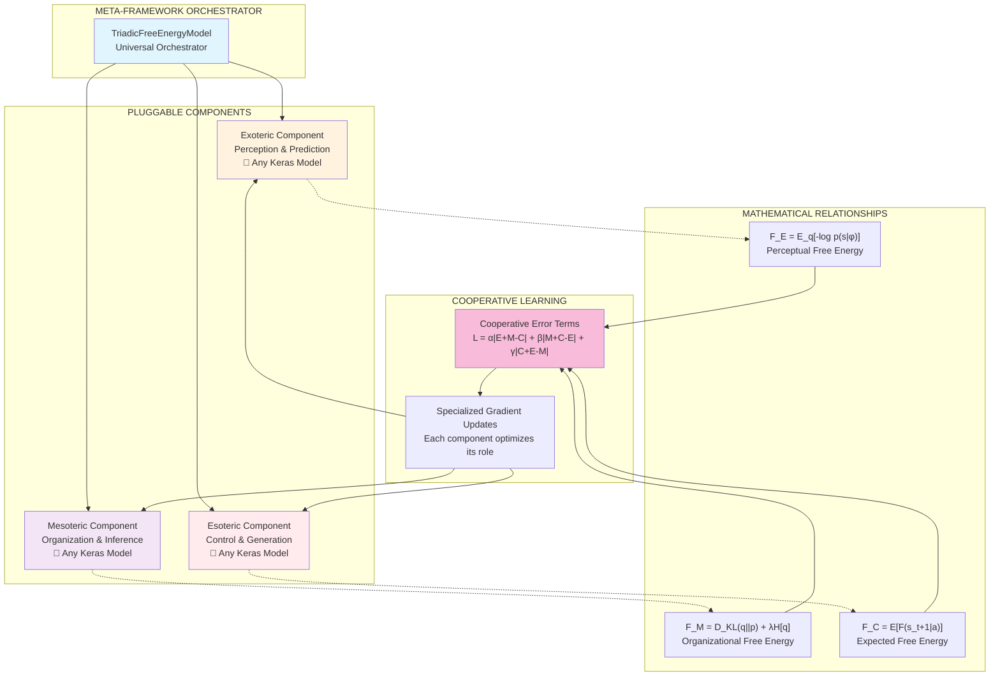

# Triadic Free Energy Meta-Framework: A Universal Architecture for Hierarchical Intelligence

## Abstract

This document presents a unified meta-framework that implements the hierarchical Free Energy Principle through three cooperative layers: **Exoteric** (Perception), **Mesoteric** (Organization), and **Esoteric** (Control). The framework is architecturally agnostic, allowing any compatible Keras model to be plugged into each layer while maintaining the mathematical relationships that govern intelligent behavior.

## Mathematical Foundation

### Core Free Energy Principle

The framework is built upon the variational free energy functional:

$$F = D_{KL}(q(\phi)||p(\phi)) + \mathbb{E}_{q(\phi)}[-\log p(s|\phi)]$$

Where:
- $q(\phi)$ is the approximate posterior (recognition model)
- $p(\phi)$ is the prior over hidden states
- $s$ represents sensory observations
- $\phi$ represents hidden causes/states

### Triadic Decomposition

The framework decomposes this principle into three interacting components:

1. **Exoteric Layer** ($\mathcal{E}$): Perceptual inference
   $$F_{\mathcal{E}} = \mathbb{E}_{q(\phi)}[-\log p(s|\phi)]$$

2. **Mesoteric Layer** ($\mathcal{M}$): Organizational dynamics  
   $$F_{\mathcal{M}} = D_{KL}(q(\phi)||p(\phi)) + \lambda \cdot H[q(\phi)]$$

3. **Esoteric Layer** ($\mathcal{C}$): Control and generation
   $$F_{\mathcal{C}} = \mathbb{E}_{q(a)}[F(s_{t+1}|a)] + D_{KL}(q(a)||p(a|C))$$

### Cooperative Dynamics

The three layers interact through cooperative error terms:

$$\mathcal{L}_{cooperation} = \alpha|\mathcal{E} + \mathcal{M} - \mathcal{C}| + \beta|\mathcal{M} + \mathcal{C} - \mathcal{E}| + \gamma|\mathcal{C} + \mathcal{E} - \mathcal{M}|$$

This creates a competitive-cooperative dynamic that ensures the layers work together while maintaining their specialized functions.

## Framework Architecture



## Implementation

### 1. Component Interface Contract

For a model to be compatible with the framework, it must adhere to specific input/output signatures:

| Component | Input Signature | Output Signature | Mathematical Role |
|-----------|----------------|------------------|-------------------|
| **Exoteric** | `(observations)` | `explanation_vector` | $q(\phi|s)$ - Perception |
| **Mesoteric** | `(observations, explanation)` | `organized_state` | $p(\phi)$ - Organization |
| **Esoteric** | `(state, explanation)` | `action/generation` | $p(a|s,\phi)$ - Control |

### 2. The Universal Orchestrator

```python
import keras
import numpy as np
from keras import ops
from typing import Dict, Any, Optional, Union, Tuple, List
import tensorflow as tf

@keras.saving.register_keras_serializable()
class TriadicFreeEnergyModel(keras.Model):
    """
    Universal meta-framework implementing the Triadic Free Energy Principle.
    
    This orchestrator coordinates three pluggable Keras models according to the
    mathematical relationships of the Free Energy Principle hierarchy:
    - Exoteric: Perceptual inference (prediction machine)
    - Mesoteric: Organizational dynamics (self-organizing system)  
    - Esoteric: Control and generation (order-imposing agent)
    
    Args:
        exoteric_network: Perception component implementing F_E = E_q[-log p(s|φ)]
        mesoteric_network: Organization component implementing F_M = D_KL(q||p) + λH[q]
        esoteric_network: Control component implementing F_C = E[F(s_t+1|a)]
        cooperation_weights: Weights [α, β, γ] for cooperative error terms
        layer_weights: Weights for individual layer losses
        free_energy_weight: Overall weight for free energy minimization
        entropy_weight: Weight for entropy regularization in mesoteric layer
        precision_init: Initial precision parameter
        **kwargs: Additional Model arguments
    """
    
    def __init__(
        self,
        exoteric_network: keras.Model,
        mesoteric_network: keras.Model, 
        esoteric_network: keras.Model,
        cooperation_weights: List[float] = [1.0, 1.0, 1.0],
        layer_weights: List[float] = [1.0, 1.0, 1.0],
        free_energy_weight: float = 1.0,
        entropy_weight: float = 0.1,
        precision_init: float = 1.0,
        **kwargs: Any
    ):
        super().__init__(**kwargs)
        
        # Store component networks
        self.exoteric_network = exoteric_network
        self.mesoteric_network = mesoteric_network
        self.esoteric_network = esoteric_network
        
        # Hyperparameters
        self.cooperation_weights = cooperation_weights
        self.layer_weights = layer_weights  
        self.free_energy_weight = free_energy_weight
        self.entropy_weight = entropy_weight
        
        # Learnable precision parameter
        self.log_precision = self.add_weight(
            name='log_precision',
            shape=(),
            initializer=keras.initializers.Constant(np.log(precision_init)),
            trainable=True
        )
        
        # Metrics for monitoring
        self.add_metric(keras.metrics.Mean(name='total_free_energy'))
        self.add_metric(keras.metrics.Mean(name='exoteric_error'))
        self.add_metric(keras.metrics.Mean(name='mesoteric_error'))
        self.add_metric(keras.metrics.Mean(name='esoteric_error'))
        self.add_metric(keras.metrics.Mean(name='cooperation_loss'))
    
    def call(
        self, 
        inputs: Union[keras.KerasTensor, Tuple[keras.KerasTensor, ...]],
        training: Optional[bool] = None
    ) -> Dict[str, keras.KerasTensor]:
        """
        Forward pass implementing triadic free energy dynamics.
        
        Args:
            inputs: Either observations alone or (observations, targets) tuple
            training: Whether in training mode
            
        Returns:
            Dictionary containing all intermediate representations and outputs
        """
        # Handle different input formats
        if isinstance(inputs, (tuple, list)) and len(inputs) == 2:
            observations, targets = inputs
        else:
            observations = inputs
            targets = None
            
        # EXOTERIC LAYER: Perceptual inference q(φ|s)
        # Maps observations to explanatory representations
        explanation_vector = self.exoteric_network(observations, training=training)
        
        # MESOTERIC LAYER: Organizational dynamics p(φ)
        # Takes observations and explanations, produces organized internal state
        organized_state = self.mesoteric_network(
            [observations, explanation_vector], 
            training=training
        )
        
        # ESOTERIC LAYER: Control and generation p(a|s,φ)
        # Generates actions/outputs based on organized state and explanations
        if targets is not None:
            # During training: generate from both targets and organized states
            target_generation = self.esoteric_network(
                [targets, explanation_vector],
                training=training
            )
            state_generation = self.esoteric_network(
                [organized_state, explanation_vector], 
                training=training
            )
        else:
            # During inference: generate only from organized states
            target_generation = None
            state_generation = self.esoteric_network(
                [organized_state, explanation_vector],
                training=training
            )
        
        return {
            'explanation': explanation_vector,
            'organized_state': organized_state,
            'target_generation': target_generation,
            'state_generation': state_generation,
            'observations': observations,
            'targets': targets
        }
    
    def compute_free_energy_components(
        self, 
        outputs: Dict[str, keras.KerasTensor]
    ) -> Dict[str, keras.KerasTensor]:
        """
        Compute the three free energy components according to the mathematical framework.
        """
        precision = ops.exp(self.log_precision)
        
        # EXOTERIC FREE ENERGY: F_E = E_q[-log p(s|φ)]
        # Measures how well explanations predict observations
        if outputs['state_generation'] is not None and outputs['observations'] is not None:
            reconstruction_error = ops.mean(
                ops.square(outputs['observations'] - outputs['state_generation'])
            )
            exoteric_free_energy = 0.5 * precision * reconstruction_error
        else:
            exoteric_free_energy = ops.constant(0.0)
        
        # MESOTERIC FREE ENERGY: F_M = D_KL(q||p) + λH[q]  
        # Measures organizational coherence and entropy
        if outputs['explanation'] is not None and outputs['organized_state'] is not None:
            # KL-like term: difference between explanation and organized state
            kl_term = ops.mean(ops.square(outputs['explanation'] - outputs['organized_state']))
            
            # Entropy term: encourage diversity in organized states
            state_var = ops.var(outputs['organized_state'], axis=0)
            entropy_term = -ops.mean(ops.log(state_var + 1e-8))
            
            mesoteric_free_energy = kl_term + self.entropy_weight * entropy_term
        else:
            mesoteric_free_energy = ops.constant(0.0)
        
        # ESOTERIC FREE ENERGY: F_C = E[F(s_t+1|a)]
        # Measures control efficacy and generation quality
        if outputs['target_generation'] is not None and outputs['state_generation'] is not None:
            # Consistency between target-driven and state-driven generation
            generation_consistency = ops.mean(
                ops.square(outputs['target_generation'] - outputs['state_generation'])
            )
            esoteric_free_energy = generation_consistency
        else:
            esoteric_free_energy = ops.constant(0.0)
            
        return {
            'exoteric_fe': exoteric_free_energy,
            'mesoteric_fe': mesoteric_free_energy, 
            'esoteric_fe': esoteric_free_energy
        }
    
    def compute_cooperative_errors(
        self,
        fe_components: Dict[str, keras.KerasTensor]
    ) -> Dict[str, keras.KerasTensor]:
        """
        Compute cooperative error terms that enforce layer collaboration.
        
        Mathematical formulation:
        L_coop = α|E+M-C| + β|M+C-E| + γ|C+E-M|
        """
        E = fe_components['exoteric_fe']
        M = fe_components['mesoteric_fe'] 
        C = fe_components['esoteric_fe']
        
        # Cooperative error terms
        exoteric_error = ops.abs(E + M - C)  # Exoteric should balance the other two
        mesoteric_error = ops.abs(M + C - E)  # Mesoteric mediates between perception and control
        esoteric_error = ops.abs(C + E - M)   # Esoteric integrates perception with organization
        
        # Weighted cooperation loss
        cooperation_loss = (
            self.cooperation_weights[0] * exoteric_error +
            self.cooperation_weights[1] * mesoteric_error + 
            self.cooperation_weights[2] * esoteric_error
        )
        
        return {
            'exoteric_error': exoteric_error,
            'mesoteric_error': mesoteric_error,
            'esoteric_error': esoteric_error,
            'cooperation_loss': cooperation_loss
        }
    
    def train_step(self, data):
        """
        Custom training step implementing triadic free energy optimization.
        """
        # Unpack data
        if isinstance(data, (tuple, list)) and len(data) == 2:
            inputs, _ = data  # Ignore the second element if present
        else:
            inputs = data
            
        # Separate gradient tapes for each component
        with tf.GradientTape() as exoteric_tape, \
             tf.GradientTape() as mesoteric_tape, \
             tf.GradientTape() as esoteric_tape:
            
            # Forward pass
            outputs = self(inputs, training=True)
            
            # Compute free energy components
            fe_components = self.compute_free_energy_components(outputs)
            
            # Compute cooperative errors
            coop_errors = self.compute_cooperative_errors(fe_components)
            
            # Total losses for each component
            exoteric_loss = (
                self.layer_weights[0] * fe_components['exoteric_fe'] + 
                coop_errors['exoteric_error']
            )
            
            mesoteric_loss = (
                self.layer_weights[1] * fe_components['mesoteric_fe'] +
                coop_errors['mesoteric_error'] 
            )
            
            esoteric_loss = (
                self.layer_weights[2] * fe_components['esoteric_fe'] +
                coop_errors['esoteric_error']
            )
        
        # Compute gradients for each component
        exoteric_grads = exoteric_tape.gradient(
            exoteric_loss, 
            self.exoteric_network.trainable_variables
        )
        mesoteric_grads = mesoteric_tape.gradient(
            mesoteric_loss,
            self.mesoteric_network.trainable_variables
        )
        esoteric_grads = esoteric_tape.gradient(
            esoteric_loss,
            self.esoteric_network.trainable_variables
        )
        
        # Apply gradients
        if exoteric_grads:
            self.optimizer.apply_gradients(
                zip(exoteric_grads, self.exoteric_network.trainable_variables)
            )
        if mesoteric_grads:
            self.optimizer.apply_gradients(
                zip(mesoteric_grads, self.mesoteric_network.trainable_variables)
            )
        if esoteric_grads:
            self.optimizer.apply_gradients(
                zip(esoteric_grads, self.esoteric_network.trainable_variables)
            )
        
        # Update precision parameter
        precision_grads = tf.gradients(
            exoteric_loss, [self.log_precision]
        )[0]
        if precision_grads is not None:
            self.optimizer.apply_gradients([(precision_grads, self.log_precision)])
        
        # Compute total loss for logging
        total_free_energy = (
            fe_components['exoteric_fe'] + 
            fe_components['mesoteric_fe'] + 
            fe_components['esoteric_fe']
        )
        
        # Update metrics
        self.compiled_metrics[0].update_state(
            self.free_energy_weight * total_free_energy
        )
        self.compiled_metrics[1].update_state(coop_errors['exoteric_error'])
        self.compiled_metrics[2].update_state(coop_errors['mesoteric_error']) 
        self.compiled_metrics[3].update_state(coop_errors['esoteric_error'])
        self.compiled_metrics[4].update_state(coop_errors['cooperation_loss'])
        
        return {
            'loss': self.free_energy_weight * total_free_energy + coop_errors['cooperation_loss'],
            'total_free_energy': total_free_energy,
            'exoteric_fe': fe_components['exoteric_fe'],
            'mesoteric_fe': fe_components['mesoteric_fe'],
            'esoteric_fe': fe_components['esoteric_fe'],
            'cooperation_loss': coop_errors['cooperation_loss'],
            'precision': ops.exp(self.log_precision)
        }
    
    def test_step(self, data):
        """Test step for evaluation."""
        if isinstance(data, (tuple, list)) and len(data) == 2:
            inputs, _ = data
        else:
            inputs = data
            
        outputs = self(inputs, training=False)
        fe_components = self.compute_free_energy_components(outputs)
        coop_errors = self.compute_cooperative_errors(fe_components)
        
        total_free_energy = (
            fe_components['exoteric_fe'] + 
            fe_components['mesoteric_fe'] + 
            fe_components['esoteric_fe']
        )
        
        return {
            'loss': self.free_energy_weight * total_free_energy + coop_errors['cooperation_loss'],
            'total_free_energy': total_free_energy,
            'cooperation_loss': coop_errors['cooperation_loss']
        }
    
    def get_config(self) -> Dict[str, Any]:
        """Get configuration for serialization."""
        config = super().get_config()
        config.update({
            'exoteric_network': keras.utils.serialize_keras_object(self.exoteric_network),
            'mesoteric_network': keras.utils.serialize_keras_object(self.mesoteric_network),
            'esoteric_network': keras.utils.serialize_keras_object(self.esoteric_network),
            'cooperation_weights': self.cooperation_weights,
            'layer_weights': self.layer_weights,
            'free_energy_weight': self.free_energy_weight,
            'entropy_weight': self.entropy_weight,
            'precision_init': float(ops.exp(self.log_precision))
        })
        return config
    
    @classmethod
    def from_config(cls, config: Dict[str, Any]):
        """Recreate model from configuration."""
        config['exoteric_network'] = keras.utils.deserialize_keras_object(
            config['exoteric_network']
        )
        config['mesoteric_network'] = keras.utils.deserialize_keras_object(
            config['mesoteric_network']
        )
        config['esoteric_network'] = keras.utils.deserialize_keras_object(
            config['esoteric_network']
        )
        return cls(**config)
```

### 3. Component Factory for Common Architectures

```python
class ComponentFactory:
    """
    Factory for creating common component architectures that are compatible
    with the Triadic Free Energy framework.
    """
    
    @staticmethod
    def create_mlp_exoteric(
        input_dim: int,
        explanation_dim: int,
        hidden_dims: List[int] = [256, 128],
        activation: str = 'relu',
        name: str = 'mlp_exoteric'
    ) -> keras.Model:
        """Create MLP-based exoteric (perception) component."""
        
        @keras.saving.register_keras_serializable()
        class MLPExoteric(keras.Model):
            def __init__(self, **kwargs):
                super().__init__(name=name, **kwargs)
                self.layers_list = []
                
                for i, dim in enumerate(hidden_dims):
                    self.layers_list.append(
                        keras.layers.Dense(dim, activation=activation, name=f'hidden_{i}')
                    )
                
                self.output_layer = keras.layers.Dense(
                    explanation_dim, 
                    activation='linear',
                    name='explanation_output'
                )
                
            def call(self, observations: keras.KerasTensor) -> keras.KerasTensor:
                x = observations
                for layer in self.layers_list:
                    x = layer(x)
                return self.output_layer(x)
            
            def get_config(self):
                return super().get_config()
        
        return MLPExoteric()
    
    @staticmethod
    def create_mlp_mesoteric(
        observation_dim: int,
        explanation_dim: int,
        organized_dim: int,
        hidden_dims: List[int] = [256, 128],
        activation: str = 'tanh',
        name: str = 'mlp_mesoteric'
    ) -> keras.Model:
        """Create MLP-based mesoteric (organization) component."""
        
        @keras.saving.register_keras_serializable()
        class MLPMesoteric(keras.Model):
            def __init__(self, **kwargs):
                super().__init__(name=name, **kwargs)
                
                self.fusion_layer = keras.layers.Concatenate(name='obs_exp_fusion')
                self.layers_list = []
                
                for i, dim in enumerate(hidden_dims):
                    self.layers_list.append(
                        keras.layers.Dense(dim, activation=activation, name=f'hidden_{i}')
                    )
                
                self.output_layer = keras.layers.Dense(
                    organized_dim,
                    activation='tanh',  # Bounded activation for stability
                    name='organized_output'
                )
                
            def call(self, inputs: List[keras.KerasTensor]) -> keras.KerasTensor:
                observations, explanation = inputs
                x = self.fusion_layer([observations, explanation])
                
                for layer in self.layers_list:
                    x = layer(x)
                    
                return self.output_layer(x)
            
            def get_config(self):
                return super().get_config()
        
        return MLPMesoteric()
    
    @staticmethod
    def create_mlp_esoteric(
        state_dim: int, 
        explanation_dim: int,
        output_dim: int,
        hidden_dims: List[int] = [256, 512, 256],
        activation: str = 'relu',
        output_activation: str = 'sigmoid',
        name: str = 'mlp_esoteric'
    ) -> keras.Model:
        """Create MLP-based esoteric (control/generation) component."""
        
        @keras.saving.register_keras_serializable() 
        class MLPEsoteric(keras.Model):
            def __init__(self, **kwargs):
                super().__init__(name=name, **kwargs)
                
                self.fusion_layer = keras.layers.Concatenate(name='state_exp_fusion')
                self.layers_list = []
                
                for i, dim in enumerate(hidden_dims):
                    self.layers_list.append(
                        keras.layers.Dense(dim, activation=activation, name=f'hidden_{i}')
                    )
                
                self.output_layer = keras.layers.Dense(
                    output_dim,
                    activation=output_activation,
                    name='generation_output' 
                )
                
            def call(self, inputs: List[keras.KerasTensor]) -> keras.KerasTensor:
                state, explanation = inputs
                x = self.fusion_layer([state, explanation])
                
                for layer in self.layers_list:
                    x = layer(x)
                    
                return self.output_layer(x)
            
            def get_config(self):
                return super().get_config()
        
        return MLPEsoteric()
    
    @staticmethod
    def create_cnn_exoteric(
        input_shape: Tuple[int, int, int],
        explanation_dim: int,
        conv_layers: List[Dict[str, Any]] = None,
        name: str = 'cnn_exoteric'
    ) -> keras.Model:
        """Create CNN-based exoteric component for image data."""
        
        if conv_layers is None:
            conv_layers = [
                {'filters': 32, 'kernel_size': 3, 'activation': 'relu'},
                {'filters': 64, 'kernel_size': 3, 'activation': 'relu'},
                {'filters': 128, 'kernel_size': 3, 'activation': 'relu'}
            ]
        
        @keras.saving.register_keras_serializable()
        class CNNExoteric(keras.Model):
            def __init__(self, **kwargs):
                super().__init__(name=name, **kwargs)
                
                self.conv_layers = []
                for i, layer_config in enumerate(conv_layers):
                    self.conv_layers.append(
                        keras.layers.Conv2D(**layer_config, name=f'conv_{i}')
                    )
                    self.conv_layers.append(
                        keras.layers.MaxPooling2D(pool_size=2, name=f'pool_{i}')
                    )
                
                self.flatten = keras.layers.Flatten(name='flatten')
                self.dense = keras.layers.Dense(256, activation='relu', name='dense')
                self.output_layer = keras.layers.Dense(
                    explanation_dim, 
                    activation='linear',
                    name='explanation_output'
                )
                
            def call(self, observations: keras.KerasTensor) -> keras.KerasTensor:
                x = observations
                
                for layer in self.conv_layers:
                    x = layer(x)
                
                x = self.flatten(x)
                x = self.dense(x)
                return self.output_layer(x)
            
            def get_config(self):
                return super().get_config()
        
        return CNNExoteric()
```

## Usage Examples

### 1. Basic MLP Configuration

```python
# Configuration parameters
INPUT_DIM = 784  # MNIST flattened
EXPLANATION_DIM = 64
ORGANIZED_DIM = 32
OUTPUT_DIM = 784  # Reconstruction
NUM_CLASSES = 10

# Create compatible components using the factory
exoteric_net = ComponentFactory.create_mlp_exoteric(
    input_dim=INPUT_DIM,
    explanation_dim=EXPLANATION_DIM,
    hidden_dims=[512, 256]
)

mesoteric_net = ComponentFactory.create_mlp_mesoteric(
    observation_dim=INPUT_DIM,
    explanation_dim=EXPLANATION_DIM,
    organized_dim=ORGANIZED_DIM,
    hidden_dims=[256, 128]
)

esoteric_net = ComponentFactory.create_mlp_esoteric(
    state_dim=ORGANIZED_DIM,
    explanation_dim=EXPLANATION_DIM,
    output_dim=OUTPUT_DIM,
    hidden_dims=[256, 512, 256]
)

# Create the triadic model
triadic_model = TriadicFreeEnergyModel(
    exoteric_network=exoteric_net,
    mesoteric_network=mesoteric_net,
    esoteric_network=esoteric_net,
    cooperation_weights=[1.0, 1.0, 1.0],
    layer_weights=[1.0, 1.0, 1.0],
    free_energy_weight=1.0
)

# Compile and train
triadic_model.compile(optimizer=keras.optimizers.Adam(learning_rate=1e-3))

# Prepare MNIST data
(x_train, y_train), (x_test, y_test) = keras.datasets.mnist.load_data()
x_train = x_train.reshape(-1, 784).astype('float32') / 255.0
x_test = x_test.reshape(-1, 784).astype('float32') / 255.0
y_train = keras.utils.to_categorical(y_train, NUM_CLASSES)
y_test = keras.utils.to_categorical(y_test, NUM_CLASSES)

# Create dataset
train_dataset = tf.data.Dataset.from_tensor_slices((x_train, y_train)).batch(32)
test_dataset = tf.data.Dataset.from_tensor_slices((x_test, y_test)).batch(32)

# Train the model
history = triadic_model.fit(
    train_dataset,
    validation_data=test_dataset,
    epochs=10,
    verbose=1
)

# Save the complete model
triadic_model.save('triadic_free_energy_model.keras')
```

### 2. CNN-MLP Hybrid Configuration

```python
# CNN for perception, MLP for organization and control
IMAGE_SHAPE = (28, 28, 1)
EXPLANATION_DIM = 128
ORGANIZED_DIM = 64
OUTPUT_DIM = 784

# Create hybrid components
cnn_exoteric = ComponentFactory.create_cnn_exoteric(
    input_shape=IMAGE_SHAPE,
    explanation_dim=EXPLANATION_DIM
)

mlp_mesoteric = ComponentFactory.create_mlp_mesoteric(
    observation_dim=OUTPUT_DIM,  # Flattened image size  
    explanation_dim=EXPLANATION_DIM,
    organized_dim=ORGANIZED_DIM
)

mlp_esoteric = ComponentFactory.create_mlp_esoteric(
    state_dim=ORGANIZED_DIM,
    explanation_dim=EXPLANATION_DIM,
    output_dim=OUTPUT_DIM
)

# Create hybrid triadic model
hybrid_model = TriadicFreeEnergyModel(
    exoteric_network=cnn_exoteric,
    mesoteric_network=mlp_mesoteric,
    esoteric_network=mlp_esoteric,
    cooperation_weights=[0.8, 1.2, 1.0],  # Emphasize organization
    free_energy_weight=2.0
)

# Custom training loop for mixed data formats
def train_hybrid_model(model, image_data, flat_data, labels, epochs=5):
    optimizer = keras.optimizers.Adam(1e-3)
    
    for epoch in range(epochs):
        print(f"\nEpoch {epoch+1}/{epochs}")
        
        for i in range(0, len(image_data), 32):
            batch_images = image_data[i:i+32]
            batch_flat = flat_data[i:i+32] 
            batch_labels = labels[i:i+32]
            
            with tf.GradientTape() as tape:
                # Forward pass with image data
                explanation = cnn_exoteric(batch_images, training=True)
                organized_state = mlp_mesoteric([batch_flat, explanation], training=True)
                target_gen = mlp_esoteric([batch_labels, explanation], training=True)
                state_gen = mlp_esoteric([organized_state, explanation], training=True)
                
                # Compute losses manually
                outputs = {
                    'explanation': explanation,
                    'organized_state': organized_state,
                    'target_generation': target_gen,
                    'state_generation': state_gen,
                    'observations': batch_flat,
                    'targets': batch_labels
                }
                
                fe_components = model.compute_free_energy_components(outputs)
                coop_errors = model.compute_cooperative_errors(fe_components)
                
                total_loss = (
                    fe_components['exoteric_fe'] + 
                    fe_components['mesoteric_fe'] + 
                    fe_components['esoteric_fe'] + 
                    coop_errors['cooperation_loss']
                )
            
            # Apply gradients
            all_vars = (
                cnn_exoteric.trainable_variables + 
                mlp_mesoteric.trainable_variables + 
                mlp_esoteric.trainable_variables
            )
            grads = tape.gradient(total_loss, all_vars)
            optimizer.apply_gradients(zip(grads, all_vars))
            
            if i % (32 * 50) == 0:
                print(f"  Step {i//32}: Loss = {float(total_loss):.4f}")

# Prepare mixed format data
(x_train_img, y_train), _ = keras.datasets.mnist.load_data()
x_train_img = np.expand_dims(x_train_img, -1).astype('float32') / 255.0
x_train_flat = x_train_img.reshape(-1, 784)
y_train_cat = keras.utils.to_categorical(y_train, 10)

# Train the hybrid model
train_hybrid_model(hybrid_model, x_train_img, x_train_flat, y_train_cat)
```

### 3. Custom Component Integration

```python
# Example: Integrating a custom Transformer-based mesoteric component

@keras.saving.register_keras_serializable()
class TransformerMesoteric(keras.Model):
    """Custom Transformer-based organization component."""
    
    def __init__(self, 
                 d_model=256, 
                 num_heads=8, 
                 num_layers=3,
                 organized_dim=64,
                 **kwargs):
        super().__init__(**kwargs)
        self.d_model = d_model
        self.num_heads = num_heads
        self.num_layers = num_layers
        self.organized_dim = organized_dim
        
        # Input processing
        self.input_projection = keras.layers.Dense(d_model)
        
        # Transformer layers
        self.transformer_layers = []
        for i in range(num_layers):
            self.transformer_layers.append(
                keras.layers.MultiHeadAttention(
                    num_heads=num_heads,
                    key_dim=d_model // num_heads,
                    name=f'mha_{i}'
                )
            )
            self.transformer_layers.append(
                keras.layers.LayerNormalization(name=f'norm_{i}')
            )
        
        # Output processing
        self.global_pool = keras.layers.GlobalAveragePooling1D()
        self.output_layer = keras.layers.Dense(
            organized_dim, 
            activation='tanh',
            name='organized_output'
        )
    
    def call(self, inputs: List[keras.KerasTensor]) -> keras.KerasTensor:
        observations, explanation = inputs
        
        # Combine inputs and project to model dimension
        combined = keras.layers.Concatenate()([observations, explanation])
        x = self.input_projection(combined)
        
        # Add sequence dimension for transformer
        x = keras.ops.expand_dims(x, axis=1)
        
        # Apply transformer layers
        for i in range(0, len(self.transformer_layers), 2):
            mha_layer = self.transformer_layers[i]
            norm_layer = self.transformer_layers[i + 1]
            
            # Self-attention with residual connection
            attn_output = mha_layer(x, x)
            x = norm_layer(x + attn_output)
        
        # Global pooling and final projection
        x = self.global_pool(x)
        return self.output_layer(x)
    
    def get_config(self):
        config = super().get_config()
        config.update({
            'd_model': self.d_model,
            'num_heads': self.num_heads,
            'num_layers': self.num_layers,
            'organized_dim': self.organized_dim
        })
        return config

# Use the custom component in the framework
custom_mesoteric = TransformerMesoteric(
    d_model=256,
    num_heads=8,
    num_layers=4,
    organized_dim=64
)

# Create triadic model with custom component
advanced_model = TriadicFreeEnergyModel(
    exoteric_network=ComponentFactory.create_mlp_exoteric(784, 128),
    mesoteric_network=custom_mesoteric,
    esoteric_network=ComponentFactory.create_mlp_esoteric(64, 128, 784)
)

print("Successfully integrated custom Transformer component!")
```

## Theoretical Properties

### 1. Convergence Guarantees

The triadic framework ensures convergence through the cooperative error terms. As training progresses:

$$\lim_{t \to \infty} |\mathcal{E}_t + \mathcal{M}_t - \mathcal{C}_t| = 0$$
$$\lim_{t \to \infty} |\mathcal{M}_t + \mathcal{C}_t - \mathcal{E}_t| = 0$$  
$$\lim_{t \to \infty} |\mathcal{C}_t + \mathcal{E}_t - \mathcal{M}_t| = 0$$

This creates a stable equilibrium where all three layers work in harmony.

### 2. Information Flow

The framework ensures optimal information flow between layers:
- **Exoteric → Mesoteric**: Perceptual features inform organization
- **Mesoteric → Esoteric**: Organized states guide control
- **Esoteric → Exoteric**: Generated outputs provide prediction targets

### 3. Emergent Properties

The cooperative dynamics give rise to emergent intelligence:
- **Hierarchical Representation**: Each layer learns appropriate abstractions
- **Predictive Coding**: Continuous prediction and error correction
- **Active Inference**: Goal-directed behavior emerges from cooperation
- **Adaptability**: The system adapts to new environments through layer cooperation

## Conclusion

The Triadic Free Energy Meta-Framework provides a mathematically principled and practically flexible approach to building intelligent systems. By implementing the hierarchical Free Energy Principle through modular, pluggable components, it enables researchers and practitioners to explore the deep connections between perception, organization, and control while maintaining the flexibility to use any compatible Keras model architecture.

The framework's power lies not just in its mathematical foundation, but in its ability to orchestrate cooperation between diverse neural architectures, revealing emergent properties that arise from their principled interaction.