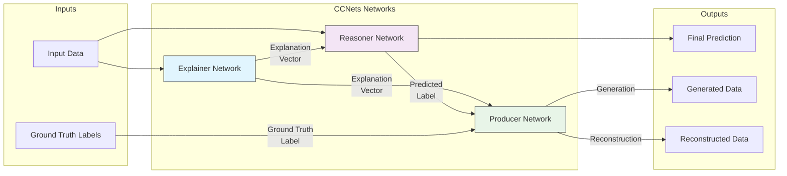

# CCNets: Causal Cooperative Networks

> *"In the Three Kingdoms, balance through cooperation creates stability where competition breeds chaos."*

**CCNets** is a revolutionary neural network architecture that implements **explainable cooperative learning** through three specialized networks working in harmony. Inspired by the Three Kingdoms political philosophy, CCNets moves beyond adversarial training to create stable, interpretable AI systems.

## 🌟 Overview

Traditional machine learning has evolved through distinct eras:
- **Supervised Era**: Single networks (efficient but rigid)
- **Adversarial Era**: Two competing networks (innovative but unstable)  
- **Cooperative Era**: **Three collaborative networks (stable and explainable)** ← *We are here*

CCNets implements this cooperative paradigm through three specialized networks that each serve a unique role while working together toward common objectives.

## 🏛️ Architecture Philosophy

### The Three Networks



1. **🧠 Explainer Network**: Creates compressed, interpretable explanation vectors from input data
2. **⚖️ Reasoner Network**: Makes predictions using both raw input and explanations
3. **🏭 Producer Network**: Generates and reconstructs data from labels and explanations

### Mathematical Framework

CCNets optimizes three fundamental losses:

```python
# Core Loss Functions
inference_loss = |reconstructed_observation - generated_observation|
generation_loss = |generated_observation - input_observation|
reconstruction_loss = |reconstructed_observation - input_observation|
```

Each network optimizes its own **cooperative objective**:

```python
# Network-Specific Cooperative Objectives
explainer_error = inference_loss + generation_loss - reconstruction_loss
reasoner_error = reconstruction_loss + inference_loss - generation_loss
producer_error = generation_loss + reconstruction_loss - inference_loss
```

This creates a balanced system where each network contributes to overall performance while maintaining its specialized role.

## 🚀 Key Features

- ✨ **Built-in Explainability**: Automatic explanation vector generation
- 🤝 **Cooperative Learning**: Three networks working together, not against each other
- 🔄 **Bidirectional Inference**: Both prediction and data generation capabilities
- 🎯 **Gradient Isolation**: Proper training dynamics with isolated network objectives
- 📊 **Cross-Verification**: Multiple pathways for validating predictions
- 🔧 **Flexible Architecture**: Easily adaptable to different domains
- 💾 **Production Ready**: Full serialization and deployment support

## 🎯 Quick Start

### Basic Usage

```python
import keras
import numpy as np
from dl_techniques.models.ccnets import create_ccnets_model

# 1. Create synthetic data
X_train = np.random.randn(1000, 20).astype(np.float32)
y_train = keras.utils.to_categorical(
    np.random.randint(0, 5, 1000), 5
).astype(np.float32)

# 2. Create CCNets model
model = create_ccnets_model(
    input_dim=20,           # Input feature dimension
    explanation_dim=8,      # Compressed explanation dimension
    output_dim=5,           # Number of classes
    loss_weights=[1.0, 1.0, 1.0]  # Equal weighting
)

# 3. Compile and train
model.compile(optimizer='adam')

# Training with CCNets format: ([observations, labels], targets)
for epoch in range(10):
    for i in range(0, len(X_train), 32):
        batch_x = X_train[i:i+32]
        batch_y = y_train[i:i+32] 
        data = ((batch_x, batch_y), None)
        metrics = model.train_step(data)
        
        if i % 320 == 0:  # Print every 10 batches
            print(f"Epoch {epoch+1}, Loss: {metrics['loss']:.4f}")

# 4. Make predictions with explanations
predictions = model.predict_step(X_train[:10])
print("Predictions shape:", predictions['predictions'].shape)
print("Explanations shape:", predictions['explanations'].shape)
print("Reconstructions shape:", predictions['reconstructions'].shape)
```

### Advanced Configuration

```python
# Create model with custom network architectures
model = create_ccnets_model(
    input_dim=100,
    explanation_dim=32,
    output_dim=10,
    explainer_kwargs={
        'hidden_dims': [256, 128, 64],
        'dropout_rate': 0.2,
        'use_batch_norm': True,
        'activation': 'gelu'
    },
    reasoner_kwargs={
        'hidden_dims': [256, 128],
        'fusion_dim': 512,
        'dropout_rate': 0.15,
        'output_activation': 'softmax'
    },
    producer_kwargs={
        'hidden_dims': [128, 256, 512],
        'dropout_rate': 0.1,
        'output_activation': 'sigmoid'
    },
    loss_weights=[1.2, 1.0, 0.8]  # Emphasize inference consistency
)
```

### Custom Training Loop

```python
import tensorflow as tf

# Create dataset
train_dataset = tf.data.Dataset.from_tensor_slices((X_train, y_train))
train_dataset = train_dataset.batch(32).shuffle(1000)

# Compile model
model.compile(optimizer=keras.optimizers.Adam(learning_rate=0.001))

# Training loop with detailed monitoring
for epoch in range(epochs):
    print(f"\nEpoch {epoch + 1}/{epochs}")
    
    for step, (x_batch, y_batch) in enumerate(train_dataset):
        # CCNets data format
        data = ((x_batch, y_batch), None)
        
        # Training step with cooperative learning
        metrics = model.train_step(data)
        
        if step % 20 == 0:
            print(f"  Step {step}: "
                  f"total={metrics['loss']:.4f}, "
                  f"inference={metrics['inference_loss']:.4f}, "
                  f"generation={metrics['generation_loss']:.4f}, "
                  f"reconstruction={metrics['reconstruction_loss']:.4f}")
```

## 🔍 Understanding CCNets Output

### Predictions and Explanations

```python
# Get model outputs
outputs = model([X_test, y_test], training=False)

explanation_vectors = outputs['explanation_vector']      # Interpretable features
predicted_labels = outputs['inferred_label']            # Classification predictions  
generated_data = outputs['generated_observation']       # Generated from ground truth
reconstructed_data = outputs['reconstructed_observation'] # Generated from predictions

# Analyze explanation vectors
print(f"Explanation statistics:")
print(f"  Mean: {np.mean(explanation_vectors):.4f}")
print(f"  Std: {np.std(explanation_vectors):.4f}")  
print(f"  Range: [{np.min(explanation_vectors):.4f}, {np.max(explanation_vectors):.4f}]")

# Measure reconstruction quality
reconstruction_error = np.mean(np.abs(X_test - reconstructed_data))
print(f"Reconstruction error: {reconstruction_error:.4f}")
```

### Cooperative Learning Analysis

```python
# Analyze cooperative behavior
losses = model.compute_losses(X_test, y_test, outputs)

print("Loss Components:")
print(f"  Inference Loss: {losses['inference_loss']:.4f}")     # Pathway consistency
print(f"  Generation Loss: {losses['generation_loss']:.4f}")   # Generation fidelity
print(f"  Reconstruction Loss: {losses['reconstruction_loss']:.4f}") # Reconstruction fidelity

print("\nCooperative Objectives:")
print(f"  Explainer Error: {losses['explainer_error']:.4f}")   # Focus: inference + generation
print(f"  Reasoner Error: {losses['reasoner_error']:.4f}")     # Focus: reconstruction + inference  
print(f"  Producer Error: {losses['producer_error']:.4f}")     # Focus: generation + reconstruction

# Cooperation score (lower = better cooperation)
cooperation_score = (losses['inference_loss'] + 
                    losses['generation_loss'] + 
                    losses['reconstruction_loss']) / 3
print(f"Cooperation Score: {cooperation_score:.4f}")
```

## 📊 Visualization

CCNets provides built-in visualization tools:

```python
from dl_techniques.models.ccnets.ccnets_examples import visualize_explanations

# Visualize explanation patterns and relationships
visualize_explanations(
    model=model,
    X_sample=X_test[:100],
    y_sample=y_test[:100],
    save_path="ccnets_analysis.png"
)
```

This creates a comprehensive visualization showing:
- Explanation vector heatmaps
- Prediction confidence distributions  
- Explanation norm vs reconstruction error relationships
- Class-wise explanation patterns

## 🧪 Use Cases

### 1. Explainable Image Classification

```python
# CIFAR-10 with explanations
model = create_ccnets_model(
    input_dim=3072,  # 32x32x3 flattened
    explanation_dim=64,
    output_dim=10,
    explainer_kwargs={'hidden_dims': [1024, 512, 256]},
    reasoner_kwargs={'hidden_dims': [512, 256]},
    producer_kwargs={'hidden_dims': [256, 512, 1024]}
)
```

### 2. Anomaly Detection with Reconstruction

```python
# High reconstruction error indicates anomalies
predictions = model.predict_step(test_data)
reconstruction_errors = np.mean(
    np.abs(test_data - predictions['reconstructions']), axis=1
)
anomalies = test_data[reconstruction_errors > threshold]
```

### 3. Data Augmentation via Generation

```python
# Generate new samples from existing labels
synthetic_data = model.producer_network([labels, explanations])
```

### 4. Model Interpretability

```python
# Analyze what the model learned
explanations = model.explainer_network(input_data)

# Find most important explanation dimensions
explanation_importance = np.std(explanations, axis=0)
top_dimensions = np.argsort(explanation_importance)[-5:]
print(f"Most informative explanation dimensions: {top_dimensions}")
```

## 🔧 API Reference

### Core Classes

#### `CCNetsModel`
The main cooperative learning model.

```python
CCNetsModel(
    explainer_network: keras.Model,
    reasoner_network: keras.Model, 
    producer_network: keras.Model,
    loss_weights: List[float] = [1.0, 1.0, 1.0],
    use_mixed_precision: bool = False
)
```

#### `ExplainerNetwork`
Creates explanation vectors from input data.

```python
ExplainerNetwork(
    input_dim: int,
    explanation_dim: int,
    hidden_dims: List[int] = [512, 256],
    activation: str = 'relu',
    dropout_rate: float = 0.3
)
```

#### `ReasonerNetwork`
Makes predictions from inputs and explanations.

```python
ReasonerNetwork(
    input_dim: int,
    explanation_dim: int,
    output_dim: int,
    hidden_dims: List[int] = [512, 256],
    fusion_dim: int = 512,
    output_activation: str = 'softmax'
)
```

#### `ProducerNetwork`
Generates/reconstructs data from labels and explanations.

```python
ProducerNetwork(
    label_dim: int,
    explanation_dim: int,
    output_dim: int,
    hidden_dims: List[int] = [256, 512],
    output_activation: str = 'sigmoid'
)
```

### Factory Functions

#### `create_ccnets_model()`
Convenient factory function for creating complete CCNets models.

```python
create_ccnets_model(
    input_dim: int,
    explanation_dim: int,
    output_dim: int,
    explainer_kwargs: Dict = {},
    reasoner_kwargs: Dict = {},
    producer_kwargs: Dict = {},
    loss_weights: List[float] = [1.0, 1.0, 1.0]
) -> CCNetsModel
```

## 🎯 Best Practices

### 1. **Choosing Architecture Dimensions**

```python
# Rule of thumb for explanation dimension
explanation_dim = min(input_dim // 4, 64)  # Compress but retain information

# Network depth based on problem complexity
simple_problem = {'hidden_dims': [64, 32]}      # < 1000 features
medium_problem = {'hidden_dims': [256, 128, 64]} # 1000-10000 features  
complex_problem = {'hidden_dims': [512, 256, 128, 64]} # > 10000 features
```

### 2. **Loss Weight Tuning**

```python
# Start with equal weights
loss_weights = [1.0, 1.0, 1.0]

# Emphasize explanation consistency for interpretability
loss_weights = [1.5, 1.0, 1.0]  

# Emphasize reconstruction for anomaly detection
loss_weights = [1.0, 1.0, 1.5]

# Emphasize generation for data augmentation
loss_weights = [1.0, 1.5, 1.0]
```

### 3. **Training Strategies**

```python
# Warm-up training: Start with lower learning rate
optimizer = keras.optimizers.Adam(learning_rate=0.0001)

# Gradual loss weight adjustment
def adjust_weights(epoch):
    if epoch < 10:
        return [0.5, 1.0, 1.0]  # Focus on generation first
    else:
        return [1.0, 1.0, 1.0]  # Then balance all objectives
```

### 4. **Monitoring Training**

Key metrics to watch:
- **Cooperation Score**: `(inference + generation + reconstruction) / 3` → should decrease
- **Error Balance**: `std([explainer_error, reasoner_error, producer_error])` → should be stable
- **Explanation Variance**: `std(explanation_vectors)` → should be meaningful (> 0.1)
- **Reconstruction Quality**: `mean(|input - reconstruction|)` → should decrease

## 🔬 Research Applications

CCNets enables several research directions:

### Explainable AI Research
- Study explanation vector patterns across different domains
- Compare CCNets explanations with other XAI methods (LIME, SHAP)
- Investigate explanation stability and consistency

### Cooperative Learning Theory
- Experiment with different cooperative objective formulations
- Study the effects of loss weight scheduling
- Analyze network specialization emergence

### Multi-Modal Learning
- Extend to vision-language tasks
- Implement cross-modal explanation transfer
- Study cooperative learning in multi-modal settings