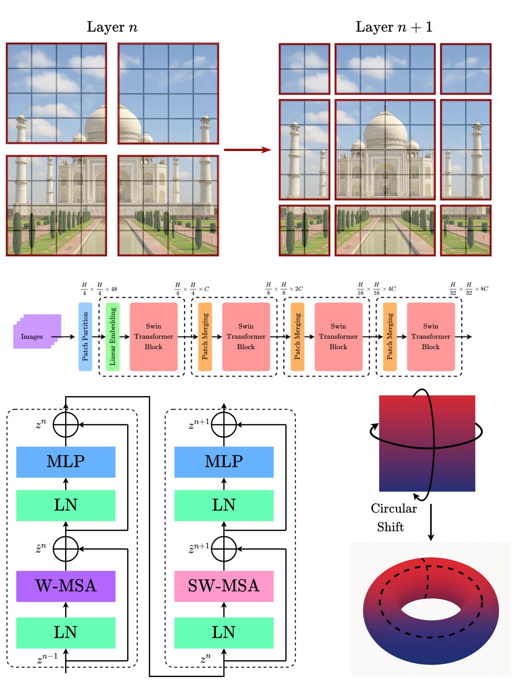

# Swin Transformer

[](https://keras.io/)
[](https://www.python.org/)
[](https://www.tensorflow.org/)

A production-ready, fully-featured implementation of the **Swin Transformer** in **Keras 3**, based on the foundational paper ["Swin Transformer: Hierarchical Vision Transformer using Shifted Windows"](https://arxiv.org/abs/2103.14030) by Liu et al. (2021).

The architecture introduces a hierarchical structure and shifted window attention, making it a highly efficient and effective backbone for a wide range of computer vision tasks.

---

## Table of Contents

1. [Overview: What is Swin Transformer and Why It Matters](#1-overview-what-is-swin-transformer-and-why-it-matters)
2. [The Problem Swin Transformer Solves](#2-the-problem-swin-transformer-solves)
3. [How Swin Transformer Works: Core Concepts](#3-how-swin-transformer-works-core-concepts)
4. [Architecture Deep Dive](#4-architecture-deep-dive)
5. [Quick Start Guide](#5-quick-start-guide)
6. [Component Reference](#6-component-reference)
7. [Configuration & Model Variants](#7-configuration--model-variants)
8. [Comprehensive Usage Examples](#8-comprehensive-usage-examples)
9. [Advanced Usage Patterns](#9-advanced-usage-patterns)
10. [Performance Optimization](#10-performance-optimization)
11. [Training and Best Practices](#11-training-and-best-practices)
12. [Serialization & Deployment](#12-serialization--deployment)
13. [Testing & Validation](#13-testing--validation)
14. [Troubleshooting & FAQs](#14-troubleshooting--faqs)
15. [Technical Details](#15-technical-details)
16. [Citation](#16-citation)

---

## 1. Overview: What is Swin Transformer and Why It Matters

### What is a Swin Transformer?

The **Swin (Shifted Window) Transformer** is a vision-focused Transformer architecture that introduces a hierarchical structure and a novel attention mechanism. Unlike the original Vision Transformer (ViT), which applies global self-attention across all image patches, the Swin Transformer computes self-attention within local, non-overlapping windows. This makes it significantly more efficient and allows it to process high-resolution images with linear complexity.

### Key Innovations

1.  **Hierarchical Feature Maps**: The model creates a pyramid of feature maps, similar to a Convolutional Neural Network (CNN). It starts with small patches and merges them in deeper layers, allowing it to capture features at different scales.
2.  **Windowed Self-Attention**: Self-attention is computed only within small, non-overlapping windows of the image, drastically reducing computational cost compared to the global attention used in ViT.
3.  **Shifted Window Self-Attention**: To enable communication between different windows, the windows are "shifted" in consecutive layers. This clever trick allows for cross-window connections, effectively creating a global receptive field while maintaining local computation.
4.  **Linear Complexity**: Due to the windowed attention mechanism, the computational complexity is linear with respect to the number of image patches, not quadratic like in ViT. This makes Swin Transformers highly scalable to large images.



### Why Swin Transformers Matter

**Standard Vision Transformer (ViT) Problem**:
```
Problem: Classify a high-resolution (e.g., 1024x1024) image.
Standard ViT Approach:
  1. Divide the image into patches (e.g., 16x16).
  2. Compute self-attention between every single patch and all other patches.
  3. Limitation: The number of patches is large, and the quadratic complexity of
     global self-attention (O(n²)) becomes computationally prohibitive. ViTs also
     produce a single-resolution feature map, which is not ideal for dense
     prediction tasks like segmentation. [4]
```

**Swin Transformer's Solution**:
```
Swin Transformer Approach:
  1. Divide the image into patches and group them into local windows.
  2. Compute self-attention only within these windows (much cheaper).
  3. In the next layer, shift the windows and compute attention again. This allows
     information to flow between the original windows.
  4. Merge patches to create a hierarchical feature map.
  5. Benefit: Achieves state-of-the-art performance with linear computational
     complexity, making it a versatile backbone for many vision tasks. [11]
```

### Real-World Impact

Swin Transformer has become a dominant architecture in computer vision, serving as a general-purpose backbone for:

-   **Image Classification**: Achieving top performance on benchmarks like ImageNet.
-   **Object Detection**: Its hierarchical features are excellent for identifying objects of various sizes.
-   **Semantic Segmentation**: The multi-scale feature maps are ideal for pixel-level classification tasks.
-   **Medical Image Analysis**: Used in models like Swin-UNET for high-resolution medical image segmentation.

---

## 2. The Problem Swin Transformer Solves

### The Limitations of Standard Vision Transformers

The original Vision Transformer (ViT) demonstrated the power of Transformers for vision but had key limitations:

1.  **Quadratic Complexity**: Global self-attention is computationally expensive, scaling quadratically with the number of patches (i.e., image resolution). This makes it impractical for very high-resolution images.
2.  **Lack of Hierarchy**: ViT produces a single, low-resolution feature map. This is suboptimal for tasks that require multi-scale information, such as detecting both small and large objects in the same image.
3.  **Scale Invariance**: ViT treats all patches at a single scale, struggling with the vast variation in the size of objects in the visual world.

```
┌─────────────────────────────────────────────────────────────┐
│  Standard Vision Transformer (ViT)                          │
│                                                             │
│  Objective: Apply Transformer architecture to images.       │
│                                                             │
│  The Scaling Problem:                                       │
│  - Its attention mechanism is global, making it very slow   │
│    and memory-intensive for high-resolution images.         │
│  - It doesn't naturally produce multi-scale features, which │
│    are critical for many vision tasks like detection and    │
│    segmentation.                                            │
└─────────────────────────────────────────────────────────────┘
```

### How Swin Transformer Changes the Game

Swin Transformer addresses these issues with its innovative architecture.

```
┌─────────────────────────────────────────────────────────────┐
│  The Swin Transformer Solution                              │
│                                                             │
│  1. Windowed Attention: Replaces global attention with      │
│     local attention within non-overlapping windows. This    │
│     reduces complexity from quadratic to linear. [4]        │
│                                                             │
│  2. Shifted Windows: Allows for cross-window connections in │
│     subsequent layers, building a global receptive field    │
│     without the cost of global attention. [1]               │
│                                                             │
│  3. Patch Merging: A downsampling technique that merges     │
│     groups of patches, creating a hierarchical feature map  │
│     similar to the pyramid structure of CNNs. [2]           │
└─────────────────────────────────────────────────────────────┘
```

This combination of features makes the Swin Transformer as versatile and powerful as leading CNNs like ResNet, but with the added benefits of the Transformer architecture.

---

## 3. How Swin Transformer Works: Core Concepts

### The Hierarchical Encoder Architecture

A Swin Transformer processes an image through a series of stages, each reducing the spatial resolution and increasing the channel depth.

```
┌──────────────────────────────────────────────────────────────────┐
│                      Swin Transformer Architecture               │
│                                                                  │
│  ┌─────────────────┐      ┌───────────────────────────────────┐  │
│  │ Patch Embedding │─────►│             Stage 1               │  │
│  │ (Patchify Image)│      │ (Linear Embedding + Swin Blocks)  │  │
│  └─────────────────┘      └───────────────────┬───────────────┘  │
│                                               │ (Patch Merging)  │
│  ┌────────────────┐     ┌─────────────────────▼──────────────┐   │
│  │   Classifier   │◄────┤             Stage 2..4             │   │
│  │ (Optional Head)│     │(Downsample + More Swin Blocks)     │   │
│  └────────────────┘     └────────────────────────────────────┘   │
└──────────────────────────────────────────────────────────────────┘
```

### Windowed and Shifted-Window Attention

The core innovation is the replacement of standard multi-head self-attention (MSA) with a window-based version.

1.  **Windowed MSA (W-MSA)**: In the first block of a pair, the image grid is divided into non-overlapping windows (e.g., 7x7 patches), and self-attention is computed independently within each window.
    -   *Problem*: Information is not shared between windows.

2.  **Shifted Window MSA (SW-MSA)**: In the second block, the window configuration is shifted by half a window size.
    -   *Solution*: This shift creates new windows that overlap with the boundaries of the previous windows, allowing information to be exchanged across them. A clever masking mechanism is used to handle the new window configurations efficiently.

This two-step process allows the model to learn both local and global relationships effectively and efficiently.

### The Complete Data Flow

```
┌─────────────────────────────────────────────────────────────────────────┐
│                     Swin Transformer Complete Data Flow                 │
└─────────────────────────────────────────────────────────────────────────┘

STEP 1: PATCH EMBEDDING
──────────────────────
Input Image (B, H, W, C)
    │
    ├─► Patch Partition (Conv2D with strides=patch_size)
    │
    └─► Flattened & Embedded Patches (B, H/4 * W/4, D)


STEP 2: STAGE 1
───────────────
Embedded Patches
    │
    ├─► Swin Block 1 (W-MSA: Regular windows)
    │
    ├─► Swin Block 2 (SW-MSA: Shifted windows)
    │
    └─► ... (repeated for `depths[0]` times)


STEP 3: PATCH MERGING + STAGE 2
──────────────────────────────
Feature Map from Stage 1
    │
    ├─► Patch Merging (Downsample HxW by 2, Double C)
    │
    ├─► Swin Block 1 (W-MSA)
    │
    ├─► Swin Block 2 (SW-MSA)
    │
    └─► ... (repeated for `depths[1]` times)


STEP 4: REPEAT FOR STAGES 3 & 4
───────────────────────────────
Repeat the Patch Merging and Swin Block stages to create a deep,
hierarchical feature representation.


STEP 5: CLASSIFICATION HEAD (Optional)
─────────────────────────────────────
Final Feature Map
    │
    ├─► Global Average Pooling
    │
    └─► Dense Layer → Logits (B, num_classes)
```

---

## 4. Architecture Deep Dive

### 4.1 Patch Embedding and Merging

-   **`PatchEmbedding`**: A convolutional layer is used to split the input image into non-overlapping patches and project them into an embedding dimension `C`.
-   **`PatchMerging`**: This layer is responsible for downsampling. It takes a `2x2` group of patches, concatenates them (increasing the channel dimension by 4x), and then applies a linear layer to reduce the channel dimension by 2x, effectively halving the spatial resolution and doubling the feature dimension.

### 4.2 Swin Transformer Block

This is the core building block of the model. Each Swin Transformer block contains:
1.  A Layer Normalization layer.
2.  A Windowed or Shifted Window Multi-Head Self-Attention module.
3.  A residual connection.
4.  Another Layer Normalization layer.
5.  A 2-layer MLP with a GELU activation in between.
6.  A final residual connection.

This structure is similar to a standard Transformer block but replaces the MSA module with the efficient window-based attention.

---

## 5. Quick Start Guide

### Installation

```bash
# Ensure you have the required dependencies
pip install keras>=3.0 tensorflow>=2.16 numpy matplotlib
```

### Your First Swin Transformer Model (30 seconds)

Let's train a small Swin Transformer on the CIFAR-10 dataset.

```python
import keras
from keras.datasets import cifar10
import numpy as np
import matplotlib.pyplot as plt

# Local imports from your project structure
# from model import SwinTransformer # Assuming model.py is in the same directory

# 1. Load and preprocess data
(X_train, y_train), (X_test, y_test) = cifar10.load_data()
X_train = X_train.astype("float32") / 255.0
X_test = X_test.astype("float32") / 255.0
y_train = keras.utils.to_categorical(y_train, 10)
y_test = keras.utils.to_categorical(y_test, 10)

# 2. Create a Swin Transformer model suitable for CIFAR-10 (32x32 images)
# We use the "tiny" variant, which is the smallest.
model = SwinTransformer.from_variant(
    "tiny",
    num_classes=10,
    input_shape=(32, 32, 3)
)

# 3. Compile the model
model.compile(
    optimizer=keras.optimizers.Adam(learning_rate=1e-3),
    loss="categorical_crossentropy",
    metrics=["accuracy"]
)
print("✅ Swin Transformer model created and compiled successfully!")
model.summary()

# 4. Train the model
history = model.fit(
    X_train, y_train,
    epochs=10, # Train longer for better results
    batch_size=128,
    validation_data=(X_test, y_test)
)
print("✅ Training Complete!")

# 5. Evaluate the model
loss, acc = model.evaluate(X_test, y_test)
print(f"Test Accuracy: {acc*100:.2f}%")
```

---

## 6. Component Reference

### 6.1 `SwinTransformer` (Model Class)

**Purpose**: The main Keras `Model` subclass that assembles the patch embedding, stages of Swin blocks, and the classification head.

```python
from model import SwinTransformer

# Create a base model for ImageNet
model = SwinTransformer.from_variant(
    "base",
    num_classes=1000,
    input_shape=(224, 224, 3),
    drop_path_rate=0.2 # Add stochastic depth for regularization
)
```

**Key Parameters**:

| Parameter | Description |
| :--- | :--- |
| `num_classes` | The number of output classes for the classifier head. |
| `embed_dim` | The initial embedding dimension (C). |
| `depths` | A list of 4 integers specifying the number of blocks in each stage. |
| `num_heads` | A list of 4 integers specifying the number of attention heads in each stage. |
| `window_size` | The size of the attention window (e.g., 7 for a 7x7 patch window). |
| `drop_path_rate` | The stochastic depth rate for regularization. |
| `include_top` | Whether to include the final classification head. Set to `False` to use as a backbone. |

**Key Methods**:
-   `from_variant()`: A factory method to easily create standard Swin Transformer sizes ("tiny", "small", "base", "large").

---

## 7. Configuration & Model Variants

This implementation provides four standard pre-configured variants from the original paper.

| Variant | Depths | Embed Dim (C) | Heads | Parameters | Use Case |
| :---: | :---: | :---: | :---: | :---: | :--- |
| **`tiny`** | | 96 | | ~28M | Small to medium datasets (CIFAR, etc.) |
| **`small`**|| 96 | | ~50M | Medium datasets, good trade-off |
| **`base`** || 128 | | ~88M | Standard for ImageNet-1k |
| **`large`**|| 192 | | ~197M | Large-scale datasets (ImageNet-22k) |

---

## 8. Comprehensive Usage Examples

### Example 1: Using Swin Transformer as a Feature Extractor

To use the Swin Transformer as a backbone for downstream tasks like object detection or segmentation, set `include_top=False`.

```python
# Create the backbone
backbone = SwinTransformer.from_variant(
    "base",
    include_top=False,
    input_shape=(224, 224, 3)
)

# You can now build a new model on top of the Swin features
inputs = keras.Input(shape=(224, 224, 3))
features = backbone(inputs)
# features will have shape (B, 7, 7, 1024) for a 224x224 input

# Add your custom head
# For example, a simple classifier
x = keras.layers.GlobalAveragePooling2D()(features)
outputs = keras.layers.Dense(100, activation="softmax")(x)

custom_model = keras.Model(inputs, outputs)
custom_model.summary()
```

---

## 9. Advanced Usage Patterns

### Pattern 1: Fine-tuning on Higher Resolution

Swin Transformers can be fine-tuned on images of a higher resolution than they were pre-trained on. The architecture is flexible enough to handle different input sizes, though performance is optimal when the input dimensions are a multiple of `patch_size * 32`.

---

## 10. Performance Optimization

### Mixed Precision Training

Swin Transformers can be accelerated significantly using mixed precision, which performs computations in `float16` where possible and `float32` for stability.

```python
# Enable mixed precision globally
keras.mixed_precision.set_global_policy('mixed_float16')

# Create model (will automatically use mixed precision)
model = SwinTransformer.from_variant("base", num_classes=1000)
model.compile(...)
```

---

## 11. Training and Best Practices

### Optimizer and Learning Rate Schedule

The original paper uses the AdamW optimizer with a cosine learning rate decay schedule and a linear warmup for the first few epochs. This is crucial for stable training and achieving the best performance.

### Regularization

-   **Stochastic Depth (`drop_path_rate`)**: This is a key regularization technique for Swin Transformers. It randomly drops entire residual blocks during training, preventing co-adaptation of layers. A rate of `0.1` to `0.3` is common.
-   **Weight Decay**: Applying weight decay via an optimizer like AdamW helps prevent overfitting.
-   **Label Smoothing**: For classification tasks, label smoothing can improve generalization.

---

## 12. Serialization & Deployment

The `SwinTransformer` model is fully serializable using Keras 3's modern `.keras` format.

### Saving and Loading

```python
# Create and train model
model = SwinTransformer.from_variant("tiny", num_classes=10, input_shape=(32, 32, 3))
model.compile(optimizer="adam", loss="categorical_crossentropy")
# model.fit(...)

# Save the entire model
model.save('my_swin_model.keras')
print("Model saved to my_swin_model.keras")

# Load the model in a new session
loaded_model = keras.models.load_model(
    'my_swin_model.keras',
    custom_objects={"SwinTransformer": SwinTransformer}
)
print("Model loaded successfully")

# Verify that the loaded model works
# prediction = loaded_model.predict(X_test[:1])
```

---

## 13. Testing & Validation

### Unit Tests

```python
import keras
import numpy as np
# from model import SwinTransformer

def test_model_creation_from_variant():
    """Test model creation from all variants."""
    for variant in ["tiny", "small", "base", "large"]:
        model = SwinTransformer.from_variant(variant, num_classes=10, input_shape=(224, 224, 3))
        assert model is not None
        print(f"✓ Swin-{variant} created successfully")

def test_forward_pass_shape():
    """Test the output shape of a forward pass."""
    model = SwinTransformer.from_variant("tiny", num_classes=10, input_shape=(224, 224, 3))
    dummy_input = np.random.rand(4, 224, 224, 3)
    output = model.predict(dummy_input)
    assert output.shape == (4, 10)
    print("✓ Forward pass has correct shape")

def test_feature_extractor_shape():
    """Test the output shape when include_top=False."""
    model = SwinTransformer.from_variant("tiny", include_top=False, input_shape=(224, 224, 3))
    dummy_input = np.random.rand(4, 224, 224, 3)
    output = model.predict(dummy_input)
    # H/32, W/32, C*8 -> 224/32=7, 96*8=768
    assert output.shape == (4, 7, 7, 768)
    print("✓ Feature extractor has correct shape")

# Run tests
if __name__ == '__main__':
    test_model_creation_from_variant()
    test_forward_pass_shape()
    test_feature_extractor_shape()
```

---

## 14. Troubleshooting & FAQs

**Issue 1: Training is unstable or performance is poor.**

-   **Cause 1**: The optimizer and learning rate schedule are critical. A simple Adam optimizer with a fixed learning rate may not be sufficient.
-   **Solution 1**: Implement a cosine decay learning rate schedule with a warmup period. Use the AdamW optimizer.
-   **Cause 2**: Insufficient regularization for the model size.
-   **Solution 2**: Increase the `drop_path_rate` and `weight_decay`.

### Frequently Asked Questions

**Q: How does Swin Transformer compare to a CNN like ResNet?**

A: Swin Transformers have demonstrated superior performance to ResNets and other leading CNNs on many benchmarks. They combine the hierarchical structure of CNNs with the powerful self-attention mechanism of Transformers, capturing both local and global dependencies more effectively.

**Q: Can I use this for small datasets?**

A: Yes, the "tiny" and "small" variants can work well on smaller datasets like CIFAR-10/100, especially when using data augmentation and proper regularization. However, like most Transformers, they benefit greatly from large-scale pre-training.

---

## 15. Technical Details

### Shifted Window Attention Mechanism

The efficiency of the Swin Transformer comes from its clever implementation of shifted window attention. To avoid re-computing windows after shifting, a cyclic shift is performed, and a mask is applied to the attention mechanism. This mask prevents attention between patches that were not adjacent in the original feature map, ensuring the computation remains valid while being highly efficient.

---

## 16. Citation

If you use the Swin Transformer in your research, please cite the original paper:

```bibtex
@inproceedings{liu2021swin,
  title={Swin transformer: Hierarchical vision transformer using shifted windows},
  author={Liu, Ze and Lin, Yutong and Cao, Yue and Hu, Han and Wei, Yixuan and Zhang, Zheng and Lin, Stephen and Guo, Baining},
  booktitle={Proceedings of the IEEE/CVF International Conference on Computer Vision},
  pages={10012--10022},
  year={2021}
}
```