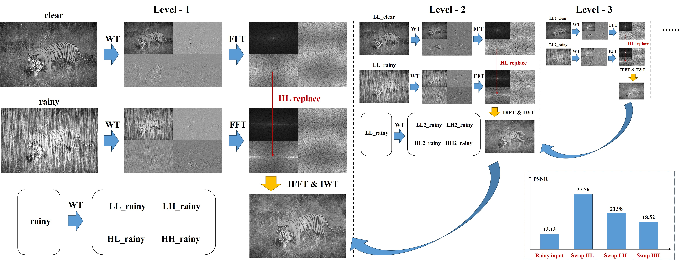
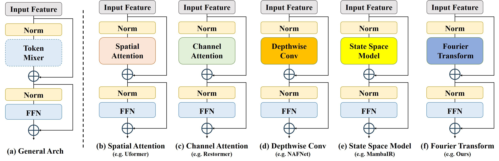
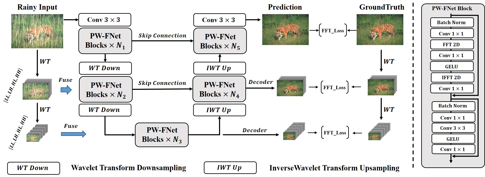

# Pyramid Wavelet-Fourier Network (PW-FNet)

[](https://keras.io/)
[](https://www.python.org/)
[](https://www.tensorflow.org/)

A Keras 3 implementation of the **Pyramid Wavelet-Fourier Network (PW-FNet)**, from
["Global Modeling Matters: A Fast, Lightweight and Effective Baseline for Efficient Image
Restoration"](https://arxiv.org/abs/2507.13663) (Jiang et al., 2025).

The architecture replaces self-attention with a Fourier-domain token mixer inside a
hierarchical U-Net, so global context costs `O(N log N)` instead of `O(N^2)` in the number
of pixels. Every block and the model itself are serializable through the standard `.keras`
format.



---

## 1. Overview: What is PW-FNet and Why It Matters

### What is PW-FNet?

PW-FNet is an image-restoration network built for speed. Its premise is that the useful
part of a Transformer for restoration is the **global receptive field**, not self-attention
specifically, and that a Fourier transform provides that field directly: every frequency
coefficient already depends on every spatial location.



### Key Ideas

1. **Fourier transform as the token mixer.** Each block applies a 2D FFT, mixes channels
   with a pointwise convolution and GELU in the frequency domain, then transforms back.
2. **Global modeling without attention.** No attention map is ever materialized, so memory
   does not grow quadratically with resolution.
3. **Hierarchical, multi-input multi-output.** A 3-level U-Net predicts a residual at full,
   half and quarter resolution, each added to a correspondingly downsampled copy of the
   input, so a loss can be applied at every scale.



### How This Implementation Differs From the Paper

The **intra-block** half of the paper — the Fourier token mixer — is what this package
implements. The **inter-block** half is simplified:

| Paper | This package |
| :--- | :--- |
| A pyramid **wavelet**-based multi-input multi-output structure, decomposing into frequency sub-bands | No wavelet transform anywhere. The multi-scale inputs are plain `average_pool` copies, the multi-scale outputs are plain residuals, and the pyramid is the U-Net's own resolutions. The "Wavelet" in the name is not implemented. |
| Results across deraining, dehazing, desnowing, deblurring, super-resolution and enhancement | Architecture only. Nothing here has been trained or benchmarked, and no weights ship with the package. |
| Named model scales | No variant table. The model is parameterized continuously by `width` and the per-level block counts. |

---

## 2. The Problem PW-FNet Solves

Transformer restoration models are effective and expensive. Their cost has three parts:

1. **Compute** — global self-attention is quadratic in the pixel count, which bites hardest
   exactly where restoration is needed, at high resolution.
2. **Memory** — the attention maps themselves dominate activation memory.
3. **Parameters** — the resulting models are awkward to deploy on constrained devices.

PW-FNet keeps the global receptive field and drops all three costs by swapping the mixer.
The whole network is built from `Conv2D`, `DepthwiseConv2D`, normalization, GELU and the
FFT — operations that are fast and well supported everywhere.

---

## 3. How PW-FNet Works: Core Concepts

### The Fourier token mixer

```
Input features (spatial)
   │
   ├─► Pointwise Conv          expand C -> hidden (2x by default)
   ├─► FFT2D                   real/imag concatenated -> 2*hidden channels
   ├─► Pointwise Conv + GELU   mix in the frequency domain
   ├─► IFFT2D                  real part only -> hidden channels
   └─► Pointwise Conv          project hidden -> C
Output features (spatial)
```

The FFT and IFFT are a **float32 island**: both cast their input to float32 because
`keras.ops.fft2` has no float16 kernel, and cast the result back to the layer's compute
dtype. Mixed precision therefore works, but the transform itself is never run in half
precision.

### The complete data flow

```
Input (B, H, W, C_img)
  │                                       input_l1 = avg_pool(input)      (H/2)
  │                                       input_l2 = avg_pool(input_l1)   (H/4)
  ├─► intro Conv2D 3x3                                       -> (B, H,   W,   D)
  ├─► Encoder level 1: enc_blk_nums[0] blocks ──(skip1)──►
  ├─► PWFNetDownsample                                       -> (B, H/2, W/2, 2D)
  ├─► Encoder level 2: enc_blk_nums[1] blocks ──(skip2)──►
  ├─► PWFNetDownsample                                       -> (B, H/4, W/4, 4D)
  ├─► Bottleneck: middle_blk_num blocks
  │      └─► output_l2 Conv2D  ──► out_quarter = input_l2 + residual
  ├─► PWFNetUpsample, concat skip2, reduce Conv2D 1x1        -> (B, H/2, W/2, 2D)
  ├─► Decoder level 2: dec_blk_nums[0] blocks
  │      └─► output_l1 Conv2D  ──► out_half    = input_l1 + residual
  ├─► PWFNetUpsample, concat skip1, reduce Conv2D 1x1        -> (B, H,   W,   D)
  ├─► Decoder level 1: dec_blk_nums[1] blocks
  │      └─► output_l0 Conv2D  ──► out_full    = input + residual
  │
  └─► returns [out_full, out_half, out_quarter]
```

Because the heads predict residuals, the network only has to learn the degradation, not
the image.

---

## 4. Architecture Deep Dive

### 4.1 `PW_FNet_Block`

Two pre-normalized residual sub-modules:

1. **Token mixer**: `x = x + Project(IFFT(GELU(Conv_freq(FFT(Expand(Norm1(x)))))))`
2. **Feed-forward**: `x = x + Project(GELU(DepthwiseConv3x3(Expand(Norm2(x)))))`

The hidden width is `int(dim * ffn_expansion_factor)`, default `2.0`. The block preserves
its input shape.

The FFN has two forms. `use_spatial_ffn=True` (the default) is the architecture's own
depthwise-convolution FFN, which keeps spatial structure. `use_spatial_ffn=False` swaps in
a Dense-based FFN from the shared factory (`ffn_type="mlp"`, `"swiglu"`, `"geglu"`, ...),
which is an experiment knob rather than the reference path; it requires `ffn_type` and
raises `ValueError` without it.

### 4.2 Scaling layers

- **`PWFNetDownsample`**: `Conv2D(dim, kernel_size=4, strides=2, padding="same")`. Halves
  the resolution and doubles the channels.
- **`PWFNetUpsample`**: `Conv2DTranspose(dim, kernel_size=2, strides=2)`. Doubles the
  resolution and halves the channels. Matching kernel and stride is what keeps transposed
  convolution from producing checkerboard artifacts.

### 4.3 The depth is fixed at 2 levels

`call` returns exactly three tensors and the topology is written out by name (`down1`,
`down2`, `up2`, `up1`, `output_l2`, `output_l1`, `output_l0`), so `enc_blk_nums` and
`dec_blk_nums` set **how many blocks run at each level**, never how many levels there are.
Both lists must have exactly two entries; any other length raises `ValueError`.

---

## 5. Quick Start Guide

```python
import keras
import numpy as np

from dl_techniques.models.vision.image_restoration.pw_fnet.model import PW_FNet


def generate_data(num_samples, shape=(64, 64, 3)):
    clean = np.random.rand(num_samples, *shape).astype("float32")
    noise = np.random.normal(0, 0.1, clean.shape).astype("float32")
    return np.clip(clean + noise, 0.0, 1.0), clean


noisy, clean = generate_data(128)

model = PW_FNet(
    img_channels=3,
    width=32,            # base channel width
    middle_blk_num=2,    # bottleneck blocks
    enc_blk_nums=[1, 1], # blocks per encoder level (exactly 2 entries)
    dec_blk_nums=[1, 1], # blocks per decoder level (exactly 2 entries)
)

# One loss per output scale, weighted towards full resolution.
model.compile(
    optimizer="adam",
    loss=["mae", "mae", "mae"],
    loss_weights=[0.6, 0.3, 0.1],
)

# Targets must match the three returned scales.
target_full = clean
target_half = np.asarray(keras.layers.AveragePooling2D(2)(clean))
target_quarter = np.asarray(keras.layers.AveragePooling2D(2)(target_half))

model.fit(
    noisy,
    (target_full, target_half, target_quarter),
    epochs=1,
    batch_size=16,
    verbose=1,
)

restored = model.predict(noisy[:1])
print([r.shape for r in restored])
# [(1, 64, 64, 3), (1, 32, 32, 3), (1, 16, 16, 3)]
```

---

## 6. Component Reference

| Component | Location | Purpose |
| :--- | :--- | :--- |
| `PW_FNet` | `...pw_fnet.model` | The full U-Net. Returns `[full, half, quarter]`. |
| `create_pw_fnet` | `...pw_fnet.model` | Thin factory over the constructor with the reference defaults. |
| `PW_FNet_Block` | `...pw_fnet.model` | Token mixer plus FFN. Shape-preserving. |
| `PWFNetDownsample` / `PWFNetUpsample` | `...pw_fnet.model` | Learned 2x scaling. |
| `FFTLayer` / `IFFTLayer` | `dl_techniques.layers.fft_layers` | 2D FFT to concatenated real/imag channels, and back. |

All five are re-exported from the package `__init__`.

### `PW_FNet` constructor arguments

| Parameter | Type | Default | Description |
| :--- | :--- | :--- | :--- |
| `img_channels` | `int` | `3` | Input/output channels. Must be positive. |
| `width` | `int` | `32` | Base channel width; levels use `width`, `2*width`, `4*width`. |
| `middle_blk_num` | `int` | `4` | Bottleneck blocks. Must be non-negative. |
| `enc_blk_nums` | `List[int]` | `[2, 2]` | Blocks per encoder level. **Exactly 2 entries.** |
| `dec_blk_nums` | `List[int]` | `[2, 2]` | Blocks per decoder level. **Exactly 2 entries.** |
| `normalization_type` | `str` | `'layer_norm'` | Any type the normalization factory accepts (`'rms_norm'`, `'band_rms'`, `'dynamic_tanh'`, ...). |
| `norm_kwargs` | `dict` | `None` | Forwarded to every normalization layer. |
| `use_spatial_ffn` | `bool` | `True` | `False` selects a factory FFN instead. |
| `ffn_type` | `str` | `None` | Factory FFN name. Required when `use_spatial_ffn=False`. |
| `ffn_kwargs` | `dict` | `None` | Forwarded to the factory FFN. |

`create_pw_fnet` takes the same arguments and forwards them unchanged. Note that
`ffn_expansion_factor` is a `PW_FNet_Block` argument only: the model does not forward it,
so every block in a `PW_FNet` runs at the `2.0` default.

---

## 7. Configuration & Model Variants

There is no `MODEL_VARIANTS` table and none was invented — the architecture is a single
3-level U-Net scaled continuously by `width` and the block counts. Parameter counts below
were measured on `img_channels=3` and are independent of input resolution.

| `width` | `middle_blk_num` | `enc`/`dec` blocks | Parameters |
| ---: | ---: | :--- | ---: |
| 16 | 1 | `[1, 1]` | 222,617 |
| 16 | 2 | `[1, 1]` | 323,097 |
| 32 | 2 | `[1, 1]` | 1,269,801 |
| 32 | 4 | `[2, 2]` (the defaults) | 2,317,225 |
| 64 | 4 | `[2, 2]` | 9,193,289 |

Parameters scale roughly with `width^2`, so `width` is the coarse capacity knob and the
block counts are the fine one.

---

## 8. Usage Examples

### Example 1: Inference at a single scale

```python
import numpy as np

noisy_image = np.random.rand(1, 128, 128, 3).astype("float32")

full, half, quarter = model.predict(noisy_image)
print(full.shape, half.shape, quarter.shape)
# (1, 128, 128, 3) (1, 64, 64, 3) (1, 32, 32, 3)
```

The half- and quarter-resolution heads are supervision targets, not a cheaper inference
path: they are produced by the bottleneck and the first decoder stage, so computing them
does not let you skip the rest of the network.

### Example 2: Non-default normalization and FFN

```python
from dl_techniques.models.vision.image_restoration.pw_fnet.model import create_pw_fnet

model = create_pw_fnet(
    width=32,
    normalization_type="rms_norm",
    norm_kwargs={"epsilon": 1e-6},
    use_spatial_ffn=False,
    ffn_type="swiglu",
    ffn_kwargs={"dropout_rate": 0.1},
)
```

Both knobs change the parameter count. `use_spatial_ffn=False` also gives up the depthwise
convolution, which is the block's only source of local spatial mixing.

---

## 9. Advanced Usage Patterns

### Weighting the multi-scale losses

Keras applies a compiled loss **per output**, so a single callable receives one `y_true`
and one `y_pred` tensor, not the three-element lists. Weighting the scales is done with
`loss_weights`, not by unpacking inside a custom loss:

```python
model.compile(
    optimizer="adam",
    loss=["mae", "mae", "mae"],
    loss_weights=[0.6, 0.3, 0.1],
)
```

A custom loss can still be passed in the list — it is simply called three times, once per
scale.

---

## 10. Performance Optimization

```python
import keras

keras.mixed_precision.set_global_policy("mixed_float16")
model = create_pw_fnet(width=16, enc_blk_nums=[1, 1], dec_blk_nums=[1, 1])
```

The three outputs come back as float16. The FFT and IFFT stay in float32 internally (see
section 3), so expect one cast in and one cast out per block — the transform is exact
either way.

Restoration is normally trained on crops. Because the model is fully convolutional, a model
trained on 128x128 patches runs unchanged on full images at inference; the only constraint
is that both spatial dimensions be divisible by 4, since the encoder halves twice.

---

## 11. Training and Best Practices

- **Supervise all three scales.** The half- and quarter-resolution heads exist for exactly
  that and cost nothing extra at training time.
- **Loss.** An L1 (MAE) loss on each scale is the simple, strong default for restoration;
  L1 in the Fourier domain is a natural companion given the architecture.
- **Optimizer.** AdamW with cosine decay is the usual choice for this class of model.
- **Residual heads.** Targets are the clean images, not the residuals — the addition of the
  downsampled input happens inside `call`.

---

## 12. Serialization & Deployment

Every class here is decorated with `@register_dl_technique` and implements `get_config`, so
`.keras` files round-trip with no `custom_objects` argument. A save/load/predict round-trip
reproduces the original outputs exactly (max absolute difference 0.0).

```python
import keras

model.save("pwfnet_denoiser.keras")
loaded = keras.models.load_model("pwfnet_denoiser.keras")
restored = loaded.predict(noisy[:1])
```

All four classes register under the defining module's dotted path,
`dl_techniques.models.pw_fnet.model><ClassName>` — the `vision/` and `image_restoration/`
directories are a filing decision, not a namespace — and each also binds the legacy
`Custom><ClassName>` alias. The scaling layers carry the `PWFNet` prefix because the legacy
alias namespace is keyed by the bare class name alone and `Downsample` / `Upsample` are
already claimed elsewhere in the library; do not rename them back.

---

## 13. Testing & Validation

```python
import numpy as np

from dl_techniques.models.vision.image_restoration.pw_fnet.model import PW_FNet


def test_output_scales():
    model = PW_FNet(width=8, middle_blk_num=1, enc_blk_nums=[1, 1], dec_blk_nums=[1, 1])
    outputs = model(np.random.rand(1, 32, 32, 3).astype("float32"))
    assert [tuple(o.shape) for o in outputs] == [
        (1, 32, 32, 3), (1, 16, 16, 3), (1, 8, 8, 3),
    ]
```

The package's own suite is `tests/test_models/test_pw_fnet/`.

---

## 14. Troubleshooting

- `enc_blk_nums and dec_blk_nums must each have exactly 2 entries` — the depth is fixed;
  the lists set block counts per level, not the number of levels.
- `ffn_type must be specified when use_spatial_ffn=False` — pick a factory FFN name.
- **A custom loss raises `OperatorNotAllowedInGraphError` while iterating `y_true`** — the
  loss is called once per output with plain tensors. Use `loss_weights` (section 9).
- **Shape mismatch during `fit`** — the targets must be a 3-tuple ordered
  `(full, half, quarter)`, matching the model's return order.
- **Odd input sizes** — both spatial dimensions must be divisible by 4.

---

## 15. Technical Details

**Frequency representation.** `FFTLayer` takes `[B, H, W, C]`, treats the input as complex
with zero imaginary part, applies `fft2` over the spatial axes, and returns
`[B, H, W, 2*C]` with the real and imaginary parts concatenated on the channel axis. That
is why `freq_conv` is `2 * hidden_dim` wide. `IFFTLayer` splits the channel axis back into
a real/imaginary pair, applies `ifft2`, and keeps only the real part.

**Why this is not attention.** The frequency-domain pointwise convolution mixes channels at
each frequency independently; the spatial mixing is entirely in the transform. There is no
data-dependent weighting between positions, which is precisely what makes it linear in
parameters and `O(N log N)` in compute.

**Complexity.** For `N` pixels, the token mixer is `O(N log N)` against global
self-attention's `O(N^2)` — at 256x256 that is a difference of several orders of magnitude
in the mixing term.

---

## 16. Citation

```bibtex
@article{jiang2025global,
  title={Global Modeling Matters: A Fast, Lightweight and Effective Baseline for
         Efficient Image Restoration},
  author={Jiang, Xingyu and Gao, Ning and Dou, Hongkun and Zhang, Xiuhui and
          Zhong, Xiaoqing and Deng, Yue and Li, Hongjue},
  journal={arXiv preprint arXiv:2507.13663},
  year={2025}
}
```
