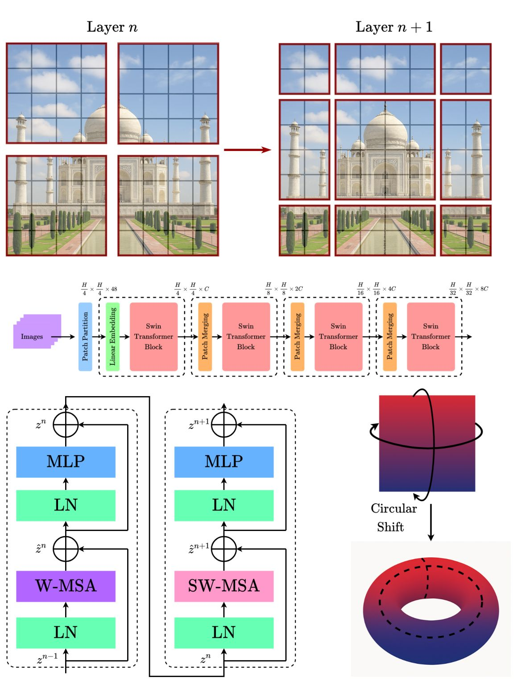

# Swin Transformer

[](https://keras.io/)
[](https://www.python.org/)
[](https://www.tensorflow.org/)

A Keras 3 implementation of the **Swin Transformer**, from ["Swin Transformer: Hierarchical Vision Transformer using Shifted Windows"](https://arxiv.org/abs/2103.14030) (Liu et al., 2021).

The architecture combines a CNN-like feature pyramid with attention computed inside local windows, which makes attention cost linear in the number of patches rather than quadratic.

---

## 1. Overview: What is Swin Transformer and Why It Matters

### What is a Swin Transformer?

Swin (Shifted Window) Transformer is a vision Transformer that computes self-attention inside small, non-overlapping windows rather than globally, and builds a hierarchy of feature maps by merging patches between stages. The result behaves like a convolutional backbone -- multi-scale features, linear cost -- while the operator inside each stage is attention.

### Key Innovations

1. **Hierarchical feature maps.** Four stages, each halving spatial resolution and doubling channels, so the backbone emits features at several scales instead of one.
2. **Windowed self-attention (W-MSA).** Attention is restricted to a `window_size x window_size` group of patches. Cost grows linearly with the patch count.
3. **Shifted windows (SW-MSA).** Alternate blocks shift the window grid by half a window, so information crosses the previous window boundaries. Over a pair of blocks the receptive field grows without any global attention.
4. **Patch merging.** A `2x2` neighbourhood is concatenated (4x channels) and linearly projected back down to 2x, halving resolution and doubling width.



---

## 2. The Problem Swin Transformer Solves

A plain ViT has two properties that hurt on dense-prediction tasks:

| ViT limitation | Consequence |
| :--- | :--- |
| Global attention over all patches | Cost is quadratic in patch count, so high resolution is expensive. |
| One fixed patch resolution end to end | A single-scale feature map, awkward for detection and segmentation, which need several scales. |

Swin addresses both directly. Windowed attention makes the cost linear; patch merging produces the pyramid. The shifted-window alternation supplies the cross-window mixing that pure windowing would otherwise lose.

---

## 3. How Swin Transformer Works: Core Concepts

### Windowed and shifted-window attention

Swin blocks come in pairs:

1. **W-MSA block.** The patch grid is divided into non-overlapping `window_size x window_size` windows and attention runs inside each one independently. Nothing crosses a window boundary.
2. **SW-MSA block.** The window grid is displaced by half a window. New windows straddle the previous boundaries, so tokens that could not see each other in the previous block now can. A cyclic shift plus an attention mask implements this without recomputing the partition, and the mask prevents attention between patches that are not actually adjacent.

### Data flow

```
Input image (B, H, W, 3)
    |
    +-> PatchEmbedding (patch_size x patch_size, stride patch_size) -> (B, H/p * W/p, C)
    +-> LayerNorm, reshape back to a grid                           -> (B, H/p, W/p, C)
    |
    +-> Stage 1: depths[0] Swin blocks (W-MSA / SW-MSA alternating)  C
    +-> PatchMerging  -> Stage 2: depths[1] blocks                   2C, half resolution
    +-> PatchMerging  -> Stage 3: depths[2] blocks                   4C, quarter resolution
    +-> PatchMerging  -> Stage 4: depths[3] blocks                   8C, eighth resolution
    |
    +-- include_top=False -> (B, H/(8p), W/(8p), 8C)   e.g. (B, 7, 7, 8C) at H=W=224, p=4
    +-- include_top=True  -> LayerNorm -> GlobalAveragePooling2D -> Dense -> logits (B, num_classes)
```

The classifier `Dense` has no activation, so it emits **logits**; compile with `from_logits=True`.

---

## 4. Architecture Deep Dive

### 4.1 Patch embedding and merging

- **Patch embedding** comes from the shared embedding factory (`embedding_type="patch_2d"`). It emits a 3D `(B, H*W, C)` tensor, which the model reshapes back to a `(B, H', W', C)` grid because the Swin blocks require 4D input. A LayerNorm sits between the two.
- **Patch merging** concatenates each `2x2` patch group into `4 * dim` channels and projects to `2 * dim`. An odd grid dimension is ceil-padded, so odd sizes are correct; they just carry padded tokens.

### 4.2 Swin Transformer block

Each block is LayerNorm -> (shifted) window attention -> residual add, then LayerNorm -> MLP with GELU -> residual add. Blocks alternate between zero shift and a half-window shift within a stage. Stochastic depth (`drop_path_rate`) is applied on the residual branches.

### 4.3 Input size

The only hard requirement is that height and width divide by `patch_size`; `PatchEmbedding2D` raises otherwise. Sizes that are not multiples of `patch_size * 8` still build and still report the correct output shape -- the model logs a warning because at least one merge stage will carry zero-padded tokens, which is a compute cost, not a correctness problem.

Window size is unconstrained. Note that a window larger than the deepest stage grid is padded up to the full window, which can waste a great deal of attention compute: at `input_shape=(32, 32, 3)` with `patch_size=4` the stage-4 grid is `1x1`, so `window_size=8` pads it to `8x8`.

---

## 5. Quick Start Guide

```python
import keras
from keras.datasets import cifar10

from dl_techniques.models.vision.swin_transformer import create_swin_transformer

# 1. Data (a subset keeps this example fast).
(x_train, y_train), (x_test, y_test) = cifar10.load_data()
x_train = x_train[:2000].astype("float32") / 255.0
y_train = y_train[:2000]
x_test = x_test[:1000].astype("float32") / 255.0
y_test = y_test[:1000]

# 2. Model. window_size=2 keeps the deepest 1x1 grid from being padded to 7x7.
model = create_swin_transformer(
    "tiny",
    num_classes=10,
    input_shape=(32, 32, 3),
    window_size=2,
)

# 3. Compile. The classifier is unactivated, so the loss reads logits.
model.compile(
    optimizer=keras.optimizers.AdamW(learning_rate=1e-3, weight_decay=1e-4),
    loss=keras.losses.SparseCategoricalCrossentropy(from_logits=True),
    metrics=["accuracy"],
)
model.summary()

# 4. Train and evaluate.
model.fit(x_train, y_train, epochs=1, batch_size=64, validation_data=(x_test, y_test))
loss, acc = model.evaluate(x_test, y_test)
print(f"Test accuracy: {acc * 100:.2f}%")
```

---

## 6. Component Reference

### 6.1 `SwinTransformer` (model class)

`dl_techniques.models.vision.swin_transformer.SwinTransformer` -- a functional `keras.Model` subclass; the graph is built in `__init__`, so the model is usable immediately after construction.

| Parameter | Default | Description |
| :--- | :--- | :--- |
| `num_classes` | `1000` | Output units in the classifier head. |
| `embed_dim` | `96` | Stage-1 channel width `C`. |
| `depths` | `(2, 2, 6, 2)` | Blocks per stage; must have exactly 4 entries. |
| `num_heads` | `(3, 6, 12, 24)` | Attention heads per stage; must have exactly 4 entries. |
| `window_size` | `7` | Side of the square attention window, in patches. |
| `mlp_ratio` | `4.0` | MLP hidden expansion inside a block. |
| `qkv_bias` | `True` | Bias on the qkv projection. |
| `dropout_rate` | `0.0` | General dropout. |
| `attn_dropout_rate` | `0.0` | Dropout on attention weights. |
| `drop_path_rate` | `0.1` | Stochastic depth rate. |
| `patch_size` | `4` | Patch side; `H` and `W` must divide by it. |
| `use_bias` | `True` | Bias (and LayerNorm centering) throughout. |
| `include_top` | `True` | `False` returns the stage-4 feature grid. |
| `input_shape` | `None` (resolves to `(224, 224, 3)`) | Input shape `(H, W, C)`. |

Also available: `kernel_initializer`, `bias_initializer`, `kernel_regularizer`, `bias_regularizer`.

`SwinTransformer.from_variant(variant, num_classes=..., input_shape=..., **overrides)` builds from `MODEL_VARIANTS`; any keyword overrides the preset value.

### 6.2 `create_swin_transformer`

The package factory. Same arguments as `from_variant`, plus `pretrained`.

```python
from dl_techniques.models.vision.swin_transformer import create_swin_transformer

model = create_swin_transformer("base", num_classes=1000, input_shape=(224, 224, 3),
                                drop_path_rate=0.2)
```

### 6.3 Pretrained weights

None are distributed. The factory accepts a `pretrained` flag, but any truthy value raises `NotImplementedError` rather than handing back a randomly initialized model. Leave it at its default (`False`).

To warm-start from a local checkpoint, build with `pretrained=False` and load explicitly. Prefer `dl_techniques.utils.weight_transfer.load_weights_or_raise(model, path)`, which raises when a load changes zero variables; bare `load_weights` is silent about a checkpoint that matches nothing.

---

## 7. Configuration & Model Variants

The four presets from the paper. Parameter counts were measured by building each model at `input_shape=(224, 224, 3)`, `num_classes=1000`, `patch_size=4`, `window_size=7`.

| Variant | Embed dim | Depths | Heads | Params |
| :--- | ---: | :--- | :--- | ---: |
| `tiny` | 96 | `[2, 2, 6, 2]` | `[3, 6, 12, 24]` | 28,289,698 |
| `small` | 96 | `[2, 2, 18, 2]` | `[3, 6, 12, 24]` | 49,607,602 |
| `base` | 128 | `[2, 2, 18, 2]` | `[4, 8, 16, 32]` | 87,770,016 |
| `large` | 192 | `[2, 2, 18, 2]` | `[6, 12, 24, 48]` | 196,535,164 |

Only `embed_dim`, `depths` and `num_heads` vary between variants; everything else comes from the constructor defaults or your overrides.

---

## 8. Usage Examples

### Example 1: backbone plus a custom head

```python
import keras
from dl_techniques.models.vision.swin_transformer import SwinTransformer

backbone = SwinTransformer.from_variant(
    "base",
    include_top=False,
    input_shape=(224, 224, 3),
)
print(backbone.output_shape)  # (None, 7, 7, 1024)

inputs = keras.Input(shape=(224, 224, 3))
features = backbone(inputs)
x = keras.layers.GlobalAveragePooling2D()(features)
outputs = keras.layers.Dense(100, name="head")(x)
custom_model = keras.Model(inputs, outputs)
```

The stage-4 grid is `(H / (patch_size * 8), W / (patch_size * 8), embed_dim * 8)`, so `tiny`/`small` give `(7, 7, 768)` at 224 and `large` gives `(7, 7, 1536)`.

### Example 2: overriding a preset

```python
from dl_techniques.models.vision.swin_transformer import SwinTransformer

# Keep the tiny depth/width schedule, change everything else.
model = SwinTransformer.from_variant(
    "tiny",
    num_classes=100,
    input_shape=(128, 128, 3),
    window_size=4,
    drop_path_rate=0.2,
    dropout_rate=0.1,
)
print(model.output_shape)  # (None, 100)
```

---

## 9. Advanced Usage Patterns

### Changing input resolution

The model is built for one fixed `input_shape` at construction time; there is no dynamic-resolution path. To fine-tune at a higher resolution, construct a second model at the new shape and transfer weights. Layers whose shapes do not depend on resolution transfer directly; the relative-position tables inside window attention depend on `window_size`, not on image size, so keeping `window_size` fixed keeps them compatible.

### Mixed precision

```python
keras.mixed_precision.set_global_policy("mixed_float16")
```

Set the policy before constructing the model.

---

## 10. Training Notes

- **Optimizer**: the paper uses AdamW with cosine decay and a linear warmup. Warmup matters.
- **Stochastic depth**: `drop_path_rate` is the main regularizer here. `0.1` (the default) to `0.3` for the larger variants.
- **Weight decay and label smoothing**: both help on classification.
- **Window size vs. input size**: pick `window_size` so the deepest stage grid is not much smaller than the window; otherwise attention compute is spent on padding.

---

## 11. Serialization

```python
model.save("my_swin.keras")
loaded = keras.models.load_model("my_swin.keras")
```

The class is registered for the `.keras` format, so no `custom_objects` argument is needed.

---

## 12. Troubleshooting

- `ValueError: depths must have 4 elements` / `num_heads must have 4 elements` -- the stage count is fixed at 4.
- A `ValueError` from `PatchEmbedding2D` -- `H` or `W` is not divisible by `patch_size`. This is the only hard size constraint.
- "Input height ... is not divisible by ..." in the log -- a warning, not an error. The model is correct; a merge stage carries padded tokens.
- Very slow or memory-hungry training on small images -- check `window_size` against the deepest stage grid (see 4.3).
- Accuracy stuck near chance -- the head emits logits; the loss must use `from_logits=True`.
- `NotImplementedError` from a truthy `pretrained` -- expected; no checkpoints ship with this package.

---

## 13. Technical Details

**Shifted-window implementation.** Rather than re-partitioning after the shift, the feature map is cyclically shifted and a mask is applied so that tokens brought together only by the wrap-around do not attend to each other. This keeps every window the same size and the batched attention regular.

**Initialization.** `kernel_initializer=None` resolves to the module's reference initializer, and each consumer receives its own `clone_initializer(...)` copy. A single seedless initializer instance replays its draw, which would otherwise make every same-shape kernel in a stage bit-identical.

**Fixed constants.** `NUM_STAGES = 4`, LayerNorm epsilon `1e-5`, and a LayerNorm after patch embedding are class-level constants rather than constructor arguments.

---

## 14. Citation

```bibtex
@inproceedings{liu2021swin,
  title={Swin transformer: Hierarchical vision transformer using shifted windows},
  author={Liu, Ze and Lin, Yutong and Cao, Yue and Hu, Han and Wei, Yixuan and Zhang, Zheng and Lin, Stephen and Guo, Baining},
  booktitle={Proceedings of the IEEE/CVF International Conference on Computer Vision},
  pages={10012--10022},
  year={2021}
}
```
