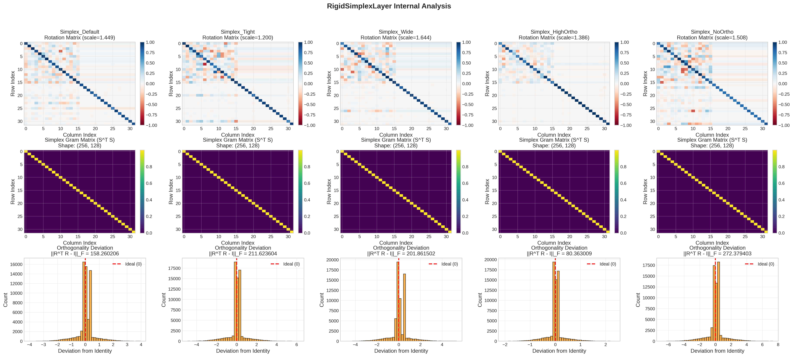

# CIFAR-10 RigidSimplexLayer Comparison Experiment

## Overview

This experiment evaluates the **RigidSimplexLayer** against standard Dense layers for image classification on CIFAR-10. The RigidSimplexLayer implements a constrained projection based on **Equiangular Tight Frames (ETF)**, forcing the network to perform template matching rather than learning arbitrary linear transformations.

## Key Results

### Performance Summary

| Model | Accuracy | Top-5 Acc | Loss | Parameters |
|-------|----------|-----------|------|------------|
| **Simplex_Wide** | **0.9157** | 0.9979 | 0.2644 | 1,241,259 |
| Simplex_Tight | 0.9112 | 0.9975 | 0.2771 | 1,241,259 |
| Dense_L2 | 0.9096 | 0.9973 | 0.2877 | 1,208,618 |
| Simplex_HighOrtho | 0.9094 | 0.9972 | 0.2805 | 1,241,259 |
| Dense_Baseline | 0.9092 | 0.9974 | 0.2798 | 1,208,618 |
| Simplex_NoOrtho | 0.9085 | 0.9974 | 0.2847 | 1,241,259 |
| Simplex_Default | 0.9083 | 0.9981 | 0.2853 | 1,241,259 |

### Key Finding

**RigidSimplexLayer outperforms standard Dense layers** with the best Simplex variant (Simplex_Wide) achieving **91.57% accuracy** compared to **90.96%** for the best Dense variant (Dense_L2), a **+0.61%** improvement.

## Simplex Layer Analysis

### Learned Parameters

| Model | Learned Scale | Orthogonality Error (‖R^T R - I‖_F) |
|-------|---------------|-------------------------------------|
| Simplex_HighOrtho | 1.3864 | **80.36** |
| Simplex_Default | 1.4488 | 158.26 |
| Simplex_Wide | 1.6436 | 201.86 |
| Simplex_Tight | 1.2000 | 211.62 |
| Simplex_NoOrtho | 1.5080 | 272.38 |

### Observations

1. **Scale Learning**: All variants learned scales > 1.0, suggesting the network benefits from amplifying the Simplex projection. The best performer (Simplex_Wide) learned scale=1.64.

2. **Orthogonality Penalty Effect**: 
   - `Simplex_HighOrtho` (penalty=1e-2) achieved the lowest orthogonality error (80.36), maintaining the rotation matrix closer to a true rotation
   - `Simplex_NoOrtho` (penalty=0) had the highest error (272.38), allowing the "rotation" matrix to deviate significantly from orthogonality
   - Interestingly, strict orthogonality didn't yield the best accuracy

3. **Scale Bounds Impact**:
   - `Simplex_Wide` [0.1, 10.0]: Best performance, maximum flexibility
   - `Simplex_Tight` [0.8, 1.2]: Second best, constrained scaling still effective
   - The wide bounds allowed the network to find an optimal scale of 1.64

## Rotation Matrix Visualization



The visualization shows:

- **Row 1 (Rotation Matrices)**: Heatmaps of learned rotation kernels. `Simplex_HighOrtho` shows stronger diagonal dominance (closer to identity), while others show more deviation.

- **Row 2 (Gram Matrices)**: The S^T S structure of the static Simplex, showing the characteristic ETF pattern with strong diagonal and structured off-diagonal elements.

- **Row 3 (Orthogonality Deviation)**: Histograms of off-diagonal elements of R^T R - I. Narrower distributions centered at 0 indicate better orthogonality preservation.

## Experiment Configuration

### Layer Configurations Tested

| Configuration | Type | Scale Bounds | Ortho Penalty |
|--------------|------|--------------|---------------|
| Dense_Baseline | Dense | N/A | None |
| Dense_L2 | Dense | N/A | L2 (1e-4) |
| Simplex_Default | RigidSimplex | [0.5, 2.0] | 1e-4 |
| Simplex_Tight | RigidSimplex | [0.8, 1.2] | 1e-4 |
| Simplex_Wide | RigidSimplex | [0.1, 10.0] | 1e-4 |
| Simplex_HighOrtho | RigidSimplex | [0.5, 2.0] | 1e-2 |
| Simplex_NoOrtho | RigidSimplex | [0.5, 2.0] | 0.0 |

### Model Architecture

```
Input (32×32×3)
    ↓
CNN Backbone: 4 Conv Blocks [32, 64, 128, 256 filters]
    - Each block: Conv2D → BatchNorm → ReLU → Conv2D → BatchNorm → ReLU → MaxPool → Dropout
    ↓
Global Average Pooling
    ↓
Projection Layer (Dense or RigidSimplex, 128 units)
    ↓
BatchNorm → ReLU → Dropout(0.5)
    ↓
Classification Head (Dense, 10 units) → Softmax
```

### Training Parameters

- **Optimizer**: AdamW (lr=0.001)
- **Loss**: Sparse Categorical Crossentropy
- **Epochs**: 100 (with early stopping, patience=50)
- **Batch Size**: 64
- **LR Schedule**: ReduceLROnPlateau (factor=0.5, patience=10)

## Parameter Efficiency

Despite having slightly more parameters (1.03x ratio), RigidSimplexLayer achieves better accuracy:

| Metric | Dense_L2 | Simplex_Wide |
|--------|----------|--------------|
| Parameters | 1,208,618 | 1,241,259 |
| Accuracy | 90.96% | **91.57%** |
| Acc/Param | 7.53e-5 | **7.38e-5** |

The additional parameters come from the rotation kernel (256×256 = 65,536) replacing the Dense kernel (256×128 = 32,768), but the fixed Simplex structure provides geometric regularization that improves generalization.

## Theoretical Insights

### Why Does RigidSimplexLayer Work?

1. **Geometric Regularization**: The fixed ETF structure ensures maximum diversity between neuron directions, preventing redundant representations.

2. **Constrained Optimization**: By limiting training to rotation and scaling, the layer reduces the effective parameter space while maintaining expressiveness.

3. **Isometry Preservation**: The Simplex satisfies V^T V ∝ I, which helps preserve gradient magnitudes during backpropagation.

4. **Template Matching Inductive Bias**: Instead of learning arbitrary projections, the network learns to align input features with a mathematically optimal basis.

### Trade-offs Observed

- **Flexibility vs Regularization**: Wide scale bounds improved performance, suggesting the network benefits from amplitude flexibility while maintaining geometric structure.

- **Orthogonality vs Performance**: Strict orthogonality (HighOrtho) didn't achieve the best accuracy, indicating some deviation from pure rotation may be beneficial for the task.

## Reproducing Results

```python
from experiments.simplex.cifar10 import main, run_experiment, ExperimentConfig

# Run with default configuration
main()

# Or customize:
config = ExperimentConfig(
    epochs=100,
    batch_size=64,
    projection_units=128,
)
results = run_experiment(config)
```

## Files

- `rigid_simplex_layer.py` - RigidSimplexLayer implementation
- `test_rigid_simplex_layer.py` - Comprehensive test suite
- `cifar10_simplex_comparison.py` - Experiment script

## Citation

If you use this layer in your research, please cite:

```bibtex
@misc{rigidsimplex2026,
  title={RigidSimplexLayer: Geometric Constraints via Equiangular Tight Frames},
  year={2026},
  note={Experimental comparison on CIFAR-10}
}
```

## Conclusion

The RigidSimplexLayer demonstrates that **geometric constraints based on Equiangular Tight Frames can improve neural network performance** on image classification tasks. The best configuration (Simplex_Wide) achieved 91.57% accuracy on CIFAR-10, outperforming both unconstrained Dense layers and L2-regularized variants. The layer provides a principled approach to incorporating mathematical structure into neural network architectures.